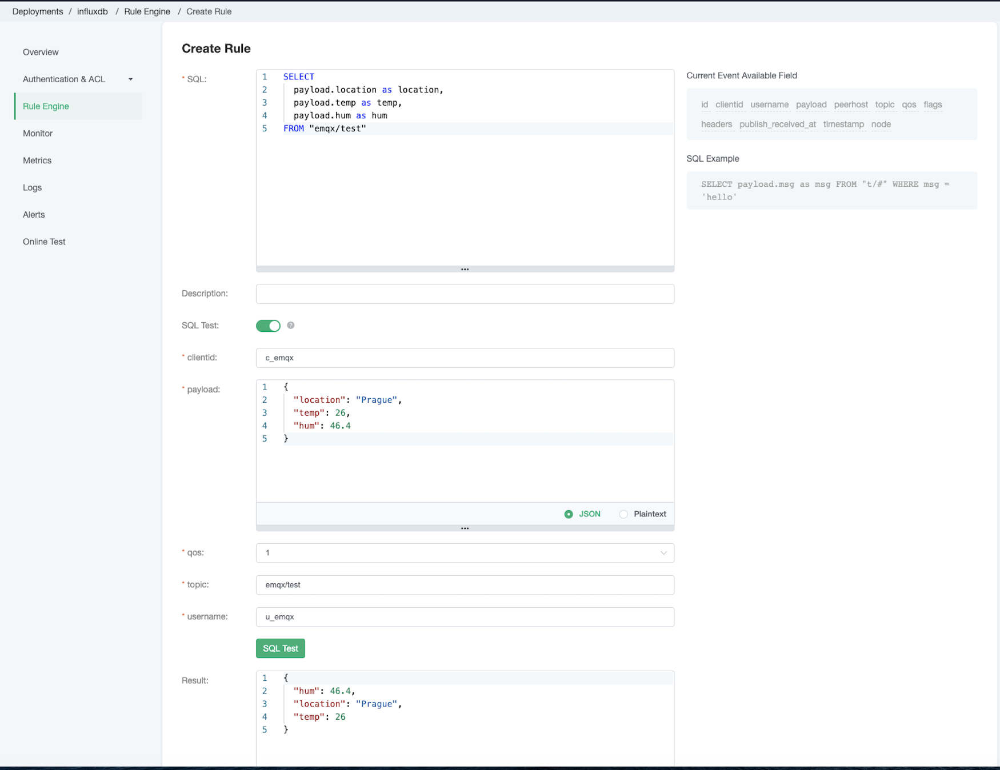
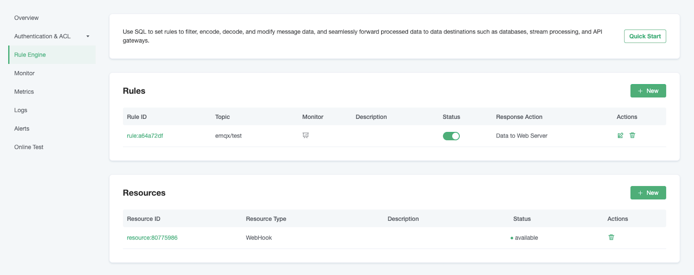

# Save device data to InfluxDB using the Rule Engine

[InfluxDB](https://www.influxdata.com/) is an open source database for storing and analyzing time-series data, with built-in HTTP API, support for SQL-like statements, and unstructured features that are very friendly for users. Its powerful data throughput and stable performance make it very suitable for the IoT field.

Through the EMQ X Cloud rule engine, we can customize the template file, and then convert the MQTT message in JSON format to Measurement and write it to InfluxDB.


In this guide, we will complete the creation of an InfluxDB rule engine to achieve the following functions:

* Record the temperature and humidity of Prague. When there is a temperature and humidity message sent to the emqx/test topic, the rule engine will be triggered to record this data in InfluxDB.


In order to achieve this function, we will complete the following 4 tasks:

1. Login and initialize InfluxDB
2. Create a resource
3. Create a rule and response action
4. Connect to MQTT X to send data
5. View results in the InfluxDB console

::: tip
Before using the rule engine, create a deployment first.
For professional deployment users: please complete [Peering Connection](../deployments/vpc_peering.md) first, and ensure that the servers involved in the following are established in the VPC under the peering connection. All the IP mentioned below refer to the intranet IP of the resource
For basic deployment users: There is no need to complete peering connection, and the IP mentioned below refers to the public IP of the resource
:::


  <div style="position: relative; padding: 30% 45%;">
  <iframe style="position: absolute; width: 100%; height: 100%; left: 0; top: 0;" src="https://www.youtube.com/embed/1S09epPWLpc" title="YouTube video player" frameborder="0" allow="accelerometer; autoplay; encrypted-media; gyroscope; picture-in-picture" allowfullscreen></iframe>
  </div>


## 1. Login and initialize InfluxDB

### Log in to the InfluxDB account


### Create Bucket

After logging in to the InfluxDB's console, go to the `Load Data` page and create a new bucket.


Name the bucket and click `Create`.


### Generate Token

Go back to the `Load Data` page and generate a new token. At this time, we will generate a token with full access.


Once the token is created, you could choose to activate/deactivate the token.


## 2. Create a resource

Go to [EMQ X Cloud Console](https://cloud.emqx.io/console/) and go to the `Rule Engine` page


Click on the `+ New` button in the `Resource` section to create a new resource.

Select the WebHook as the resource type and fill in the request URL as follows:


```
    Url:
        https://us-east-1-1.aws.cloud2.influxdata.com/api/v2/write
    Request parameters:
        org: organizations
        bucket: data buckets
        precision: Timestamp precision(ns, us, ms, s)
    Example:
        https://us-east-1-1.aws.cloud2.influxdata.com/api/v2/write?org=tifidol259%40revutap.com&bucket=em qx&precision=ns
```

Then add the request headers as following:

```
    Content-Encoding: identity
    Content-Type: text/plain
    Accept: application/json
    Authorization: Token <your_influxdb_token>
    User-Agent: Telegraf
```


Click `Conform` to finish creating the resource. If the resource is created successfully, you will see the status for the resource is `avaliable`


## 3. Create a rule

Click on the `+ New` button in the `Rules` section to create a new rule.

Our goal is that as long as the emqx/test topic has monitoring information, the engine will be triggered. Certain SQL processing is required here:

* Only target the topic "emqx/test"
* Get the three data we need: location, temperature, humidity

According to the above principles, the SQL we finally get should be as follows:

```
SELECT
    payload.location as location, 
    payload.temp as temp, 
    payload.hum as hum
FROM "emqx/test"
```


You can click **SQL Test** under the SQL input box to fill in the data:

* topic: emqx/test
* payload:
```json
{
  "location": "Prague",
  "temp": 26,
  "hum": 46.4
}
```
Click Test to view the obtained data results. If the settings are correct, the test output box should get the complete JSON data as follows:

```json
{
  "hum": 46.4,
  "location": "Prague", 
  "temp": 26
}
```



::: tip Tip
If the test fails, please check whether the SQL is compliant and whether the topic in the test is consistent with the SQL filled in.
:::


### Create a response action

Click Add Action, on the Select Action page, select **Data forward** and **Data to Web Server**

Select the resource we just created

Enter the payload Template as follows:

```
temp_hum,location=${location} temp=${temp},hum=${hum}
```

where:

```
    Measurement: temp_hum
    Tags: location
    Fields: temp, hum
```


Click `Confirm` to finish creating the response action and finish creating the rule

Go back to the `Rule Engine` page, now you can see the rule we created is on the list




## 4. Connect to MQTT X to send data

We recommend you to use MQTT X, an elegant cross-platform MQTT 5.0 desktop client to subscribe/publish messages.

>If you are using EMQ X Cloud for the first time, you can go to [Deployment Connection Guide](../connect_to_deployments/introduction.md) to view the MQTT client connection and test guide

We will be using the MQTT X desktop version in this tutorial.

In the MQTT X console, click on the `add` button and fill in the deployment information to connect to the deployment


Enter the topic name and payload message to publish the message


## 5. View results in influxDB console

Go back to the InfluxDB console and go to the `Data Explorer` page

Select the bucket and filter the measurement, fields, then InfluxDB will generate the graphs for you


