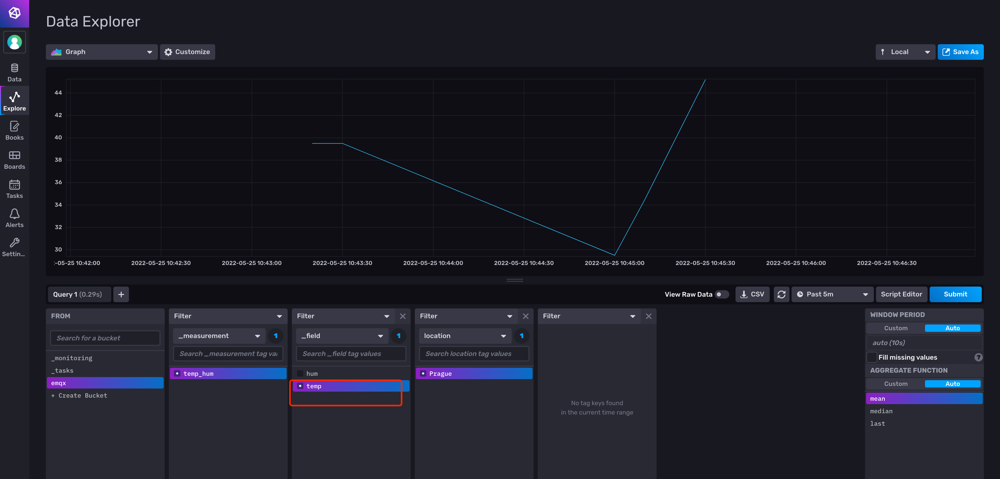
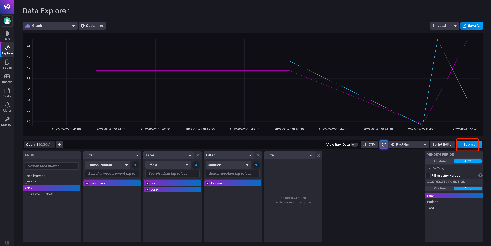

# Integrate with InfluxDB 2.0

[InfluxDB V2](https://www.influxdata.com/) is an open source database for storing and analyzing time-series data, with built-in HTTP API, support for SQL-like statements, and unstructured features that are very friendly for users. Its powerful data throughput and stable performance make it very suitable for the IoT field.

Through the EMQX Cloud Data Integrations, we can customize the template file, and then convert the MQTT message in JSON format to Measurement and write it to InfluxDB.

In this guide, we will complete the creation of an InfluxDB data integration to achieve the following functions:

* Record the temperature and humidity of Prague. When there is a temperature and humidity message sent to the emqx/test topic, the Data Integrations will be triggered to record this data in InfluxDB.

In order to achieve this function, we will complete the following 4 tasks:

1. Login and initialize InfluxDB
2. Create a resource
3. Create a rule and response action
4. Connect to MQTTX to send data
5. View results in the InfluxDB console

Before you start, you will need to complete the following:

- A deployment (EMQX Cluster) has been created on EMQX Cloud.
- For Professional Plan users: Please complete [Peering Connection Creation](../deployments/vpc_peering.md) first, all IPs mentioned below refer to the internal network IP of the resource.(Professional Plan with a [NAT gateway](../vas/nat-gateway.md) can also use public IP to connect to resources).
- For BYOC Plan users: Please establish a peering connection between the VPC where BYOC is deployed and the VPC where the resources are located. All IPs mentioned below refer to the internal IP of the resources. If you need to access the resources via public IP addresses, please configure a NAT gateway in your public cloud console for the VPC where BYOC is deployed.

  <LazyIframeVideo vendor="youtube" src="https://www.youtube.com/embed/1S09epPWLpc/?autoplay=1&null" />

## 1. Login and initialize InfluxDB

### Log in to the InfluxDB account


### Create Bucket

After logging in to the InfluxDB's console, go to the `Load Data` page and create a new bucket. Name the bucket and click `Create`.


### Generate Token

Go back to the `Load Data` page and find a new token. You could choose to activate/deactivate the token.


## 2. Create Resource

Go to [EMQX Cloud Console](https://cloud-intl.emqx.com/console/) and go to the `Data Integrations` page


Click on the `InfluxDB HTTP V2 Service` card to create a new resource.


Click Test button when configuration is complete, then click New button to create a resource when it is available.

## 3. Create Rule

After the resource is successfully created, you can return to the data integration page and find the newly created resource, and click create rule.Our goal is that as long as the emqx/test topic has monitoring information, the engine will be triggered. Certain SQL processing is required here:

* Only target the topic "emqx/test"
* Get the three data we need: location, temperature, humidity

According to the above principles, the SQL we finally get should be as follows:

```sql
SELECT
    payload.location as location, 
    payload.temp as temp, 
    payload.hum as hum
FROM "emqx/test"
```

You can click **SQL Test** under the SQL input box to fill in the data:

* topic: emqx/test
* payload:

```json
{
  "location": "Prague",
  "temp": 26,
  "hum": 46.4
}
```

Click Test to view the obtained data results. If the settings are correct, the test output box should get the complete JSON data as follows:

```json
{
  "hum": 46.4,
  "location": "Prague", 
  "temp": 26
}
```


::: tip
If the test fails, please check whether the SQL is compliant and whether the topic in the test is consistent with the SQL filled in.
:::

## 4. Create Action

After completing the rule configuration, click Next to configure and create an action. Then enter the fields and tags as follows:

```bash
Measurement: temp_hum
Fields: temp ${temp}, hum ${hum}
Tags: location ${location}
```


## 5. Connect to MQTTX to send data

We recommend you to use MQTTX, an elegant cross-platform MQTT 5.0 desktop client to subscribe/publish messages.

>If you are using EMQX Cloud for the first time, you can go to [Deployment Connection Guide](../connect_to_deployments/overview.md) to view the MQTT client connection and test guide

We will be using the MQTTX desktop version in this tutorial.

In the MQTTX console, click on the `add` button and fill in the deployment information to connect to the deployment, Enter the topic name and payload message to publish the message


## 6. View results in influxDB console

Go back to the InfluxDB console and go to the `Data Explorer` page

Select the bucket and filter the measurement, fields, then InfluxDB will generate the graphs for you





