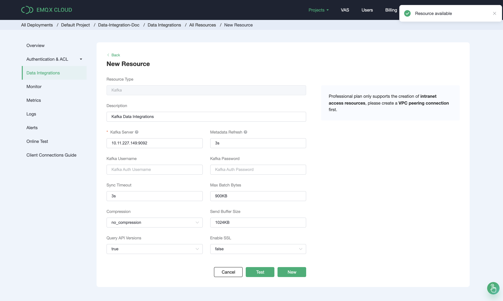

# Bridge device data to Kafka using the Data Integrations

In this article, we will simulate temperature and humidity data and report these data to EMQX Cloud via the MQTT protocol and then use the EMQX Cloud Data Integrations to bridge the data into Kafka.

Before you start, you need to complete the following operations:

* Deployments have already been created on EMQX Cloud (EMQX Cluster).

* For Professional Plan users: Please complete [Peering Connection Creation](../deployments/vpc_peering.md) first, all IPs mentioned below refer to the internal network IP of the resource.(Professional Plan with a [NAT gateway](../vas/nat-gateway.md) can also use public IP to connect to resources)

  <LazyIframeVideo vendor="youtube" src="https://www.youtube.com/embed/Bk-uhfSm32I/?autoplay=1&null" />

Kafka configuration

1. Install Kafka

    ```bash
    # Install zookeeper
    docker run -d --restart=always \
        --name zookeeper \
        -p 2181:2181 \
        zookeeper

    # Install Kafka and open port 9092
    docker run -d  --restart=always --name mykafka \
        -p 9092:9092 \
        -e HOST_IP=localhost \
        -e KAFKA_ADVERTISED_PORT=9092 \
        -e KAFKA_ADVERTISED_HOST_NAME=<server IP> \
        -e KAFKA_BROKER_ID=1 \
        -e KAFKA_LOG_RETENTION_HOURS=12 \
        -e KAFKA_LOG_FLUSH_INTERVAL_MESSAGES=100000 \
        -e KAFKA_ZOOKEEPER_CONNECT=<server IP>:2181 \
        -e ZK=<server IP> \
        wurstmeister/kafka
    ```

2. Create a topic

    ```bash
    # Create the "emqx" topic in the Kafka instance
      
    $ docker exec -it mykafka /opt/kafka/bin/kafka-topics.sh --zookeeper <broker IP>:2181 --replication-factor 1 --partitions 1 --topic emqx --create
    
    ```

   If the topic is successfuly created, the message of `Created topic emqx` will be returned.

## Deployment Data Integrations Configuration

Go to the `Data Integrations` page

1. Create kafka resources and verify that they are available.

   On the data integration page, click kafka resources, fill in the kafka connection details, and then click test. Please check the kafka service if the test fails.
   

2. Click the New button after the test is passed and you will see the Create Resource successfully message.

   

3. Create a new rule

   Put the following SQL statement in the SQL input field. The device reporting message time (up timestamp), client ID, and message body (Payload) will be retrieved from the temp hum/emqx subject in the SQL rule, and the device ambient temperature and humidity will be read from the message body.

   ```sql
   SELECT 
   timestamp as up_timestamp, 
   clientid as client_id, 
   payload.temp as temp,
   payload.hum as hum
   FROM
   "temp_hum/emqx"
   ```
   

4. Rule SQL Testing

   To see if the rule SQL fulfills our requirements, click SQL test and fill in the test payload, topic, and client information.

   

5. Add Action to Rule

   Click Next to add a Kafka forwarding action to the rule once the SQL test succeeds. To demonstrate how to bridge the data reported by the device to Kafka, we'll utilize the following Kafka topic and message template.

   ```
   # kafka topic
   emqx
   
   # kafka message template 
   {"up_timestamp": ${up_timestamp}, "client_id": ${client_id}, "temp": ${temp}, "hum": ${hum}}
   ```

   

6. After successfully binding the action to the rule, click View Details to see the rule sql statement and the bound actions.

   

7. To see the created rules, go to Data Integrations/View Created Rules. Click the Monitor button to see the detailed match data of the rule.

   

## Test

1. Use [MQTT X](https://mqttx.app/) to simulate temperature and humidity data reporting

   You need to replace broker.emqx.io with the created deployment [connection address](../deployments/view_deployment.md), add [client authentication information](../deployments/auth.md) to the EMQX Dashboard.
   

2. View data bridging results

    ```bash
    # Go to the Kafka instance and view the emqx topic
      
    $ docker exec -it mykafka /opt/kafka/bin/kafka-console-consumer.sh --bootstrap-server <broker IP>:9092  --topic emqx --from-beginning
      
    ```
   

