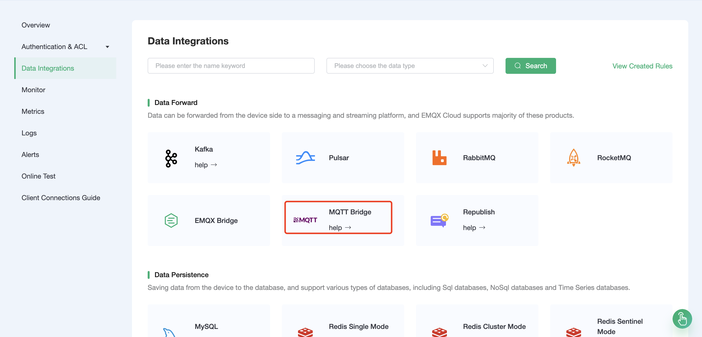
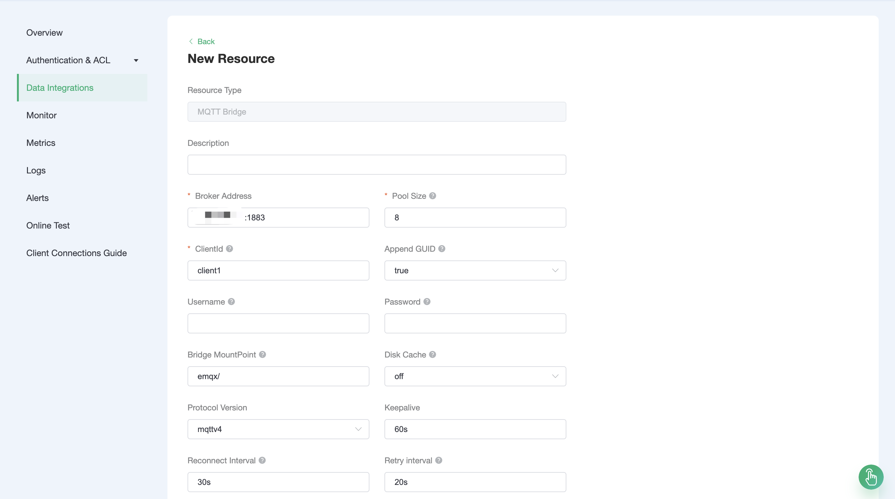
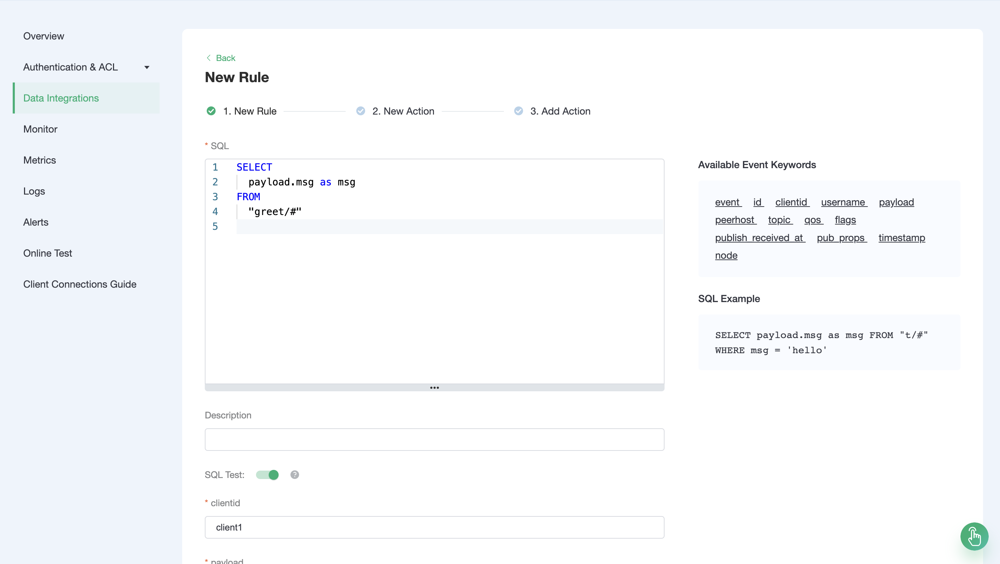
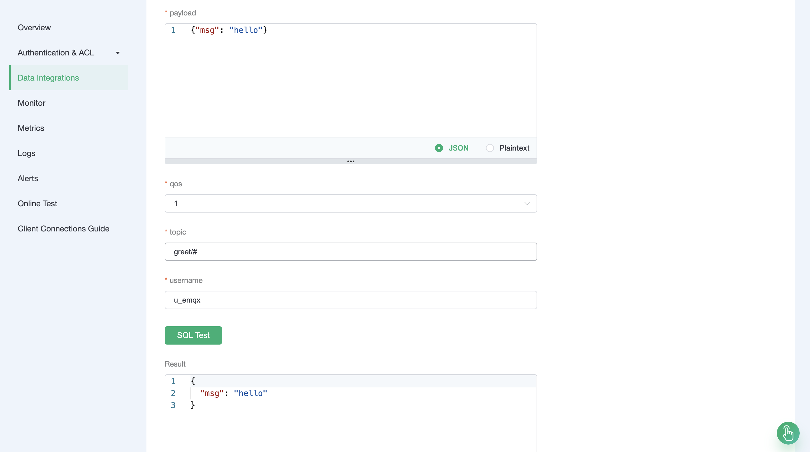
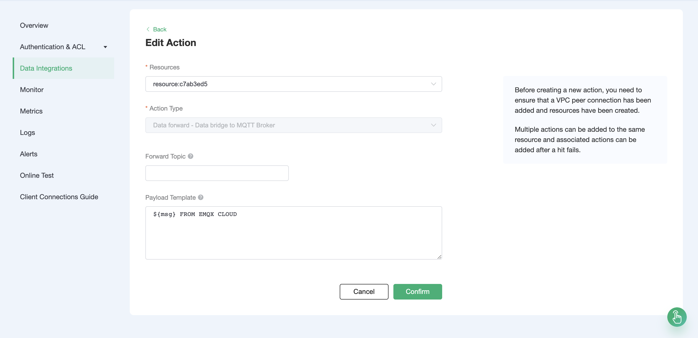
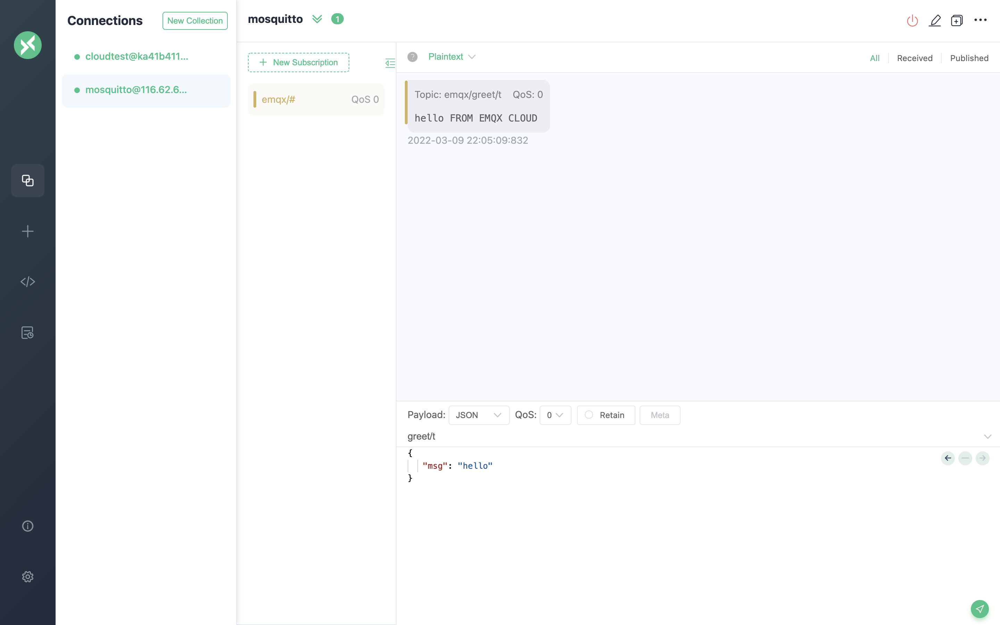

# Bridge device data to MQTT Broker Using the Data Integrations

In order to facilitate the message bridging of multiple MQTT Brokers, you can use the Data Integrations to operate.

This guide will create a a data integration bridged by MQTT Broker to achieve the following functions:

- Forward all messages sent to the greet topic to another MQTT Broker

In order to achieve this function, we will complete the following 4 tasks:

1. Start Mosquitto service
2. Set the filter conditions of the data integration
3. Create a resource and an action
4. Complete the data integrations creation and test

:::tip Tip
- Deployments have already been created on EMQX Cloud (EMQX Cluster).
- For Professional deployment users: Please complete [Peering Connection Creation](../deployments/vpc_peering.md) first, all IPs mentioned below refer to the internal network IP of the resource.(Professional Plan with a [NAT gateway](../vas/nat-gateway.md) can also use public IP to connect to resources)
- For basic deployment users: There is no need to complete peering connection, and the IP mentioned below refers to the public IP of the resource
:::

## Create Mosquitto service

In your cloud server, create a mosquitto service. For the convenience of demonstration, we use docker to build quickly here. (Do not use it in production environment)

```shell
docker run -it -p 1883:1883 --name mosquitto eclipse-mosquitto:1.6
```

After that, open the server's 1883 port

## EMQX Cloud Data Integrations configuration

Enter [EMQX Cloud Console](https://cloud-intl.emqx.com/console/), and click to enter the deployment to use MQTT Broker bridge.

On the deployment page, drop down to select the MQTT Bridge resource type.



## Create resources and actions

1. New Resource

   Click on Data Integrations on the left menu bar, fill in the private address of the server in the remote broker address, place the mount point on `emqx/`.

   - Remote broker address: fill in the IP address and port of the server.
   - Bridge MountPoint (**optional**): fill in `emqx/`, that is,  add the mount point emqx/in front of the forwarding topic.

   >**"Bridge MountPoint"** refers to the mount point of the bridge topic, which is usually applicable to scenarios where a mount point needs to be added before forwarding the topic. For example, if the mount point of the bridge topic is set to `emqx/`, when the local node sends a message to `topic1`, the topic of the remote bridge node will be changed to `emqx/topic1`.

   

   Then click Test. If "test available" returns, it means the test was successful.
   ::: tip Tip
   If the test fails, please check whether the [VPC peering connection](../deployments/vpc_peering.md) is completed and whether the IP address is correct.
   :::

2. Rule Testing

   Our goal is to trigger the engine when the topic of greet receives messages. Certain SQL processing is required here:

- Only target 'greet/#'

  According to the above principles, the SQL we finally get should be as follows:

  ```sql
  SELECT
    payload.msg as msg
  FROM
    "greet/#"
  ```

  
  

3. Add a response action

   Click Next, select the resource created in the first step, and fill in "${msg} FROM EMQX CLOUD" in the message content template, and click confirm.
   >**"Forwarding topic"**(optional): The topic to use when forwarding messages. If it is not provided, it defaults to the topic of the bridged message.

   

## Test

> If you are using EMQX Cloud for the first time, you can go to [Deployment Connection Guide](../connect_to_deployments/overview.md) to view the MQTT client connection and test guide

When creating a resource, we set the bridge mount point to `emqx/`, and when creating a new action, we set the forwarding message topic as empty, where the client subscribes to Mosquitto's `emqx/#` topic. The topic of the actual received message is **`emqx/greet/t`**.

At the same time, we send "hello" to the `greet/t` topic of EMQX Cloud, and the rule engine will be triggered. We can see that Mosquitto has received the message of "hello FROM EMQX CLOUD"


