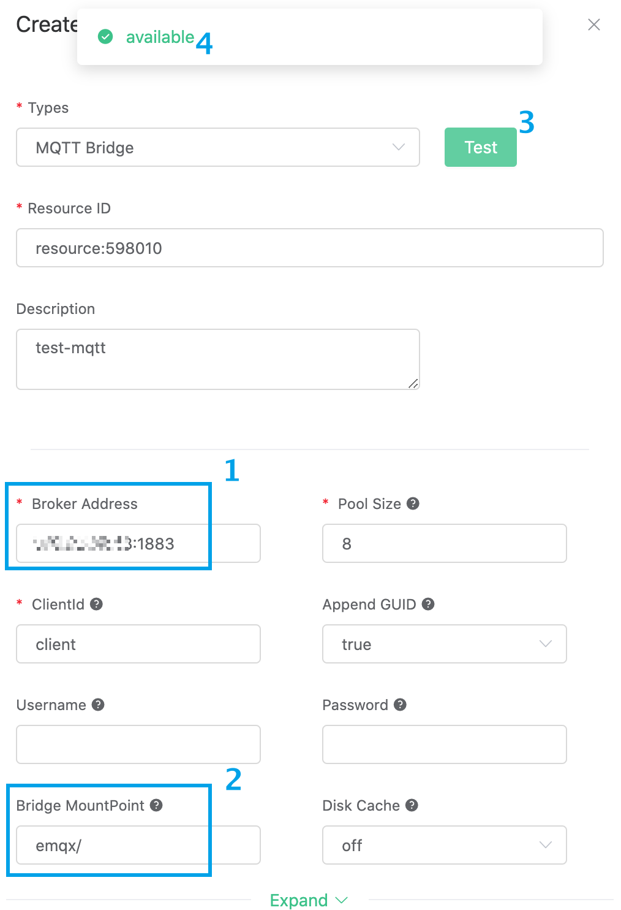

# Bridge device data to MQTT Broker using the Rule Engine

In order to facilitate the message bridging of multiple MQTT Brokers, you can use the rule engine to operate.

This guide will create a rule engine bridged by MQTT Broker to achieve the following functions:

- Forward all messages sent to the greet topic to another MQTT Broker


In order to achieve this function, we will complete the following 4 tasks:

1. Start Mosquitto service
2. Set the filter conditions of the rule engine
3. Create a resource and an action
4. Complete the rule engine creation and test

::: tip Tip
Before using the rule engine, create a deployment first.
For professional deployment users: please complete [Peering Connection](../deployments/vpc_peering.md) first, and ensure that the servers involved in the following are established in the VPC under the peering connection. All the IP mentioned below refer to the intranet IP of the resource
For basic deployment users: There is no need to complete peering connection, and the IP mentioned below refers to the public IP of the resource
:::


## 1. Create Mosquitto service

In your cloud server, create a mosquitto service. For the convenience of demonstration, we use docker to build quickly here. (Do not use it in production environment)

```shell
sudo docker run -it -p 1883:1883 adek06/mqtt:mosquitto
```

After that, open the server's 1883 port

## 2. Set the filter conditions of the rule engine

Enter [EMQ X Cloud Console](https://cloud.emqx.io/console/), and click to enter the deployment to use MQTT Broker bridge.

On the deployment page, select the rule engine and click Create.


Our goal is to trigger the engine when the topic of greet receives messages. Certain SQL processing is required here:

* Only target 'greet/#'

According to the above principles, the SQL we finally get should be as follows:

```sql
SELECT
  payload.msg as msg
FROM
  "greet/#"
```


## 3. Create resources and actions
Click Add Action. On the Select Action page, select Bridge Data to MQTT Broker, click Next, and on the Configure Action page, click Create Resource.


On the Create Resource page, select MQTT Bridge as the resource type, fill in the private address of the server in the remote broker address, place the mount point on emqx/, and click Test. If "test available" returns, it means the test was successful.

::: tip Tip
If the test fails, please check whether the [VPC peering connection](../deployments/vpc_peering.md) is completed and whether the IP address is correct. 
:::




Click OK to return to the configuration action page. The resource just created is selected by default. Fill in "${msg} FROM EMQ X CLOUD" in the message content template, and click OK.


The created action will be displayed in the response action column. After confirming that the information is correct, click Create in the lower right corner to complete the configuration of the rule engine.


## 4. Test

>If you are using EMQ X Cloud for the first time, you can go to [Deployment Connection Guide](../connect_to_deployments/introduction.md) to view the MQTT client connection and test guide

When configuring the action in the third step, we set the mount point to emqx/. Therefore, we use the client to subscribe to the topic emqx/# of Mosquitto.

At the same time, we send "hello" to the greet topic of EMQ X Cloud, and the rule engine will be triggered. We can see that Mosquitto has received the message of "hello FROM EMQ X CLOUD"


