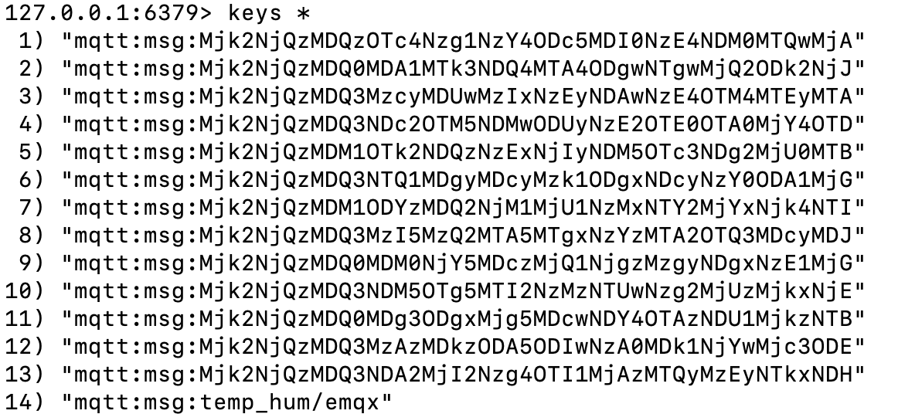

# Store Device Offline Messages Using Data Integrations

We will simulate temperature and humidity data and report them to the EMQX Cloud via the MQTT protocol, and then use EMQX Cloud data integration to save offline messages to cloud service resources (third-party database or message queue), which is implemented in this article using Redis as an example.

::: warning
QoS > 0 required to save offline messages
:::

Before you start, you need to complete the following operations:

- Deployments have already been created on EMQX Cloud (EMQX Cluster).
- For Professional Plan users: Please complete [Peering Connection Creation](../deployments/vpc_peering.md) first, all IPs mentioned below refer to the internal network IP of the resource.(Professional Plan with a [NAT gateway](../vas/nat-gateway.md) can also use public IP to connect to resources)

## Redis configuration

1. Install Redis

   ```bash
   docker run -itd --name redis -p 6379:6379 redis
   ```

## Data Integrations configuration

Go to Deployment Details and click on EMQX Dashbaord to go to Dashbaord.

1. New Resource

   Click on Rules on the left menu bar → Resources, click on New Resource and drop down to select the Redis single-node mode resource type. Fill in the Redis information you have just created and click Test. If there is an error, instantly check that the database configuration is correct.
   

2. Rule Testing
   Click on Rules on the left menu bar → Rules, click on Create and enter the following rule to match the SQL statement. We will read out its message information, if the topic is `temp_hum/emqx`.

   The FROM statement of the rule SQL explains.

   temp_hum/emqx: Publisher posts a message to "temp_hum/emqx" triggers saving offline messages to Redis

   $events/session_subscribed: Subscriber subscribes to topic "temp_hum/emqx" triggers fetching offline messages

   $events/message_acked: Subscriber replies to the message ACK and triggers the deletion of the received offline message

   ```sql
   SELECT
       *
   FROM
       "temp_hum/emqx",
       "$events/session_subscribed",
       "$events/message_acked"
   WHERE
       topic =~ 'temp_hum/emqx'
   ```

   

3. Add a response action

   Click on Add Action in the bottom left corner, drop down and select → Offline Message → Save Offline Message to Redis, select the resource created in the first step.

   ::: tip Tip
   Here you need to plan for the Redis Key expiration time, and it is recommended to save no more than 100 messages offline
   :::

   

4. Click on New Rule and return to the list of rules
   

5. View rules monitoring
   

## Test

1. Use [MQTT X](https://mqttx.app/) to simulate temperature and humidity data reporting

   You need to replace broker.emqx.io with the created deployment [connection address](../deployments/view_deployment.md), and add [client authentication information](../deployments/auth.md) to the EMQX Dashboard.

   ::: tip Tip

   QoS > 0 required to send messages
   :::

   

2. View data dump results

    ```bash
    $ docker exec -it redis bash
    $ redis-cli
    $ keys *
    ```

   

3. Use [MQTT X](https://mqttx.app/) to consume offline data
   In MQTT X, subscribe to topic temp_hum/emqx to get offline data.

   ::: tip Tip
   The QoS of the subscription topic must be greater than 0, otherwise the message will be received repeatedly.
   :::

   
   

4. View the data consumed by redis

   ```bash
   $ docker exec -it redis bash
   $ redis-cli
   $ keys *
   ```

   
