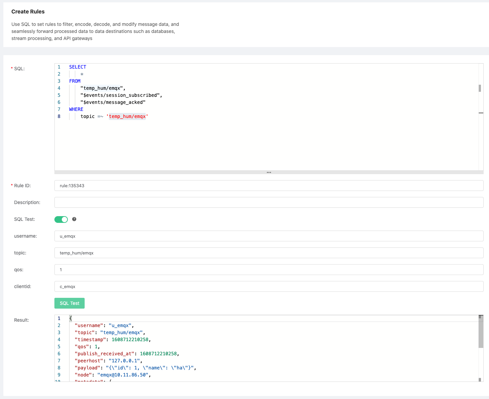
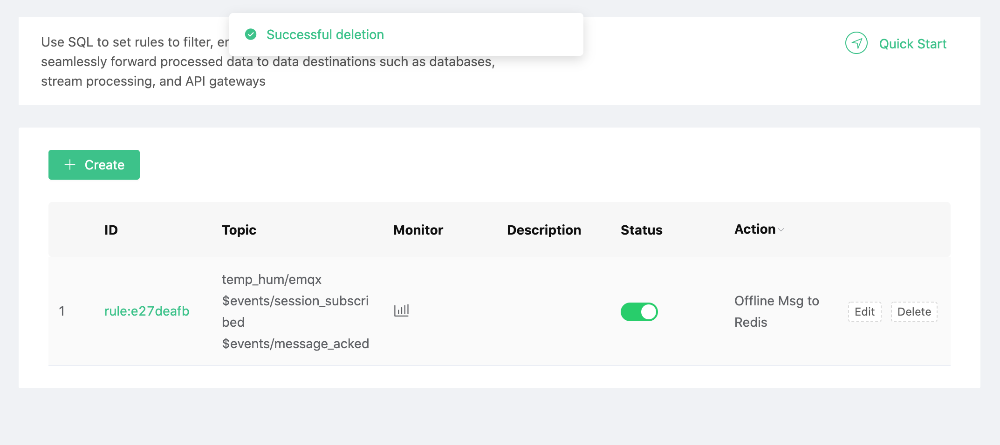
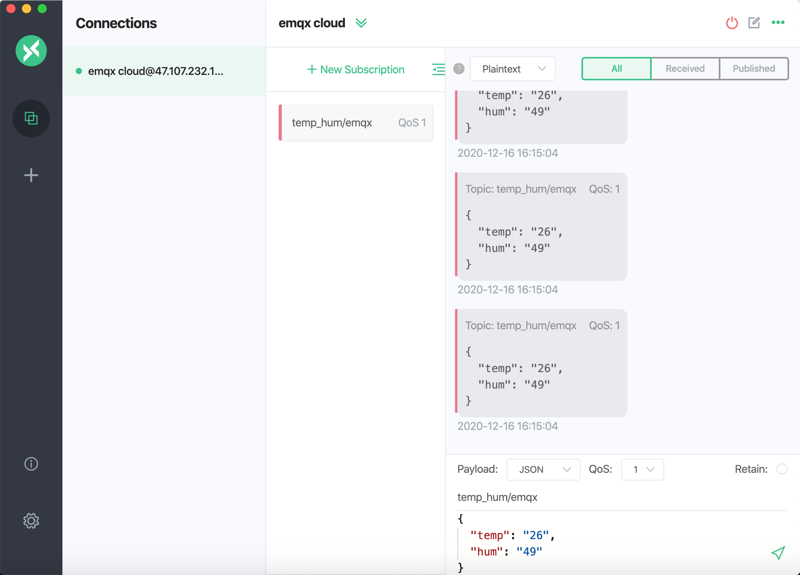
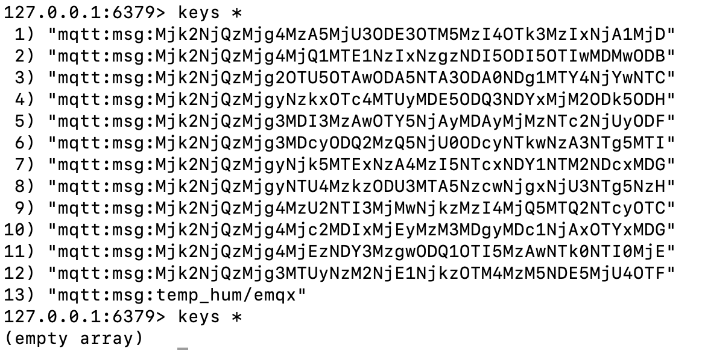

# Store device offline messages to Redis using the Rule Engine

In this article, we will simulate temperature and humidity data and report these data to EMQ X Cloud via the MQTT protocol and then use the EMQ X Cloud rules engine to dump the offline messages into Redis.

::: danger
QoS > 0 required to save offline messages
:::

Before you start, you need to complete the following operations:
* Deployments have already been created on EMQ X Cloud (EMQ X Cluster).
* For exclusive deployment users: Please complete [Peering Connection Creation](../deployments/vpc_peering.md) first, all IPs mentioned below refer to the intranet IP of the resource.
* For free trial and shared deployment users: No peering connection is required, all IPs below refer to the public IP of the resource.

### Redis configuration

1. Install Redis

   ```bash
   docker run -itd --name redis -p 6379:6379 redis
   ```

### EMQ X Cloud rules engine configuration

Go to Deployment Details and click on EMQ X Dashbaord to go to Dashbaord.

1. New Resource

   Click on Rules on the left menu bar → Resources, click on New Resource and drop down to select the Redis single-node mode resource type. Fill in the Redis information you have just created and click Test. If there is an error, instantly check that the database configuration is correct.
   

2. Rule Testing
   Click on Rules on the left menu bar → Rules, click on Create and enter the following rule to match the SQL statement. We will read out its message information, if the topic is `temp_hum/emqx`.

   ```sql
   SELECT
       *
   FROM
       "temp_hum/emqx",
       "$events/session_subscribed",
       "$events/message_acked"
   WHERE
       topic =~ 'temp_hum/emqx'
   ```
   

3. Add a response action

   Click on Add Action in the bottom left corner, drop down and select → Offline Message → Save Offline Message to Redis, select the resource created in the first step.

   ::: tip Tip
   Here you need to plan for the Redis Key expiration time, and it is recommended that no more than 100 messages be saved offline
   :::

   

4. Click on New Rule and return to the list of rules
   

5. View rules monitoring
   

### Test

1. Use [MQTT X](https://mqttx.app/) to simulate temperature and humidity data reporting

   You need to replace broker.emqx.io with the created deployment [connection address](../deployments/view_deployment.md), and add [client authentication information](../deployments/dashboard/users_and_acl.md) to the EMQ X Dashboard.

   ::: tip Tip

   QoS > 0 required to send messages
   :::

   

2. View data dump results

    ```bash
    $ docker exec -it myredis bash
    $ redis-cli
    $ keys *
    ```
   

3. Use [MQTT X](https://mqttx.app/) to consume offline data
   In MQTT X, subscribe to topic temp_hum/emqx to get offline data.

   
   

4. View the data consumed by redis

   ```bash
   $ docker exec -it myredis bash
   $ redis-cli
   $ keys *
   ```

   
