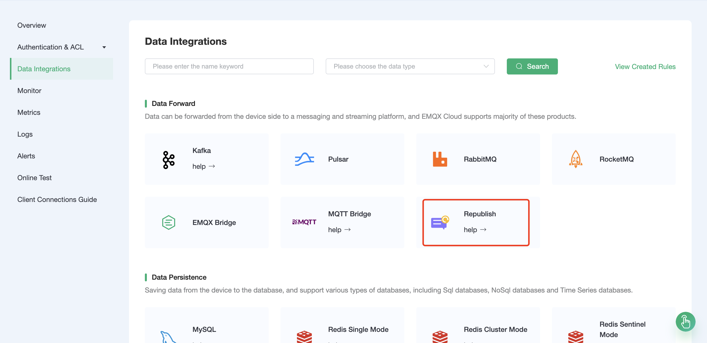
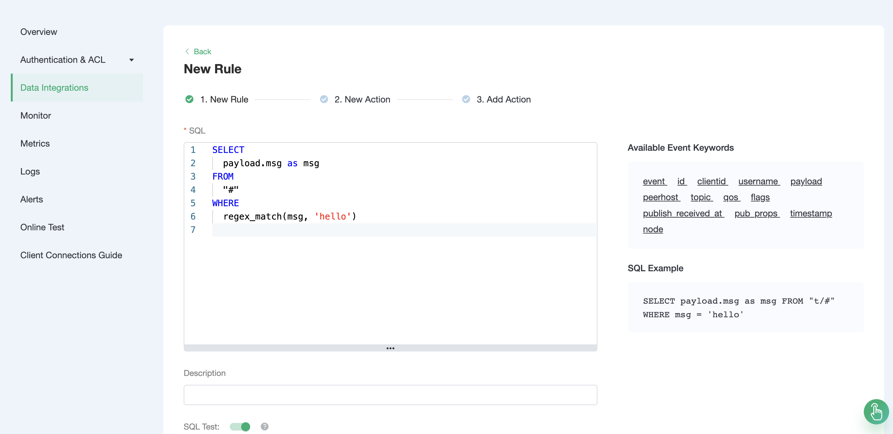
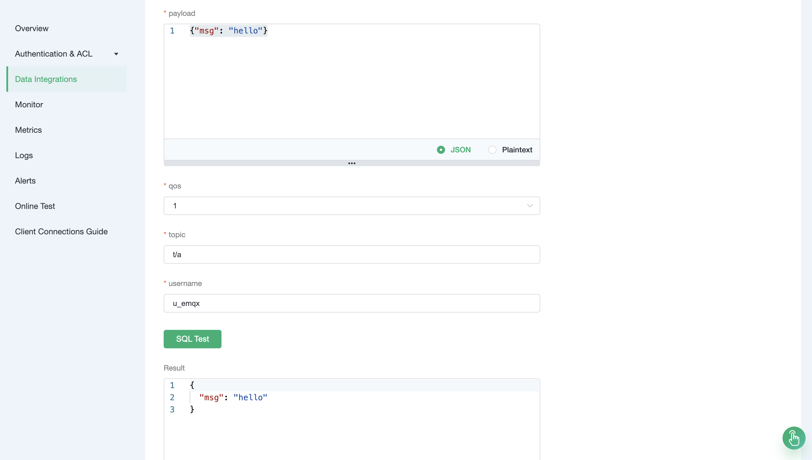
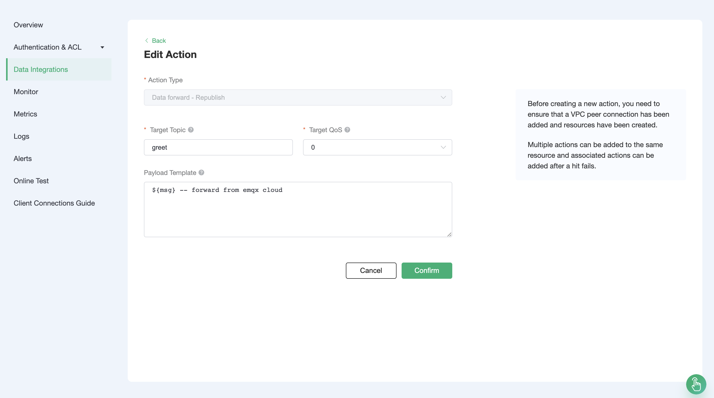
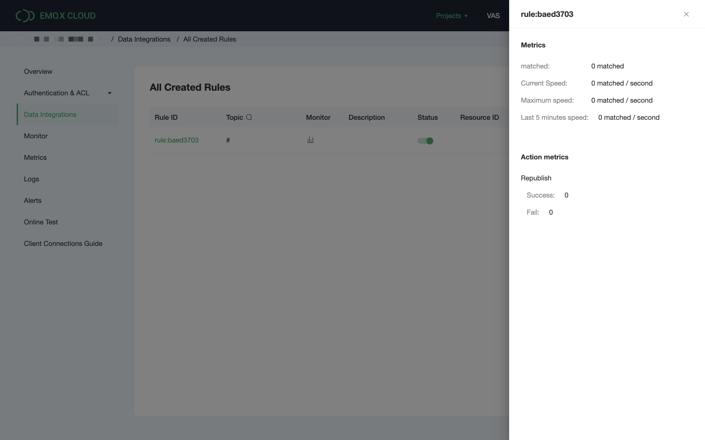
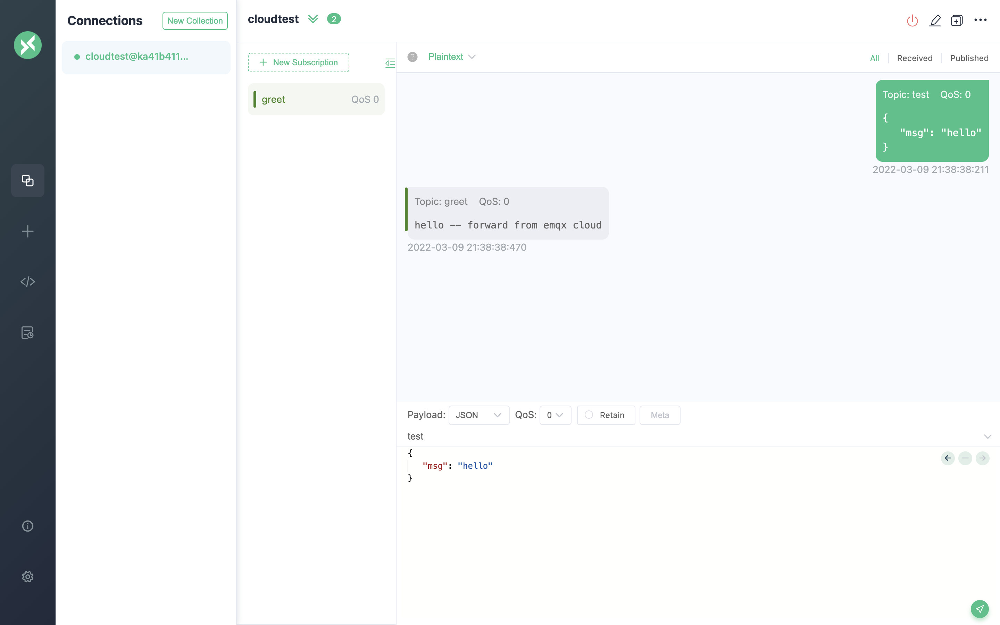

# Use the Data Integrations of message republishing

When a message meets a certain features, you want to publish it to other topics without writing code. EMQX Cloud has prepared such a service for you: By using the EMQX Cloud Data Integrations-message republishing, you can easily achieve this function.

This guide will complete the creation of a `message republishing` data integrations to achieve the following goals:

- When the msg of any message contains the string of 'hello', forward the message to the topic of greet.

In order to achieve this function, we will complete the following 3 tasks in turn:

1. Set the filter criteria of the Data Integrations
2. Create an action
3. Complete the creation of the Data Integrations and test it

## EMQX Cloud Data Integrations configuration

Go to Deployment Details and click on EMQX Dashboard to go to Dashboard.

1. Data Forward
   
   Click on Data Integrations on the left menu bar, drop down to select the Republish resource type.
   

2. Rule Testing
   
   Our goal is that as long as the msg contains the string of 'hello' in any message, the engine will be triggered. Certain SQL processing is required here:

- Target all topics, that is '#'
- Perform regular matching on the msg in the payload, and execute the rule if it contains the string of 'hello'

  According to the above principles, the SQL we finally get should be as follows:

  ```sql
  SELECT
    payload.msg as msg
  FROM
   "#"
  WHERE
    regex_match(msg, 'hello')
  ```

  

  You can click SQL test under the SQL input box to fill in the data:

  - topic: t/a
  - payload:

  ```json
  {
    "msg": "hello"
  }
  ```

  Click Test to view the obtained data results. If the settings are correct, the test output box should get the complete JSON data as follows:

  ```json
  {
    "msg": "hello"
  }
  ```

  The test output is consistent with expectations, and we can proceed to the next steps.
  ::: tip Tip
  If the test fails, please check whether the SQL is compliant
  :::

  

3. Add a response action
   
   Click to Next. In the configuration action page, set the target topic to greet, fill in "${msg} - forward from emqx cloud" in the message content template, and set the target QoS as default. Click confirm.
  

4. View rules monitoring
   
   

## Test

> If you are using EMQX Cloud for the first time, you can go to [Deployment Connection Guide](../connect_to_deployments/overview.md) to view the MQTT client connection and test guide

We try to send the following data to the test topic

```json
{
  "msg": "hello"
}
```

On the rule page, click Monitor and you can see that the number of successes becomes 1.


At the same time, a message forwarded from the topic greet was received.


