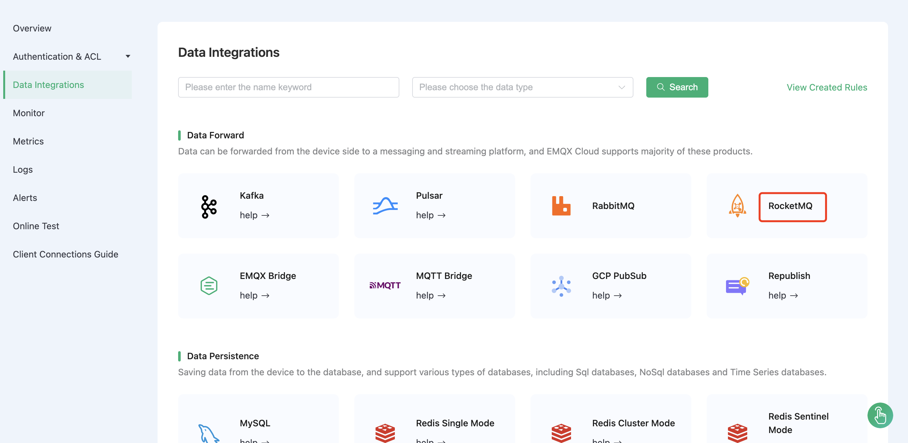
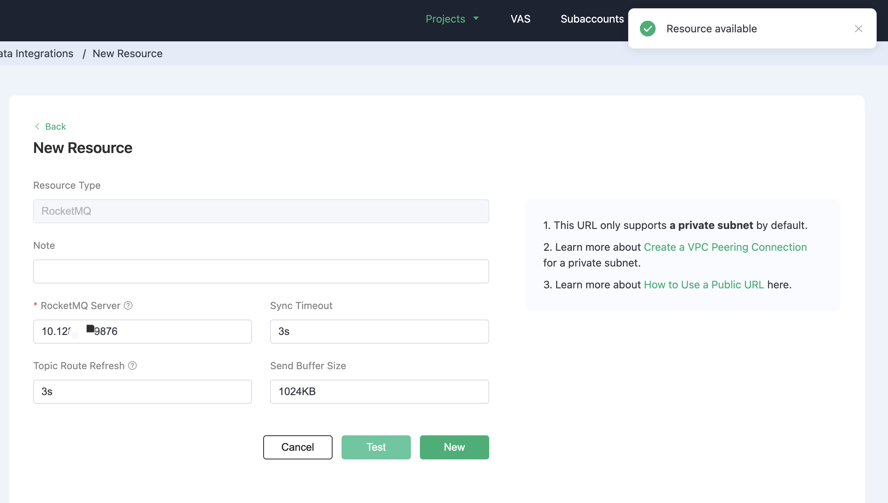
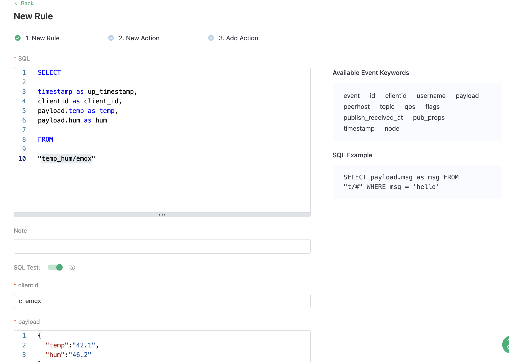
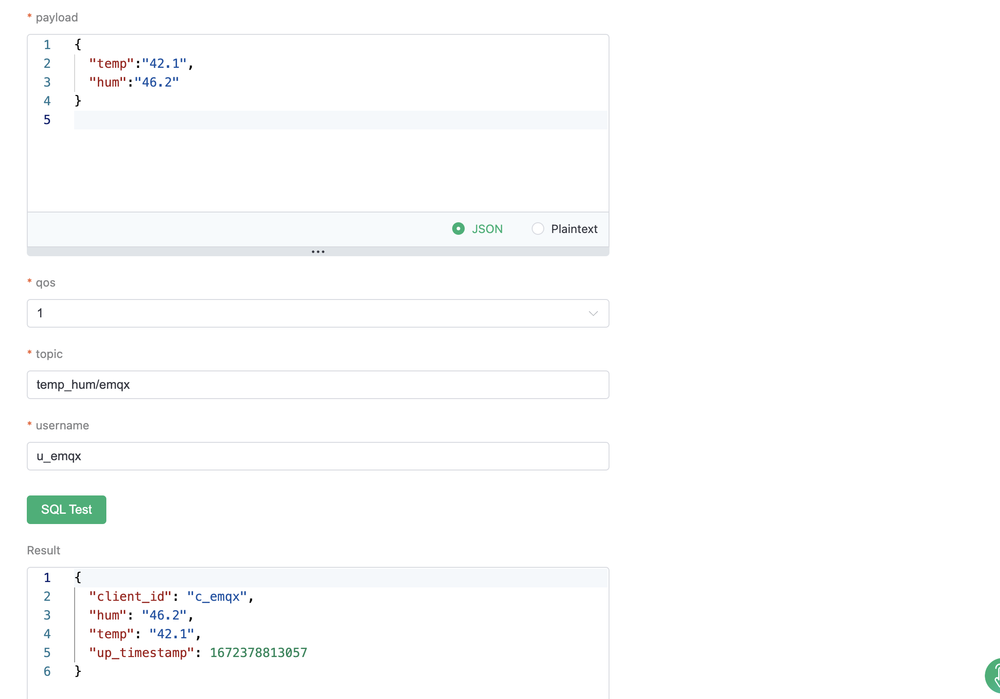
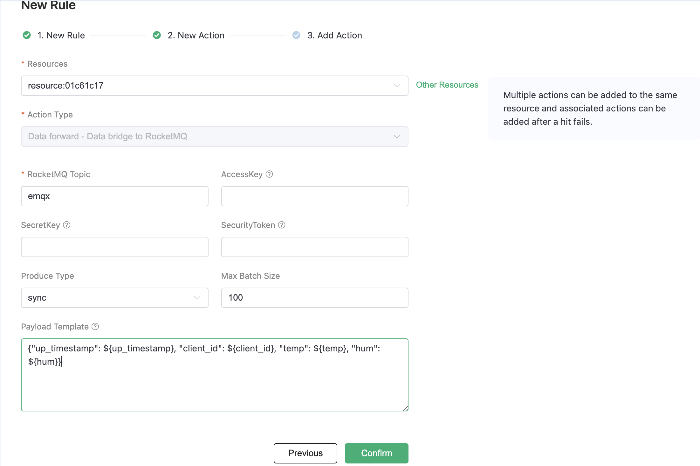
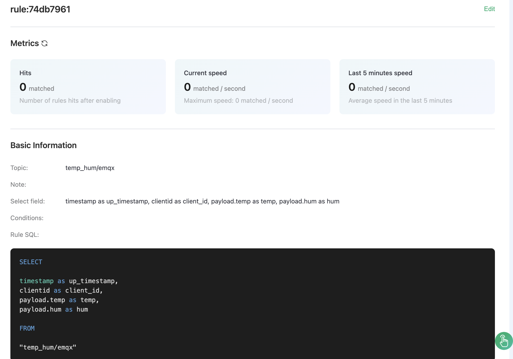
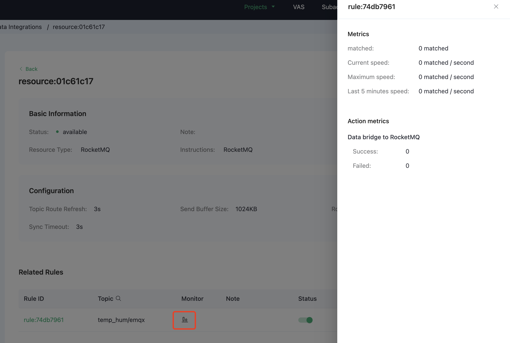
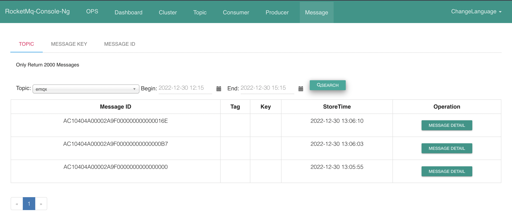

# Bridge device data to RocketMQ using the Data Integrations

[RocketMQ](https://rocketmq.apache.org/docs/4.x/) is a distributed message and streaming data platform with low latency, high performance, high reliability, trillion-level capacity, and flexible scalability.

In this article, we will simulate temperature and humidity data and report these data to EMQX Cloud via the MQTT protocol and then use the EMQX Cloud Data Integrations to bridge the data into RocketMQ.

Before you start, you need to complete the following operations:

* Deployments have already been created on EMQX Cloud (EMQX Cluster).

* For Professional deployment users: Please complete [Peering Connection Creation](../deployments/vpc_peering.md) first, all IPs mentioned below refer to the internal network IP of the resource.(Professional deployment with a [NAT gateway](../vas/nat-gateway.md) can also use public IP to connect to resources)

## RocketMQ configuration

1. Start NameServer

    ```bash
    docker run -d \
      --restart=always \
      --name rmqnamesrv \
      -p 9876:9876 \
      -e "MAX_POSSIBLE_HEAP=100000000" \
      rocketmqinc/rocketmq \
      sh mqnamesrv
   ```

2. Start the broker container

    ```bash
   # Modify the configuration file
   vi /opt/rocketmq/broker.conf
   brokerIP1=<Server private address>
   autoCreateTopicEnable = true

   docker run -d  \
      --restart=always \
      --name rmqbroker \
      --link rmqnamesrv:namesrv \
      -p 10911:10911 \
      -p 10909:10909 \
      -e "NAMESRV_ADDR=namesrv:9876" \
      -e "MAX_POSSIBLE_HEAP=200000000" \
      -v /opt/rocketmq/broker.conf:/etc/rocketmq/broker.conf \
      rocketmqinc/rocketmq \
      sh mqbroker -c /etc/rocketmq/broker.conf  
    ```

3. Install RocketMQ Console

    ```bash
    docker run -d --restart=always --name rmqconsole \
      --link rmqnamesrv:namesrv \
      -e "JAVA_OPTS=-Drocketmq.namesrv.addr=namesrv:9876 -Dcom.rocketmq.sendMessageWithVIPChannel=false" \
      -p 8080:8080 \
      -t styletang/rocketmq-console-ng
    ```

## Deployment Data Integrations Configuration

Go to the `Data Integrations` page

   

1. Create RocketMQ resources and verify that they are available.

   Click RocketMQ resources, fill in the rocketmq connection details, and then click test. Please check the RocketMQ service if the test fails.

   

2. Create a new rule

   Put the following SQL statement in the SQL input field. The device reporting message time (up timestamp), client ID, and message body (Payload) will be retrieved from the temp hum/emqx subject in the SQL rule, and the device ambient temperature and humidity will be read from the message body.

   ```sql
   SELECT 
   timestamp as up_timestamp, 
   clientid as client_id, 
   payload.temp as temp,
   payload.hum as hum
   FROM
   "temp_hum/emqx"
   ```

   

3. Rule SQL Testing

   To see if the rule SQL fulfills our requirements, click SQL test and fill in the test payload, topic, and client information.

   

4. Add Action to Rule

   Click Next to add a RocketMQ forwarding action to the rule once the SQL test succeeds. To demonstrate how to bridge the data reported by the device to RocketMQ, we'll utilize the following RocketMQ topic and message template.

   ```bash
   # rocketmq topic
   emqx
   
   # rocketmq message template 
   {"up_timestamp": ${up_timestamp}, "client_id": ${client_id}, "temp": ${temp}, "hum": ${hum}}
   ```

   

5. After successfully binding the action to the rule, click View Details to see the rule sql statement and the bound actions.

   

6. To see the created rules, go to Data Integrations/View Created Rules. Click the Monitor button to see the detailed match data of the rule.

   

## Test

1. Use [MQTT X](https://mqttx.app/) to simulate temperature and humidity data reporting

   You need to replace broker.emqx.io with the created deployment connection address, add client authentication information to the EMQX Dashboard.

   

2. View data bridging results

   Access your server's RocketMQ address and port through a browser, and you can get the message forwarding result for the corresponding topic on the Console page:

   
