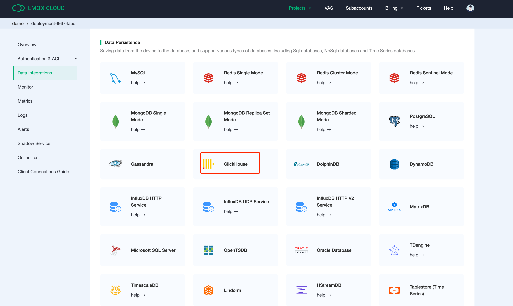
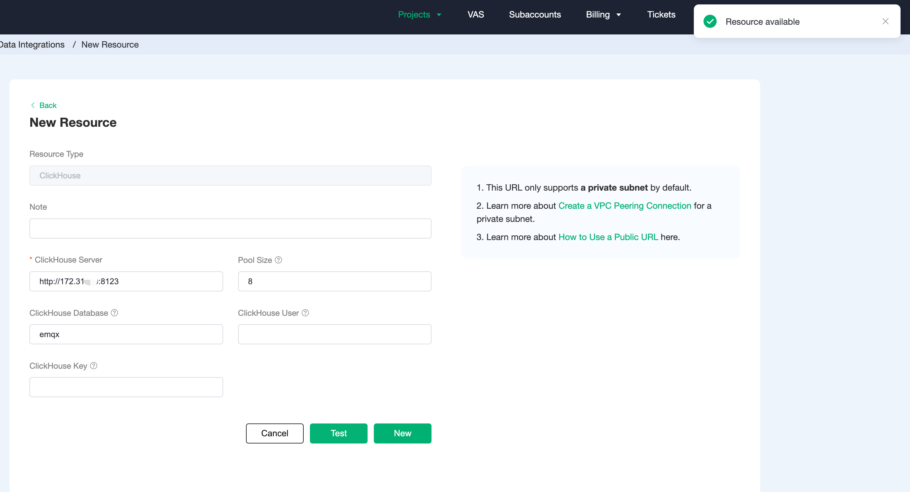
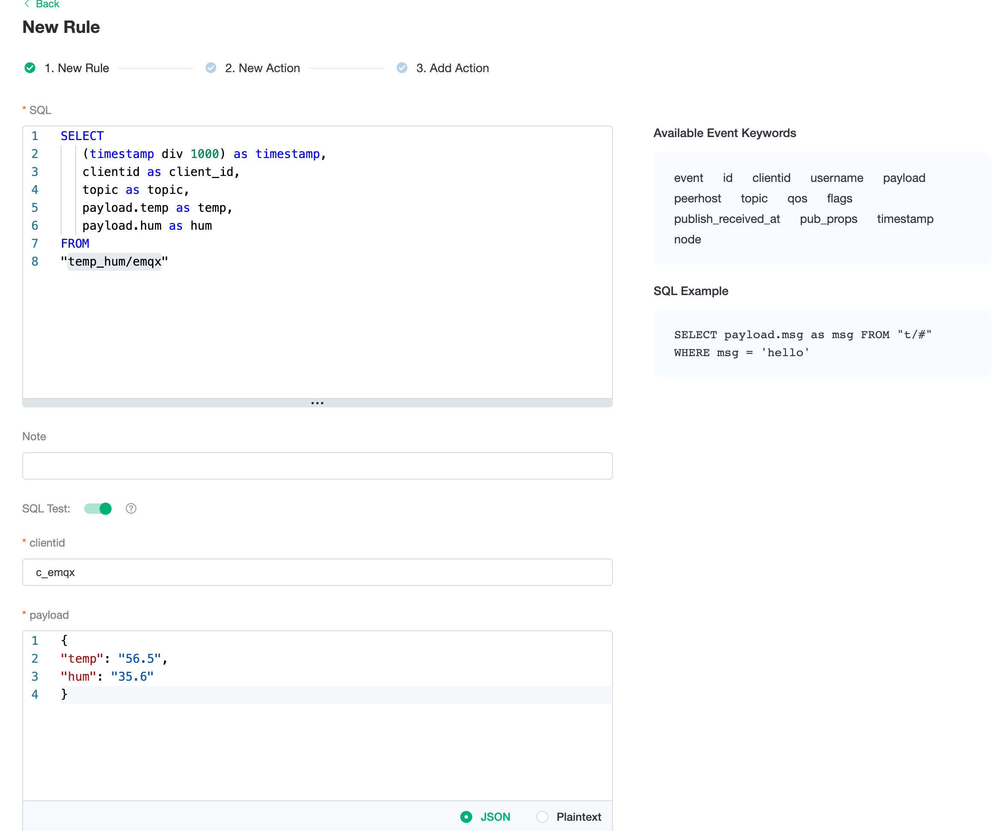
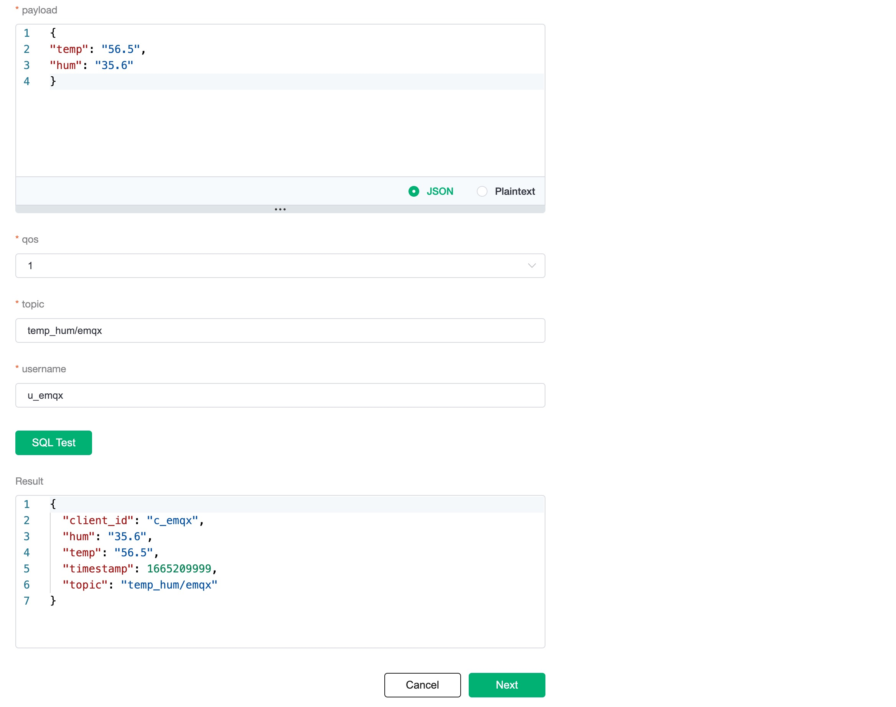
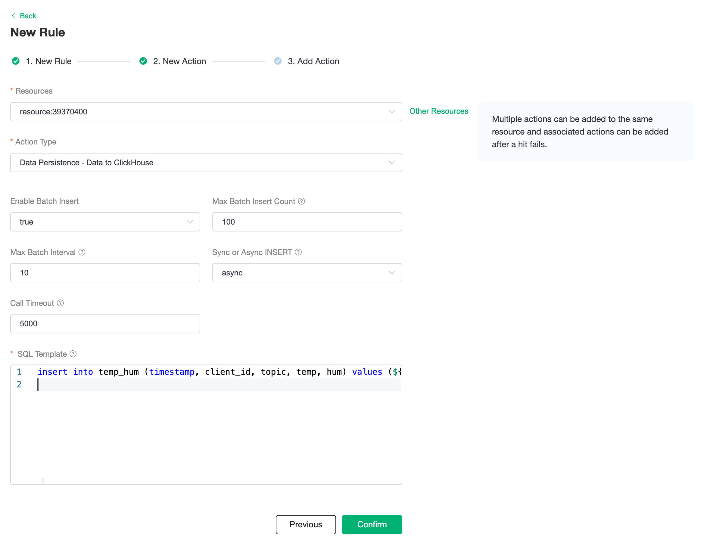
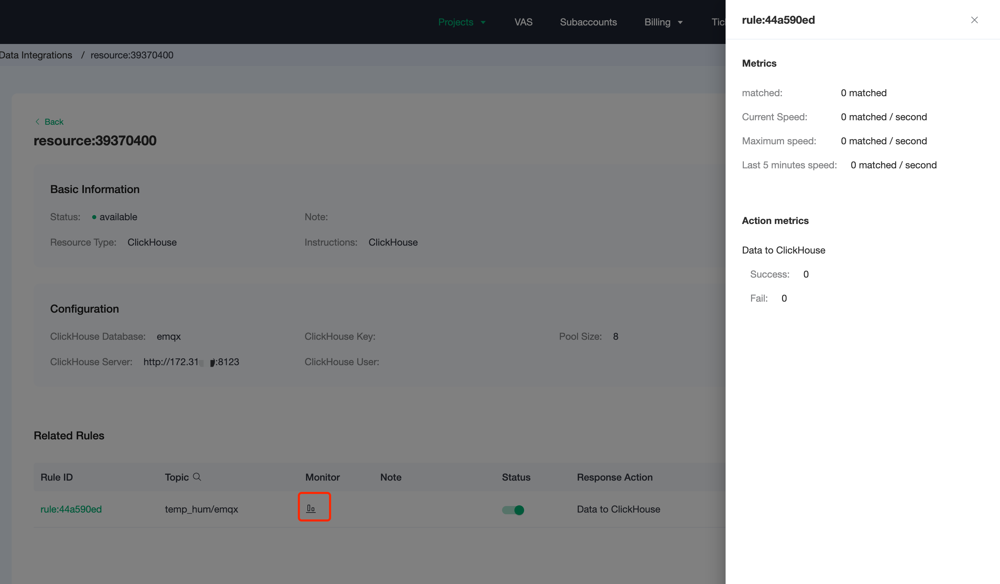
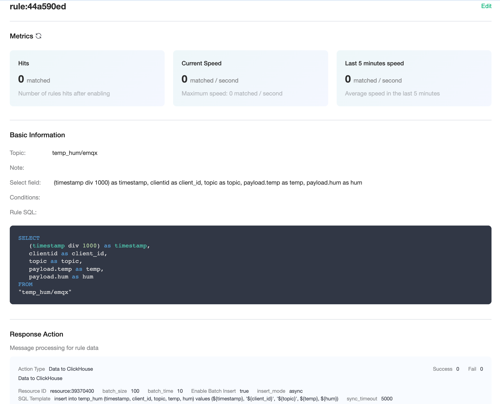
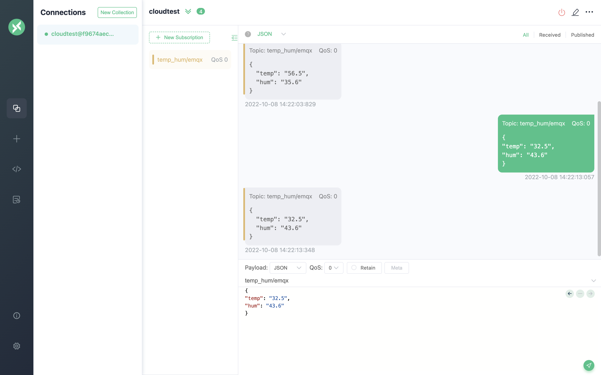
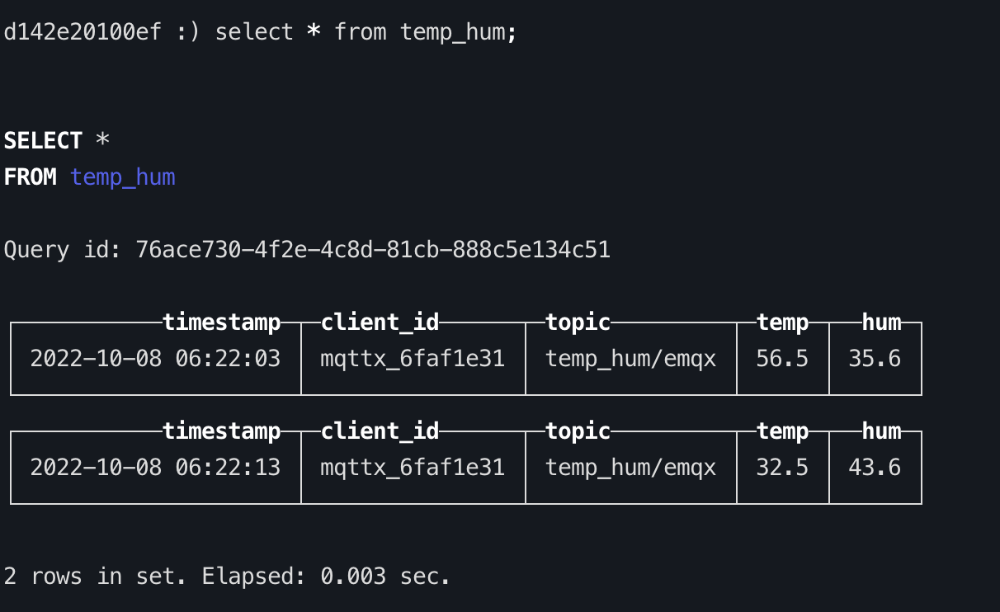

# Integrate with ClickHouse

[ClickHouse](https://clickhouse.com/docs/en/) is an open-source column-oriented DBMS (column-oriented DBMS) for data analysis (OLAP). It is currently used by many big manufacturers in China, including Tencent, Today's Headlines, Ctrip, Racer, Tiger, etc. The cluster size is up to thousands of nodes.

In this article, we will simulate temperature and humidity data and report it to EMQX Cloud via the MQTT protocol, and then use the EMQX Cloud data integrations to dump the data to ClickHouse.

Before you start, you need to complete the following operations:

- Deployments have already been created on EMQX Cloud (EMQX Cluster).
- For Professional deployment users: Please complete [Peering Connection Creation](../deployments/vpc_peering.md) first, all IPs mentioned below refer to the internal network IP of the resource.(Professional deployment with a [NAT gateway](../vas/nat-gateway.md) can also use public IP to connect to resources)

## ClickHouse configuration

1. Install ClickHouse

   ```bash
   # server
   docker run -d --name clickhouse-server -p 9000:9000 -p 8123:8123 --ulimit nofile=262144:262144 -v=/opt/clickhouse:/var/lib/clickhouse yandex/clickhouse-server
   ```

2. New database

   ```bash
   # run clickhouse-client 
   docker exec -it clickhouse-server bash
   clickhouse-client
   
   create database emqx;
   use emqx;
   ```

3. New table

   Use the following SQL statement to create `temp_hum` table. This table will be used to save the temperature & humidity data of device data.

   ```sql
   CREATE TABLE temp_hum (timestamp DateTime, client_id String, topic String, temp Float32, hum Float32) ENGINE = MergeTree() PARTITION BY toYYYYMM(timestamp) ORDER BY (timestamp);
   ```

## EMQX Cloud Data Integrations configuration

Go to your deployment and click on the `Data Integrations` menu bar on the left.

1. New Resource

   Click on `Data Integration` in the left menu bar, find ClickHouse under Data Persistence and click on New Resource.

   

   Fill in the information about the ClickHouse database you have just created and click on Test. If an error occurs, you should promptly check if the database configuration is correct.

   

2. Fill in rule

   Once the resource has been created, click on New Rule and enter the following rule to match the SQL statement. In the following rule, we get the data reported in the message from the `temp_hum/emqx` topic.

   ```sql
   SELECT
      (timestamp div 1000) as timestamp,
      clientid as client_id,
      topic as topic,
      payload.temp as temp,
      payload.hum as hum
   FROM
   "temp_hum/emqx"
   ```

   We can use the `SQL test` to test and see the results.

   
   

3. Add a response action

   Click Next to go to the Actions screen, select the resource created in step 1, select `Data Persistence - Save Data to ClickHouse` for the action type and enter the following data to insert into the SQL template and click confirm.

   ```sql
   insert into temp_hum (timestamp, client_id, topic, temp, hum) values (${timestamp}, '${client_id}', '${topic}', ${temp}, ${hum})
   ```

   

4. View Resource Detail

   Click on the resource to see the detail.

   

5. Check Rules Monitoring

   Click the monitor icon of rule to see the metrics

   

## Test

1. Use [MQTTX](https://mqttx.app/) to simulate reporting temperature and humidity data.

   You need to replace broker.emqx.io with the deployment connection address you have created and add the client-side authentication information in the EMQX Cloud console.

    - topic: `temp_hum/emqx`
    - payload:

      ```json
      {
      "temp": "32.5",
      "hum": "43.6"
      }
      ```

   

2. View data dump results

   ```sql
   select * from temp_hum;
   ```

   
