# Save device data to ClickHouse Cloud using the Data Integrations

[ClickHouse](https://clickhouse_cloud.com/docs/en/) is a column-oriented database management system (DBMS) for online analytical processing of queries (OLAP). ClickHouse’s performance exceeds all other column-oriented database management systems. It processes billions of rows and tens of gigabytes of data per server second.

A couple days ago, ClickHouse announced the launch of [ClickHouse Cloud](https://clickhouse_cloud.com/cloud), a lightning-fast cloud-based database that simplifies and accelerates insights and analytics for modern digital enterprises.

In this article, we will simulate temperature and humidity data and report it to EMQX Cloud via the MQTT protocol, and then use the EMQX Cloud data integrations to dump the data to ClickHouse Cloud.

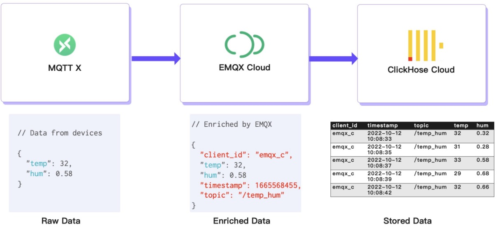

Before you start, you need to complete the following operations:

- Deployments have already been created on EMQX Cloud (EMQX Cluster).
- For Professional deployment users: Please complete [NAT gateway](../vas/nat-gateway.md) first, all IPs mentioned below refer to the public IP of the resource.

## ClickHouse Cloud configuration

[ClickHouse Cloud](https://clickhouse_cloud.com/cloud) is in public beta and you can apply for a free trial at the official ClickHouse website. It offers a 14-day free trial.

ClickHouse provides a [quick start](https://clickhouse_cloud.com/docs/en/quick-start), just follow the steps on the doc and you will get an instance up and running in minutes. During this setup, the ClickHouse instance was created on AWS in N. Virginia (us-east-1) as an EMQX Cloud instance was also deployed in the same region.

During the setup process, you will also need to pay attention to the connection settings. In this article, we use "Anywhere", but if you choose a specific location, you will need to add the NAT gateway IP address you got from your EMQX Cloud deployment to the whitelist.


After the provisioning, you should be able to see the service running:

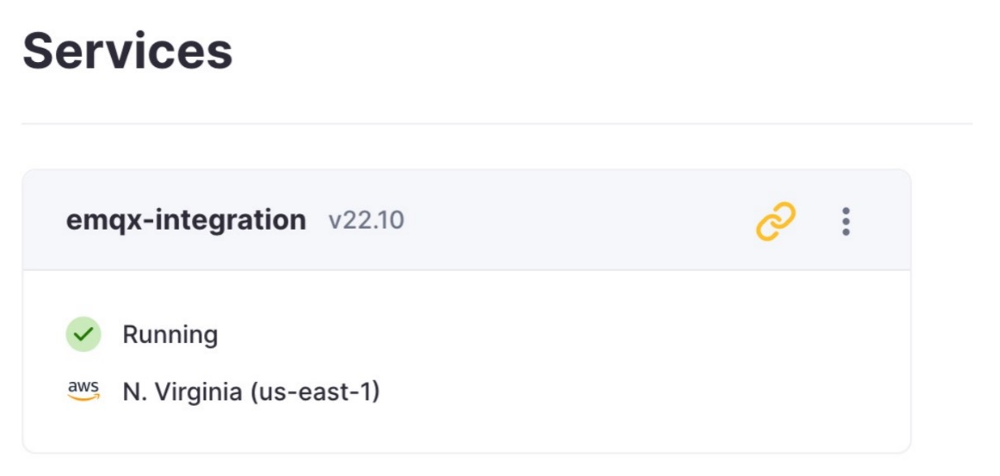

Click on the link in the panel and you will find the connection string, which is needed when setting up the integration with EMQX Cloud.

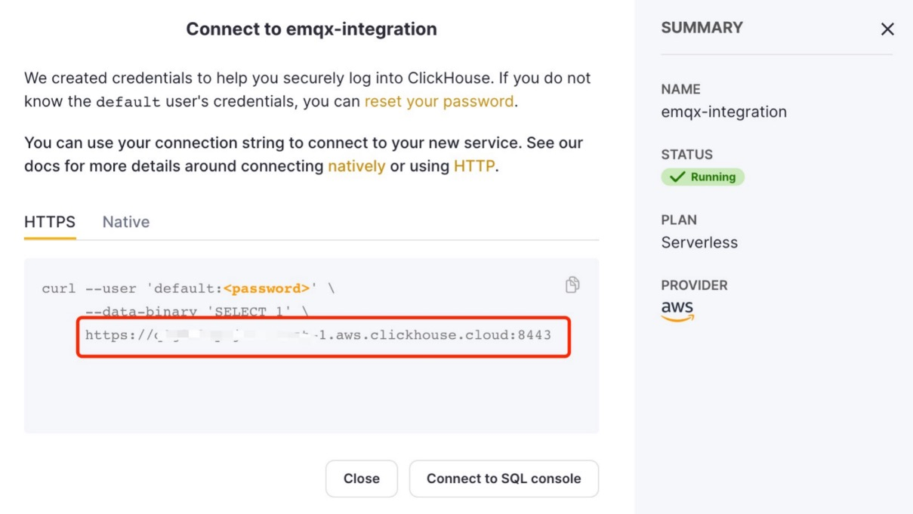

The credentials you created are also needed for the integration.

Click ‘Connect to SQL console’ button and let’s create a database and table.

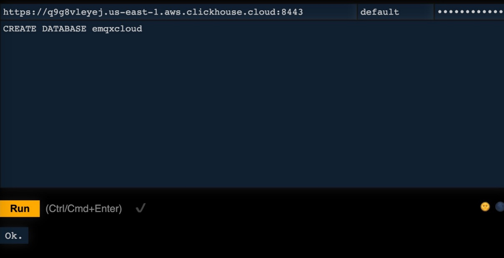

In this article, we created a database named `emqxcloud`. Then create a table named "temp_hum" to store the temperature and humidity data from the EMQX cloud.

   ```sql
   CREATE TABLE emqxcloud.temp_hum 
   (
      client_id String, 
      timestamp DateTime, 
      topic String, 
      temp Float32, 
      hum Float32
   ) 
   ENGINE = MergeTree() 
   PRIMARY KEY (client_id, timestamp)
   ```

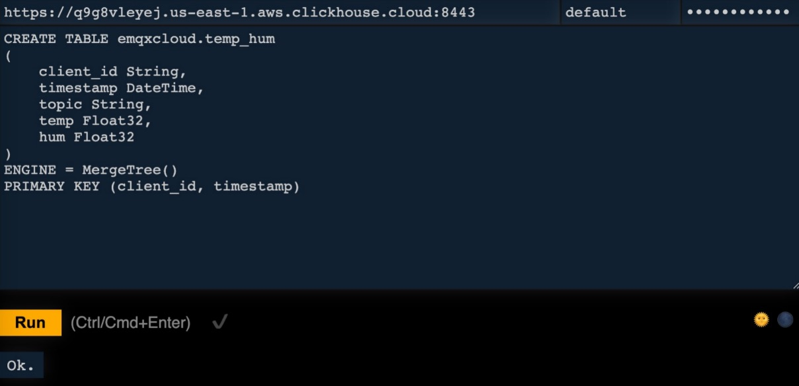

As you can see, this table has 5 columns and in addition to temperature and humidity, it also records the topic name, client id and timestamp.

Now we have all the settings for the ClickHouse service.

## EMQX Cloud Data Integrations configuration

Go to your deployment and click on the `Data Integrations` menu bar on the left.

1. New Resource

   Click on `Data Integration` in the left menu bar, find ClickHouse Cloud under Data Persistence and click on New Resource.

   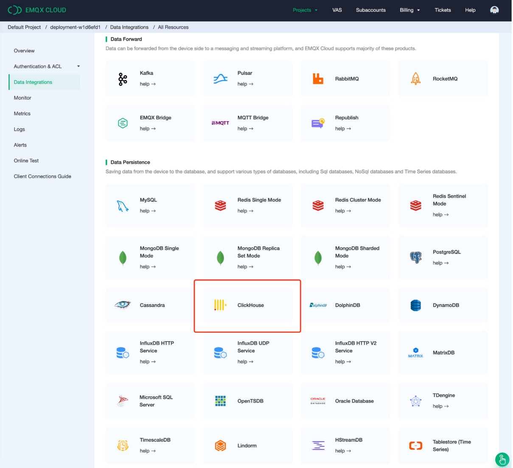

   Fill in the information about the ClickHouse Cloud database you have just created and click on `Test`. If an error occurs, you should promptly check if the database configuration is correct.

   - Note: add a note for this resource
   - Server address: this is the address of your ClickHouse Cloud service, remember don’t forget the port.
   - Database name: `emqxcloud` we created in the above steps.
   - User: the username for connecting to your ClickHouse Cloud service.
   - Key: the password for the connection.

   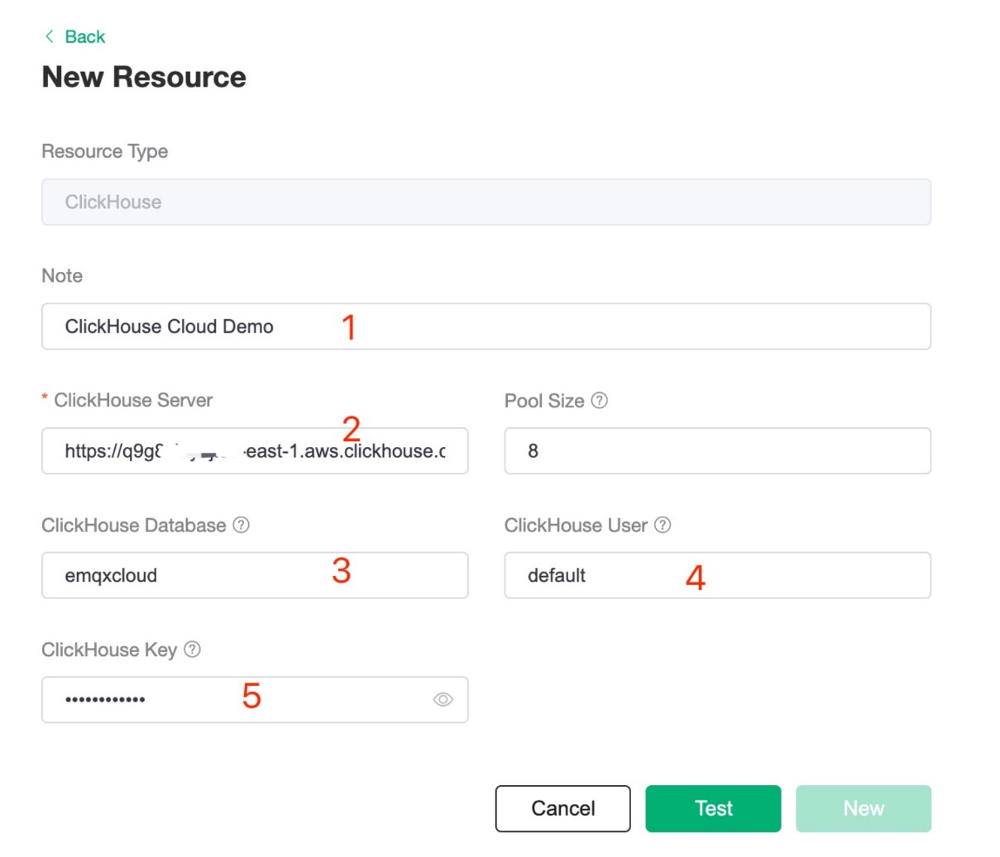

2. Fill in rule

   Once the resource has been created, click on New Rule and enter the following rule to match the SQL statement. In the following rule, we get the data reported in the message from the `/temp_hum` topic.

   ```sql
   SELECT
      clientid as client_id,
      (timestamp div 1000) as timestamp,
      topic as topic,
      payload.temp as temp,
      payload.hum as hum
   FROM
   "/temp_hum"
   ```

   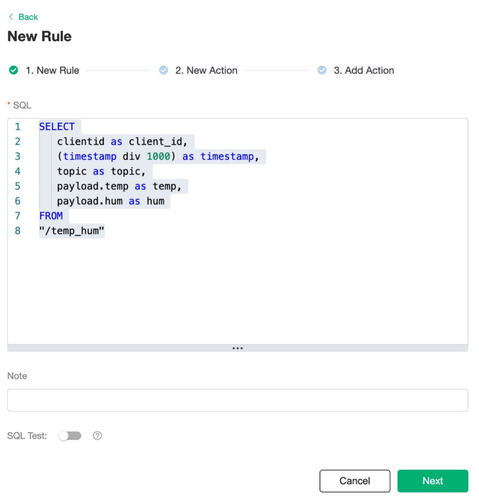

   We can use the `SQL test` to test and see the results. It will read the messages from the `/temp_hum` topic and enrich the JSON object by adding client_id, topic, and timestamp info.

   So, the raw JSON you send to the topic:

   ```bash
   {"temp": 28.5, "hum": 0.68}
   ```

   It will be converted into:

   ```bash
   {
     "client_id": "c_emqx",
     "hum": 0.68,
     "temp": 28.5,
     "timestamp": 1665568455,
     "topic": "/temp_hum"
   }
   ```

3. Add a response action

   Click Next to go to the Actions screen, select the resource created in step 1, select `Data Persistence - Save Data to ClickHouse Cloud` for the action type and enter the following data to insert into the SQL template and click confirm.

   ```sql
   INSERT INTO temp_hum (client_id, timestamp, topic, temp, hum) VALUES ('${client_id}', ${timestamp}, '${topic}', ${temp}, ${hum})
   ```

   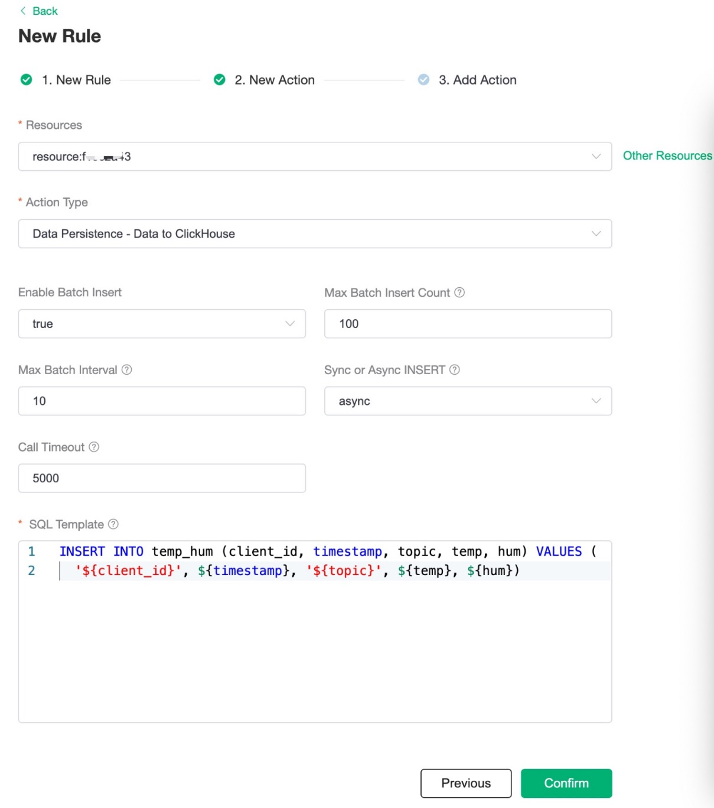

4. View Rule Detail

   Click on the rule id to see the detail. All the MQTT messages sent to the `/temp_hum` topic will be enriched and persisted into your ClickHouse Cloud database.

   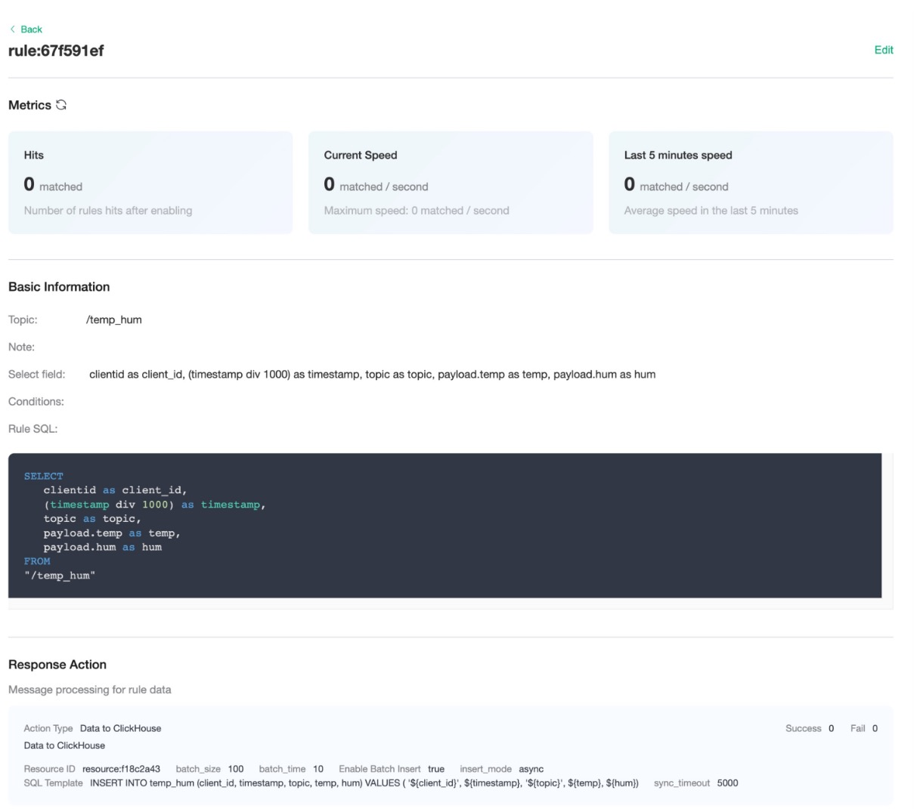

## Test

1. Use [MQTT X](https://mqttx.app/) to simulate reporting temperature and humidity data.

   You need to replace broker.emqx.io with the deployment [connection address](../deployments/view_deployment.md) you have created and add the [client-side authentication information](../deployments/auth.md) in the EMQX Cloud console.

    - topic: `/temp_hum`
    - payload:

      ```json
      {
      "temp": "26.5",
      "hum": "0.38"
      }
      ```

   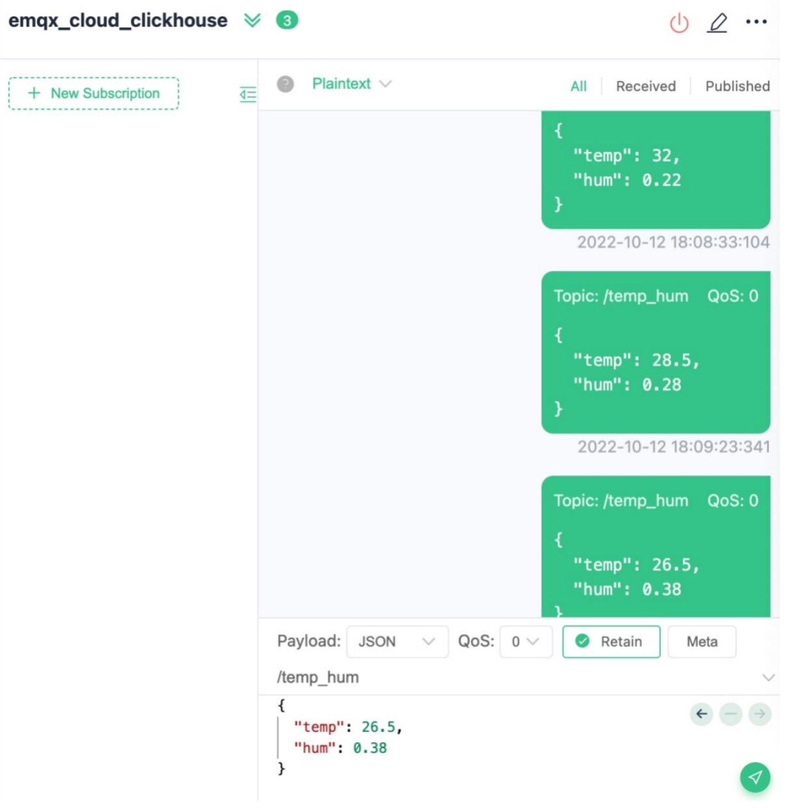

   Click the send button on the right. You can change the temperature value and send more data to MQTT broker.

   The data sent to EMQX Cloud should be processed by the rule engine and inserted into ClickHouse Cloud automatically.

2. View data dump results

   You can connect to the SQL console on ClickHouse Cloud panel or use any client tool to fetch data from your ClickHouse. In this article, we used the SQL console.

   By executing the SQL:

   ```sql
   SELECT * FROM emqxcloud.temp_hum
   ```

   You will see the data you published to EMQX Cloud is now stored in ClickHouse Cloud.

   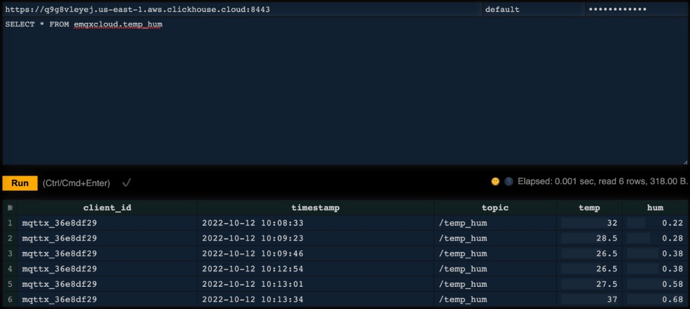
