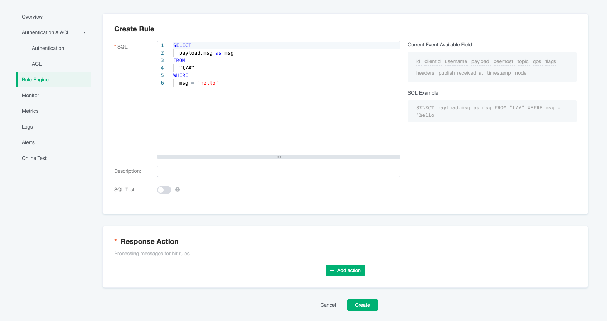
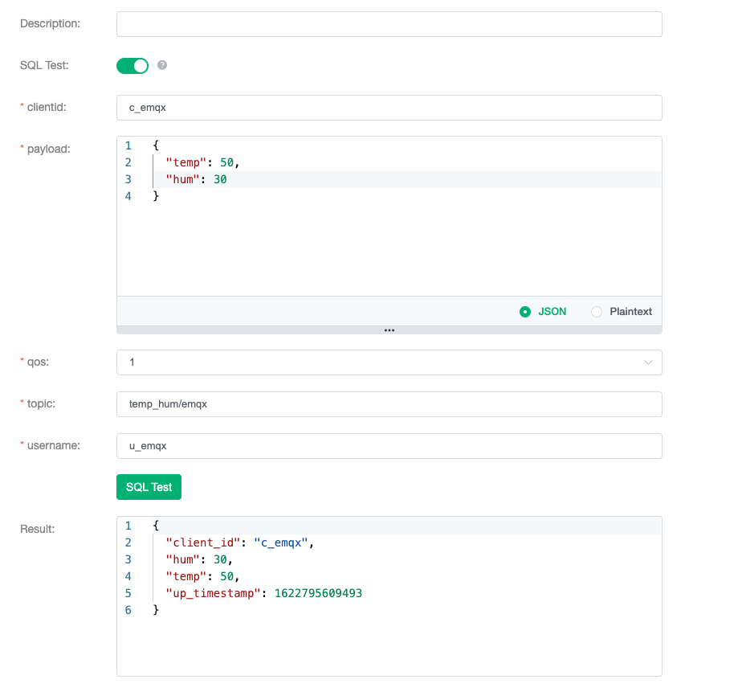
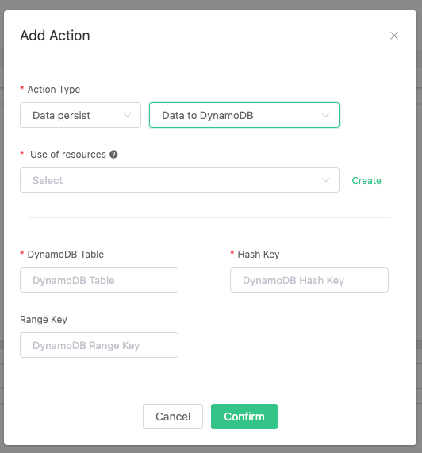
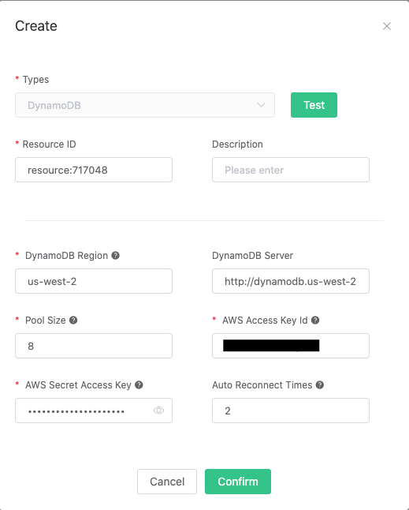
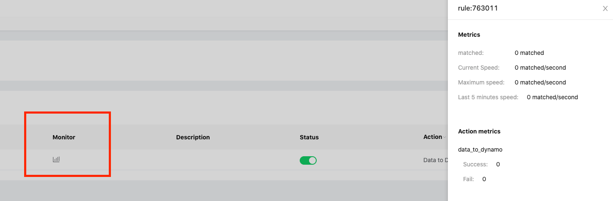
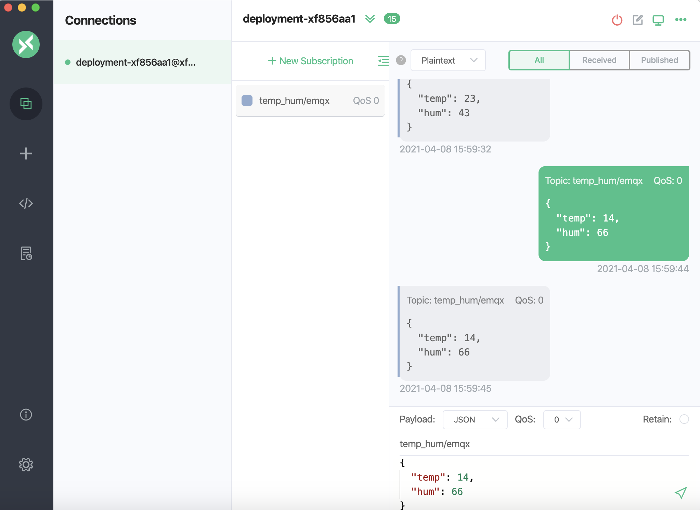

# Save device data to DynamoDB using the Rule Engine

In this article, we will simulate the temperature and humidity
data, and publish these data to EMQ X Cloud via the MQTT protocol, and then we will use the EMQ X Cloud
rule engine to store the data to DynamoDB.

Before you start, you will need to complete the following:

* A deployment (EMQ X Cluster) has been created on EMQ X Cloud.

* For professional deployment users: Please complete the creation of a [VPC Peering Connection](../deployments/security_features_and_settings/vpc_peering.md) first. All IPs mentioned below refer to the resource's intranet IP.

* For basic deployment users: No VPC Peering Connection is required. All IPs mentioned below refer to the resource's public IP.

## DynamoDB Configuration

### Create a DynamoDB table

You could create a new DynamoDB table by the following steps:

1. Download DynamoDB locally (using macOS X as an example):
   
   ```bash
   $ brew install dynamodb-local
   $ dynamodb-local
   ```
   
2. Create a JSON file called `temp_hum.json` to define a table called temp_hum

   ```json
   {
      "TableName": "temp_hum",
      "KeySchema": [
            { "AttributeName": "hum", "KeyType": "HASH"},
            { "AttributeName": "temp", "KeyType": "RANGE"}
       ],
      "AttributeDefinitions": [
            { "AttributeName": "hum", "AttributeType": "N" },
            { "AttributeName": "temp", "AttributeType": "N" }
      ],
      "ProvisionedThroughput": {
            "ReadCapacityUnits": 5,
            "WriteCapacityUnits": 5
      }
   }
   ```
   
3. Initialize table

   ```bash
   $ aws dynamodb create-table --cli-input-json file://temp_hum.json --endpoint-url http://localhost:8000
   ```   


## Rule Engine Configuration

### Create a new Rule

* Select `Rule Engine` from the left menu bar and select the `+ New` button to go to the page of creating a new rule.

   

* Change the SQL command into the following:

   ```sql
   SELECT 

   timestamp as up_timestamp, clientid as client_id, payload.temp as temp, payload.hum as hum

   FROM

   "temp_hum/emqx"
   ```
   
   You could also test the sql command to see if it gives the results you want:

   

### Add a response action

*   Towards the bottom of the page, click the `Add Action` button and select data persist for DynamoDB.
   
      

*   In order to add a response action, you need to create a resource first. Click on the `Create` button to a new resource.

*   In the creation page, fill in the DynamoDB information. You could always test connectivity by clicking the `Test` button before actually create the resource.

      

*   Click the `Confirm` button to finish creation and return to the creating action page. Filling in the information for the DynamoDB Table and click `Confirm`.

      

   Click the `Create` button at the bottom of the page to finish creating the rule. You could also monitor the rules by following:

   


## Test

1. Use [MQTT X](https://mqttx.app/) to simulate publishing temperature and humidity data

   You need to replace broker.emqx.io with the deployment [connection address](../deployments/view_deployment.md) you have created and add the [client-side authentication information](../deployments/auth_and_acl.md) in the EMQ X Dashboard.
   

2. View stored results
   
      ```bash
      $aws dynamodb scan --table-name temp_hum --region us-west-2 --endpoint-url http://localhost:8000    
      ```
