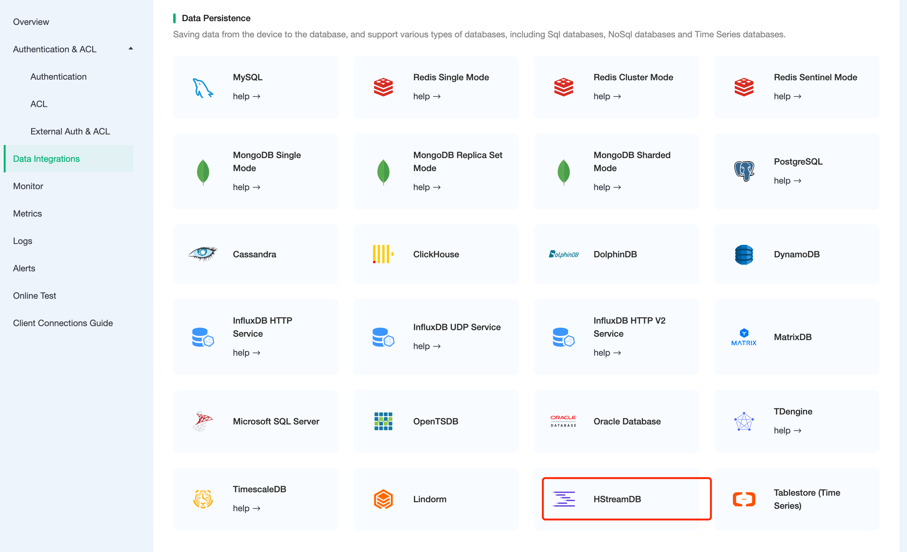
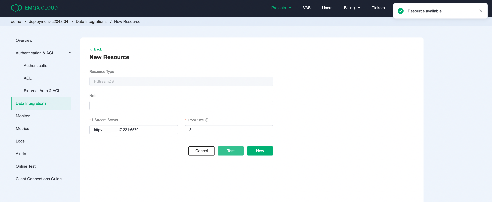
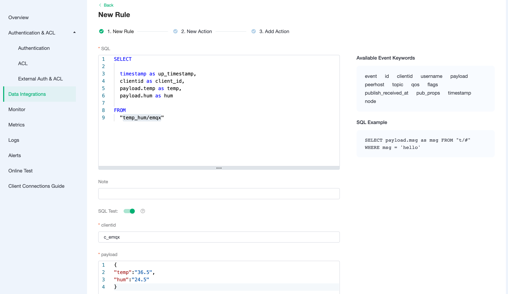
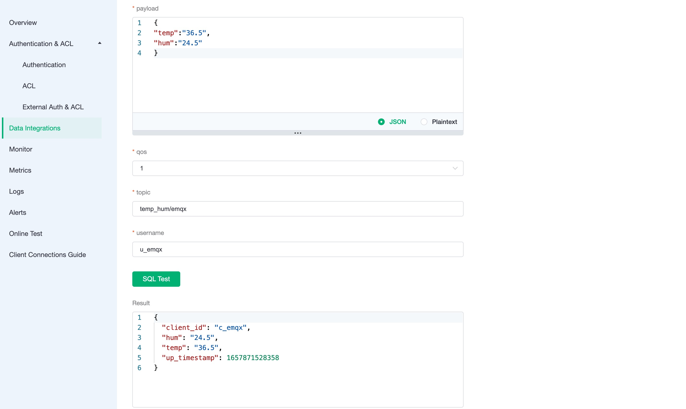
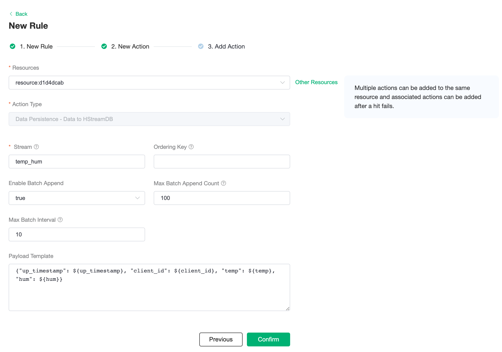
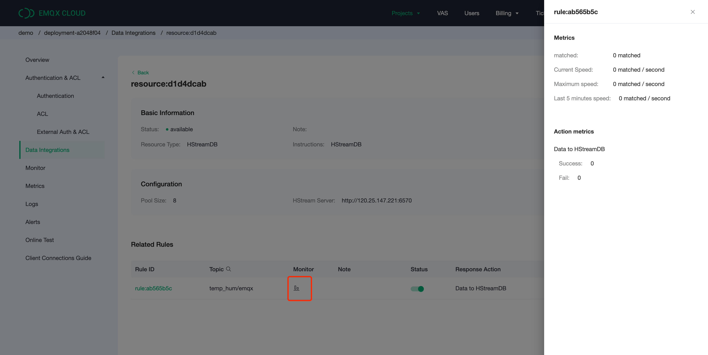
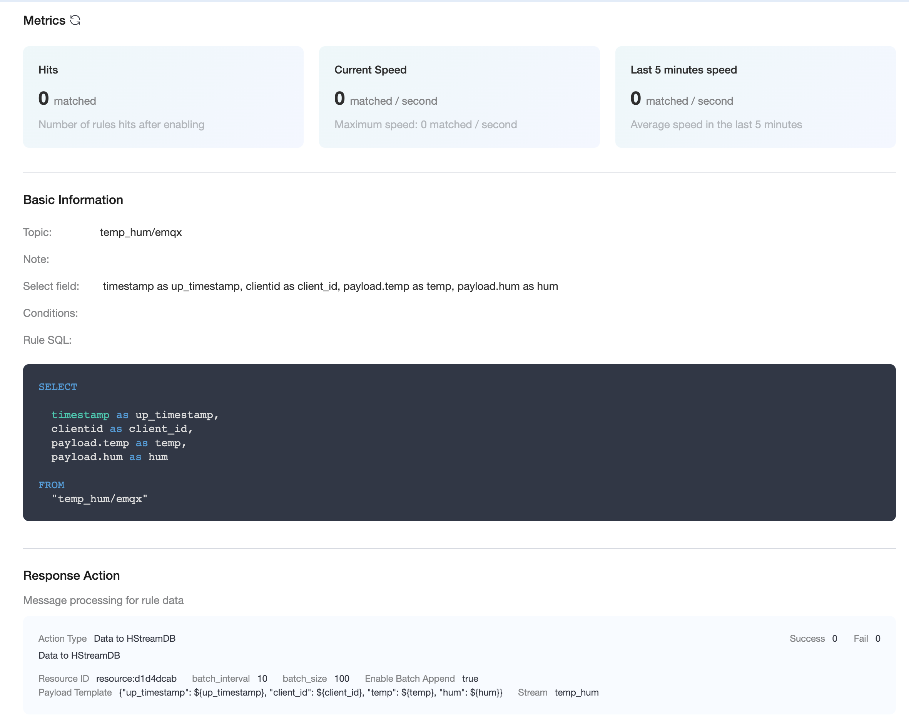
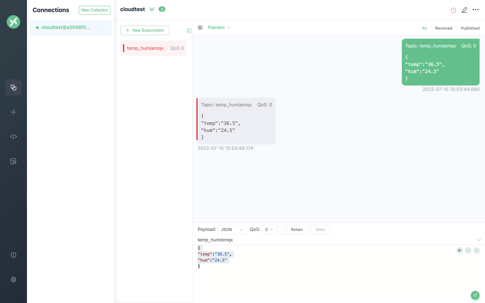

# Integrate with HStreamDB

[HStreamDB](https://www.emqx.com/en/products/hstreamdb) is a streaming database designed for large-scale real-time data stream management, including access, storage, processing, and distribution. It uses standard SQL (and its streaming extensions) as the main interface language, with real-time as the main feature, and aims to simplify the operation and management of data streams and the development of real-time applications.

In this article, we will simulate temperature and humidity data and report it to EMQX Cloud via the MQTT protocol, and then use the EMQX Cloud data integrations to dump the data to HStreamDB.

Before you start, you need to complete the following operations:

- Deployments have already been created on EMQX Cloud (EMQX Cluster).
- For Professional Plan users: Please complete [Peering Connection Creation](../deployments/vpc_peering.md) first, all IPs mentioned below refer to the internal network IP of the resource.(Professional Plan with a [NAT gateway](../vas/nat-gateway.md) can also use public IP to connect to resources)

## HStreamDB Configuration

1. HStreamDB Installation

   > To deploy, refer to the [HStreamDB Help](https://hstream.io/docs/en/latest/start/quickstart-with-docker.html#requirement) and create the hstream-client using the following command.

   Create quick-start.yaml

   ```bash
   ## quick-start.yaml

   version: "3.5"

   services:
   hserver0:
      image: hstreamdb/hstream:v0.8.0
      depends_on:
         - zookeeper
         - hstore
      ports:
         - "6570:6570"
      expose:
         - 6570
      networks:
         - hstream-network
      volumes:
         - data_store:/data/store
      command:
         - bash
         - "-c"
         - |
         set -e
         /usr/local/script/wait-for-storage.sh hstore 6440 zookeeper 2181 600 \
         /usr/local/bin/hstream-server \
         --host 0.0.0.0 --port 6570 \
         --internal-port 6571 \
         --server-id 100 \
         --address < server ip >  \
         --zkuri zookeeper:2181 \
         --store-config /data/store/logdevice.conf \
         --store-admin-host hstore --store-admin-port 6440

   hserver1:
      image: hstreamdb/hstream:v0.8.0
      depends_on:
         - zookeeper
         - hstore
      ports:
         - "6572:6572"
      expose:
         - 6572
      networks:
         - hstream-network
      volumes:
            - data_store:/data/store
      command:
         - bash
         - "-c"
         - |
         set -e
         /usr/local/script/wait-for-storage.sh hstore 6440 zookeeper 2181 600 \
         /usr/local/bin/hstream-server \
         --host 0.0.0.0 --port 6572 \
         --internal-port 6573 \
         --server-id 101 \
         --address < server ip > \
         --zkuri zookeeper:2181 \
         --store-config /data/store/logdevice.conf \
         --store-admin-host hstore --store-admin-port 6440

   hstream-http-server:
      image: hstreamdb/hstream:v0.8.0
      depends_on:
         - hserver0
         - hserver1
      ports:
         - "6580:6580"
      expose:
         - 6580
      networks:
         - hstream-network
      command:
         - bash
         - "-c"
         - |
         set -e
         /usr/local/bin/hstream-http-server \
            -gRPCServerHost hserver \
            -httpServerPort 6580 \
            -gRPCServerPort 6570

   hstore:
      image: hstreamdb/hstream:v0.8.0
      networks:
         - hstream-network
      volumes:
         - data_store:/data/store
      command:
         - bash
         - "-c"
         - |
         set -ex
         /usr/local/bin/ld-dev-cluster --root /data/store \
         --use-tcp --tcp-host $$(hostname -I | awk '{print $$1}') \
         --user-admin-port 6440 \
         --no-interactive

   zookeeper:
      image: zookeeper
      expose:
         - 2181
      networks:
         - hstream-network
      volumes:
         - data_zk_data:/data
         - data_zk_datalog:/datalog

   networks:
   hstream-network:
      name: hstream-network

   volumes:
   data_store:
      name: quickstart_data_store
   data_zk_data:
      name: quickstart_data_zk_data
   data_zk_datalog:
      name: quickstart_data_zk_datalog
   ```

   Start HStreamDB service

   ```bash
   # Launch in the same folder
   docker-compose -f quick-start.yaml up

   # Backstage start-up
   docker-compose -f quick-start.yaml up -d
   ```

2. Launching the SQL command line interface of HStreamDB

   Use the following command to create the hstream-client :

   ```bash
   docker run -it --rm --name some-hstream-cli --network host hstreamdb/hstream:v0.8.0 hstream-client --port 6570 --client-id 1
   ```

   Access to the console.

    ```bash
            __  _________________  _________    __  ___
      / / / / ___/_  __/ __ \/ ____/   |  /  |/  /
      / /_/ /\__ \ / / / /_/ / __/ / /| | / /|_/ /
      / __  /___/ // / / _, _/ /___/ ___ |/ /  / /
   /_/ /_//____//_/ /_/ |_/_____/_/  |_/_/  /_/


   Command
   :h                           To show these help info
   :q                           To exit command line interface
   :help [sql_operation]        To show full usage of sql statement
   ```

3. Stream creation

   ```bash
   > CREATE STREAM temp_hum;
   temp_hum
   > SHOW STREAMS;
   temp_hum
   ```

## EMQX Cloud Data Integration Configuration

1. Create HStreamDB resource

   Click on `Data Integration` in the left menu bar, find HStreamDB under Data Persistence, and click on `New Resource`.

   

   Fill in the information about the HStreamDB database you have just created and click on Test. If an error occurs, you should check if the database configuration is correct.

   

2. Create Rule

   Once the resource is created click on New Rule and enter the following rule to match the SQL statement. In the following rule we read the message upload time `up_timestamp`, the client ID, the message body (Payload) from the `temp_hum/emqx` subject and the temperature and humidity from the message body respectively.

   ```sql
   SELECT

   timestamp as up_timestamp, 
   clientid as client_id, 
   payload.temp as temp, 
   payload.hum as hum

   FROM
   "temp_hum/emqx"  
   ```

   We can use the `SQL test` to test and see the results.

   
   

3. Add Action

   Click next to the action screen, select the resource created in the first step, select `Data Persistence - Save Data to HStreamDB` for the action type and enter the parameters, which are defined in the following table.

   | Parameter Name            | Definition                                        | Type    |
   | ------------------------- | ------------------------------------------------- | ------- |
   | Stream                    | Stream name, no variables allowed                 | String  |
   | Ordering Key              | Partition key, use variable                       | String  |
   | Enable Bulk Insertion     | Enables or disables bulk writing, default is on   | Boolean |
   | Maximum number of batches | Maximum number of message entries in a batch      | Integer |
   | Max Batch Interval (ms)   | Maximum interval between batches, in milliseconds | Integer |
   | Message content template  | Content of the message message to be written      | Binary  |

   Insert the message content template and click on Confirm.

   ```sql
   {"up_timestamp": ${up_timestamp}, "client_id": ${client_id}, "temp": ${temp}, "hum": ${hum}} 
   ```

   

4. View Resource Detail

   Once the action has been created, return to the list and click on the resource to view the resource details and rule monitoring information.

   

5. Check Rules Monitoring

   The rule details screen allows you to view rule and action details by clicking on the rule.

   

## Test

1. Use [MQTT X](https://mqttx.app/) to connect the deployment

   You need to replace broker.emqx.io with the created deployment connection address, and add client authentication information to the EMQX Cloud Dashboard.

    - topic: `temp_hum/emqx`
    - payload:

      ```json
      {
         "temp": "36.4",
         "hum": "23.5"
      }
      ```

   

2. View the data saving results

   The data has been written to HStreamDB and you can use any consumption method to consume the message.

   The consumption tool [fetcher](https://github.com/hstreamdb/fetcher) based on the HStream Golang SDK is used in this example, and the result is as follows.

   ```sql
   ./fetcher -s f1 -n temp_hum -p <server ip>:6570 -c cons1 -v
   ```

   
