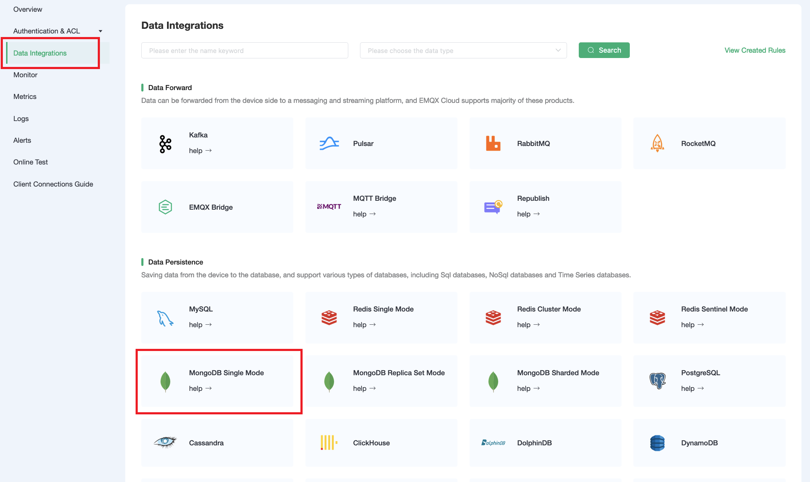
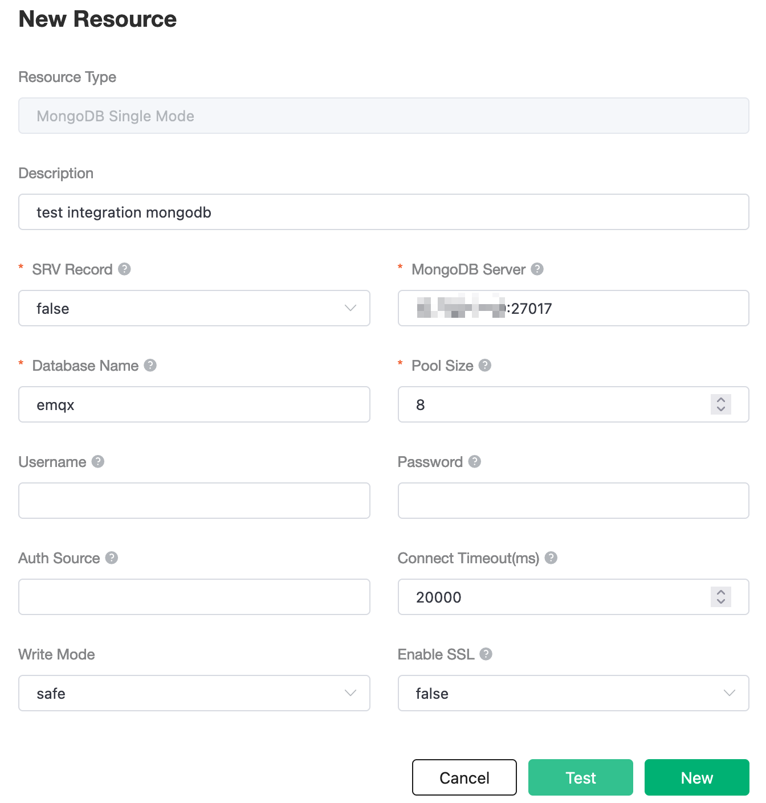
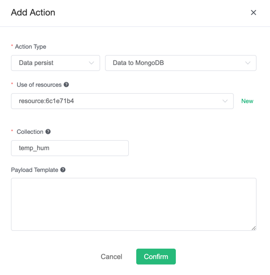
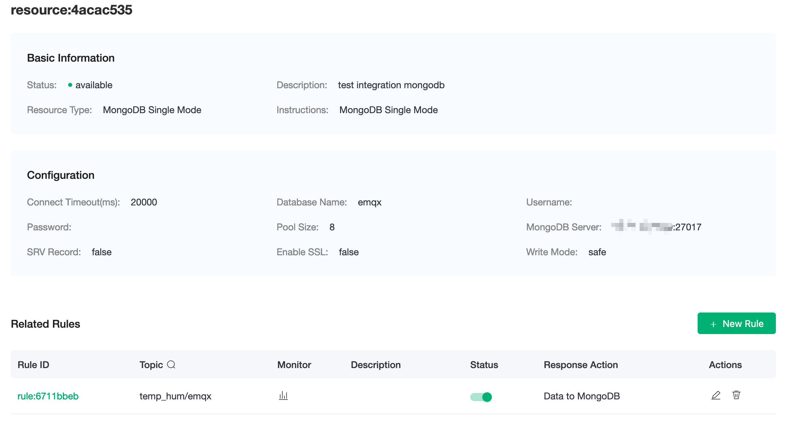
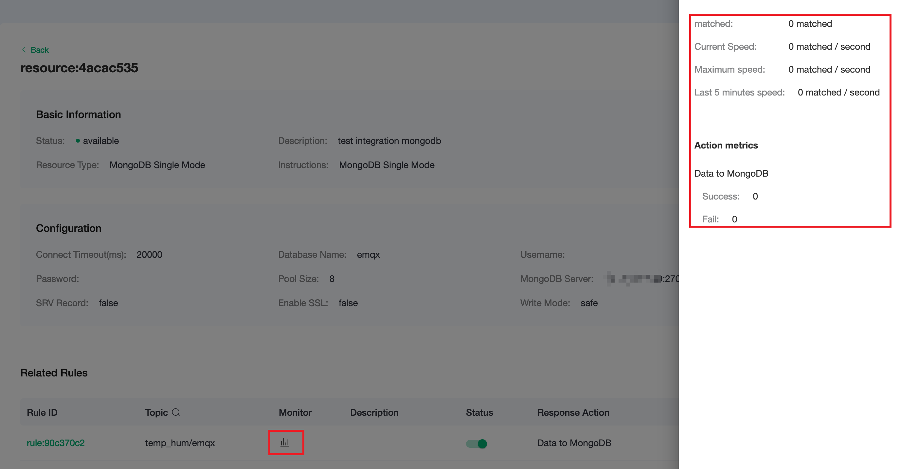
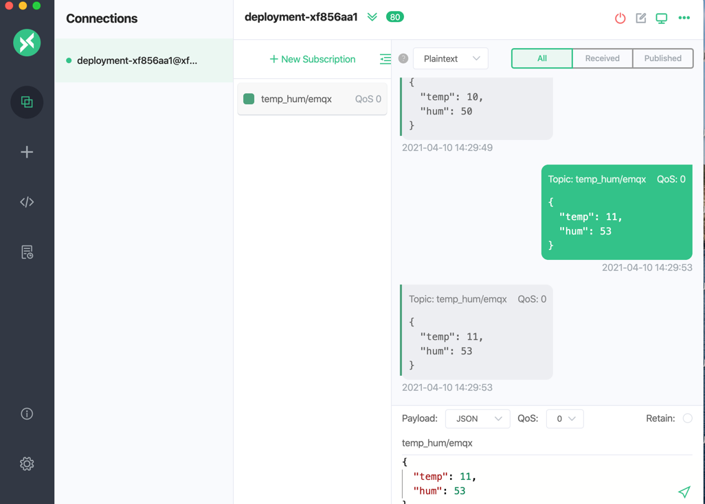
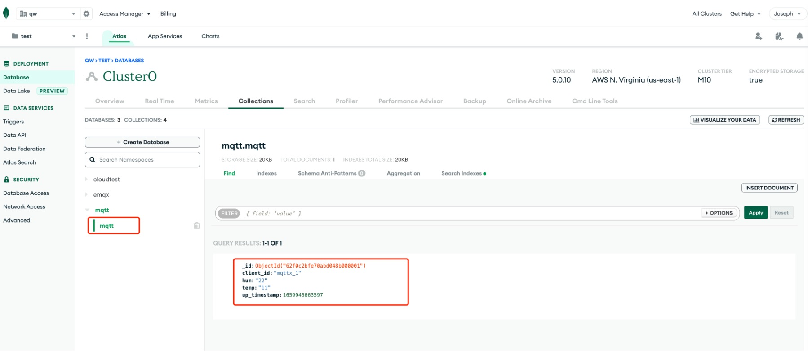

# Save device data to MongoDB using the Data Integrations

In this article, we will simulate the temperature and humidity
data, and publish these data to EMQX Cloud via the MQTT protocol, and then we will use the EMQX Cloud
Data Integrations to store the data to MongoDB.

Before you start, you will need to complete the following:

- Deployments have already been created on EMQX Cloud (EMQX Cluster).
- For Professional Plan users: Please complete [Peering Connection Creation](../deployments/vpc_peering.md) first, all IPs mentioned below refer to the internal network IP of the resource.(Professional Plan with a [NAT gateway](../vas/nat-gateway.md) can also use public IP to connect to resources)

## MongoDB Configuration

1. Install MongoDB
   
   ```bash
   docker run --name mongo -d -p 27017:27017 mongo:5.0
   ```

3. Enter Container
   
   ```bash
   docker exec -it mongo mongosh emqx
   ```
4. Insert data into `temp_hum` collection and view the result.
   
   ```sql
   db.temp_hum.insert({up_timestamp: 34256, client_id: 1, temp: 20, hum: 33})
   db.temp_hum.find()
   ```
   

## Data Integrations Configuration

Go to Deployment Details and click on `Data Integrations` on the left menu bar.

1. Create MongoDB Resource

   Click on `MongoDB Single Mode` under the Data Persistence.

   

   Fill in the information you have just created and click `Test`. If there is an error, you should check if the database configuration is correct. Then click on `New` to create MongoDB resource

   

2. Create Rule

   Choose the MongoDB resource under Configured Resources, click on `New Rule` and enter the following rule to match the SQL statement. In the following rule we read the time `up_timestamp` when the message is reported, the client ID, the message body (Payload) from the `temp_hum/emqx` topic and the temperature and humidity from the message body respectively.

   ```sql
   SELECT 
      timestamp div 1000 AS up_timestamp, clientid AS client_id, payload.temp AS temp, payload.hum AS hum
   FROM
      "temp_hum/emqx"
   ```

   


3. Create Action

   Click on the `Next` button in the bottom to enter action view. Select the resource created in the first step, select `Data Persistence - Data to MongoDB` for `Action Type` and enter the following data to insert into the SQL template.

   

   Click on `Confirm` to create action.

4. View Resource Detail

   Click on the resource to see the detail.

   


5. Check Rules Monitoring

   Click the monitor icon of rule to see the metrics

   


## Test

1. Use [MQTT X](https://mqttx.app/) to simulate publishing temperature and humidity data

   You need to replace broker.emqx.io with the deployment [connection address](../deployments/view_deployment.md) you have created and add the [client-side authentication information](../deployments/auth.md) in the EMQX Dashboard.
   

2. View stored results
   
   ```
   db.temp_hum.find()
   ```
   
