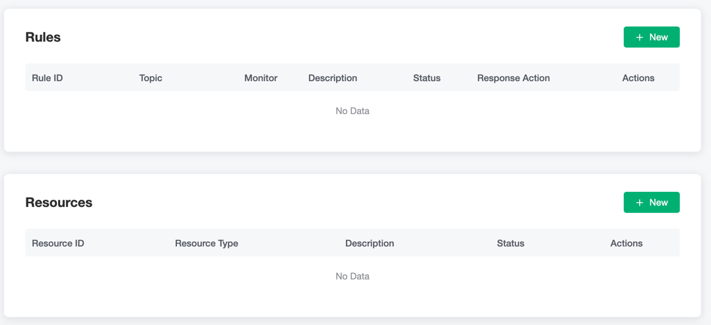
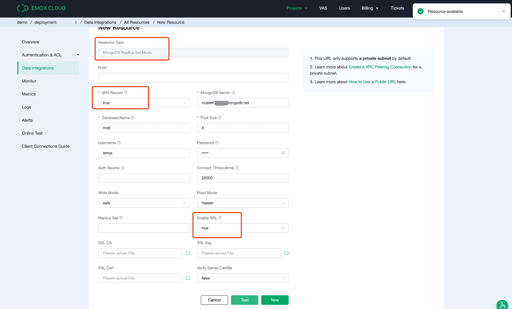
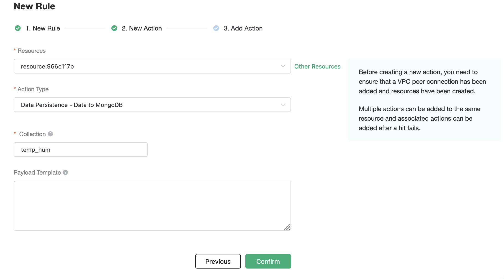

# Save device data to MongoDB using the Rule Engine

In this article, we will simulate the temperature and humidity
data, and publish these data to EMQ X Cloud via the MQTT protocol, and then we will use the EMQ X Cloud
rule engine to store the data to MongoDB.

Before you start, you will need to complete the following:

* A deployment (EMQ X Cluster) has been created on EMQ X Cloud.

* For Dedicated Deployment users: Please complete the creation of a [VPC Peering Connection](../deployments/security_features_and_settings/vpc_peering.md) first. All IPs mentioned below refer to the resource's intranet IP.

* For Free Trial and Shared Deployment users: No VPC Peering Connection is required. All IPs mentioned below refer to the resource's public IP.

## MongoDB Configuration

1. Pull the newest version of MongoDB mirror
   
   ```bash
   docker pull mongo:latest
   ```

2. Run Mongo Container
   
    ```bash
    docker run -itd --name mongo -p 27017:27017 mongo --auth
   ```

3. Execute Container
   
    ```bash
    docker exec -it mongo mongo admin
   ```

4. Create user and set up the password
   
    ```bash
    db.createUser({ user:'root',pwd:'public',roles:[ { role:'userAdminAnyDatabase', db: 'admin'},"readWriteAnyDatabase"]});
   ```

5. Connect by using the user information above 
   
   ```bash
   db.auth('root', 'public')
   ```
   
    You will get the same result by following the steps above.
   
    
6. Create a new database
   
   ```sql
   Use emqx
   ```

7. Insert data into `temp_hum` collection and view the result.
   
    ```sql
     db.temp_hum.insert({up_timestamp: 34256, client_id: 1, temp: 20, hum: 33})
   ```
   

## EMQ X Cloud Rule Engine Configuration

Select `Rule Engine` from the left menu bar to edit rule engine configuration.

1. Create MongoDB Resource

   Click on Rule Engine on the left menu bar and
   click on `+ New` button to create a new resource.

   

   Then fill in the information regarding the MongoDB
   you choose to store the data. You could always test if the database configuration you entered is correct before confirm to add the resource. If you get an error message after
   clicking the `Test` button, make sure to double-check the input information
   and retry.

   

   If the configuration test is passed, click on `confirm` to finish creating resource.

2. Create Rule

   Now we need to create a rule for the rule engine.
   Click on Rule Engine on the left menu bar and
   click on `+ New` button to create a new Rule.

   In the following rule, we read the timestamp,
   client ID, payload via temp_hum/emqx topic.

   ```sql
   SELECT 
   
   timestamp as up_timestamp, clientid as client_id, payload.temp as temp, payload.hum as hum  
   
   FROM  
   
   "temp_hum/emqx"  
   ```

   

3. Rule Test

   You should always test the SQL ahead to make sure it's functioning
   as you expected.
   
   


4. Add Action

   After inputting the SQL command, it's time to create the response actions.

   Towards the bottom of the page, in the Response Action section,
   click on the `+ Add action` button.

   

5. Click on `Confirm` to finish creating a Rule. You could always come back to edit you rules and add more actions.
   
   


6. Check Rules Monitoring
   
   


## Test

1. Use [MQTT X](https://mqttx.app/) to simulate publishing temperature and humidity data

   You need to replace broker.emqx.io with the deployment [connection address](../deployments/view_deployment.md) you have created and add the [client-side authentication information](../deployments/auth_and_acl.md) in the EMQ X Dashboard.
   

2. View stored results
   
      ```
     db.temp_hum.find()
      ```
   
