# Save device data to MongoDB Atlas using the Data Integrations

[MongoDB Atlas](https://www.mongodb.com/docs/atlas/) is a multi-cloud database service by the same people that build MongoDB. Atlas simplifies deploying and managing your databases while offering the versatility you need to build resilient and performant global applications on the cloud providers of your choice.

In this article, we will simulate the temperature and humidity data, and publish these data to EMQX Cloud via the MQTT protocol, and then we will use the EMQX Cloud Data Integrations to store the data to MongoDB Atlas.

Before you start, you will need to complete the following:

- Deployments have already been created on EMQX Cloud (EMQX Cluster).
- For Professional Plan users: Please complete [Peering Connection Creation](../deployments/vpc_peering.md) first, all IPs mentioned below refer to the internal network IP of the resource.(Professional Plan with a [NAT gateway](../vas/nat-gateway.md) can also use public IP to connect to resources)

## MongoDB Atlas Configuration

If you are new to MongoDB Atlas, we recommend that you follow the [MongoDB Atlas help documentation](https://www.mongodb.com/docs/atlas/getting-started/) to create it.

1. Create a version of MongoDB Atlas that supports [VPC peering](https://www.mongodb.com/docs/atlas/security-vpc-peering/).
   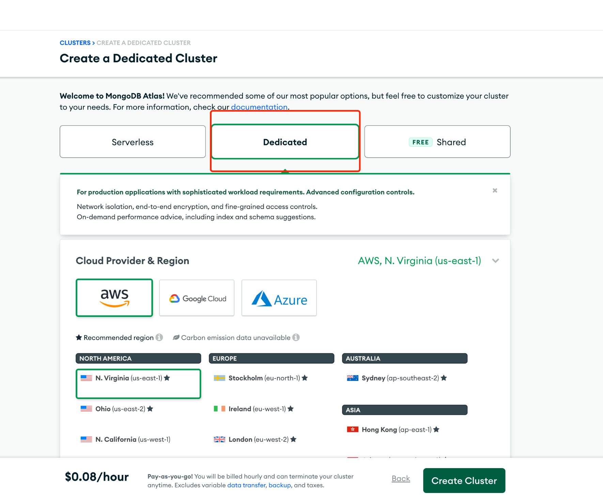

2. Create username and password for database authentication.

   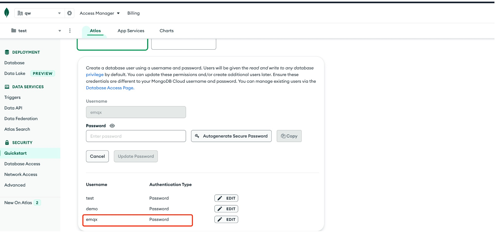

3. Select VPC Peering for network type.

   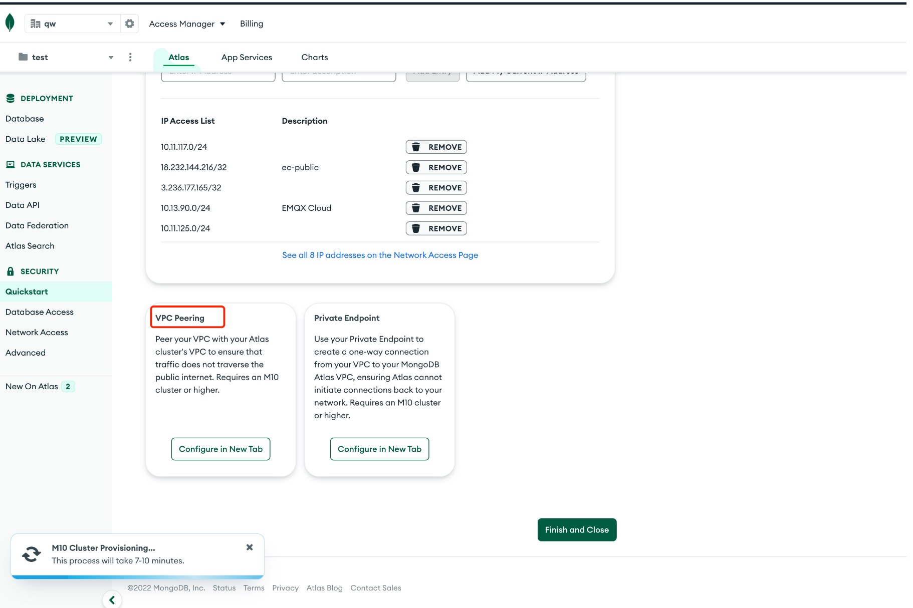

4. Populate the EMQX Cloud VPC information into the peer connection page of MongoDB Atlas, and you can get the peering ID for further use.

   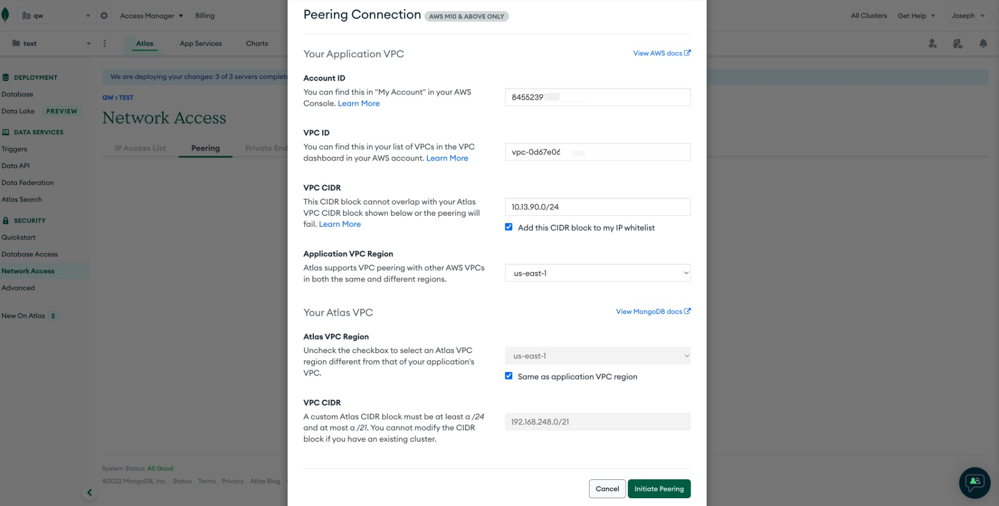
   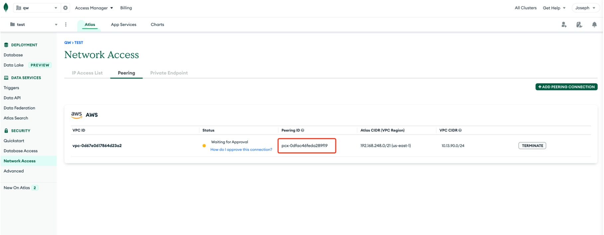

5. Once you have obtained the Peering ID and VPC ID, add your MongoDB Atlas VPC information to the EMQX Cloud console.

   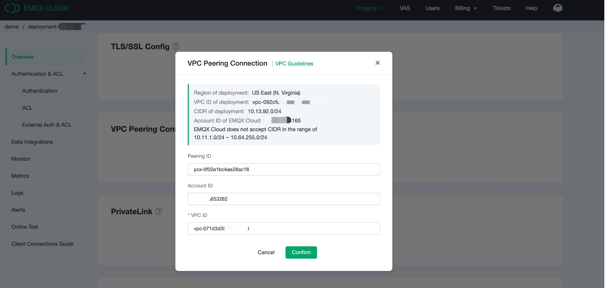

6. Until the status is available, indicating that the VPC peer connection has been successfully created.

   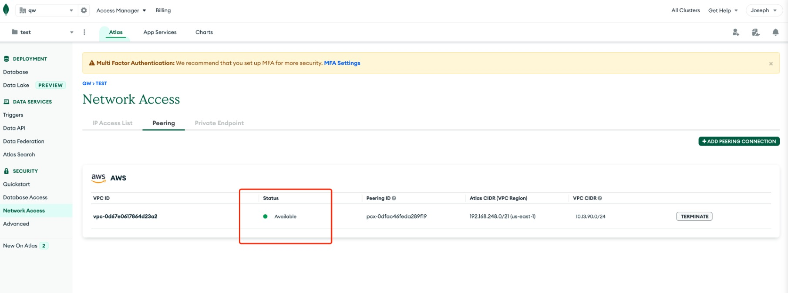

7. Get the connection address of MongoDB Atlas instance.

   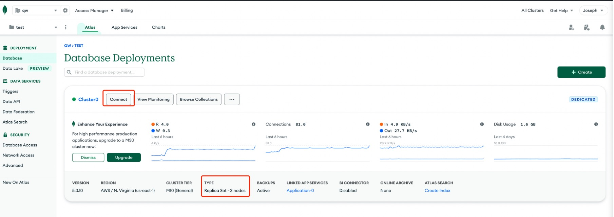
   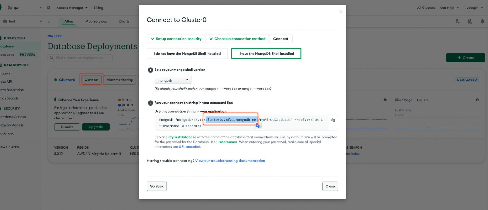

## Data Integrations Configuration

Go to Deployment Details and click on `Data Integrations` on the left menu bar.

1. Create MongoDB Atlas Resource

   Click on `MongoDB Replica Set Mode` under the Data Persistence.

   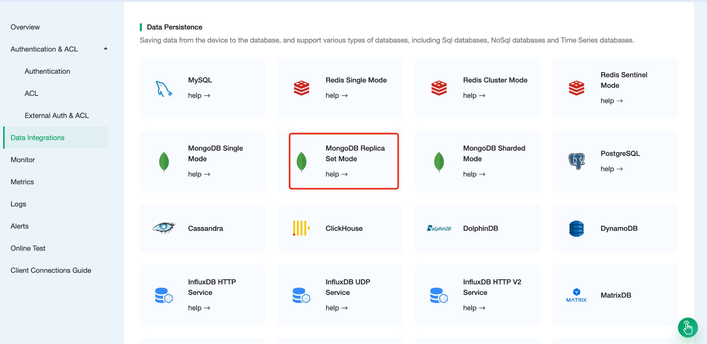

   Fill in the information you have just created and click `Test`. If there is an error, you should check if the database configuration is correct. Then click on `New` to create MongoDB Atlas resource

   

2. Create Rule

   Choose the MongoDB Atlas resource under Configured Resources, click on `New Rule` and enter the following rule to match the SQL statement. In the following rule we read the time `up_timestamp` when the message is reported, the client ID, the message body (Payload) from the `temp_hum/emqx` topic and the temperature and humidity from the message body respectively.

   ```sql
   SELECT 
      timestamp div 1000 AS up_timestamp, 
      clientid AS client_id, 
      payload.temp AS temp, 
      payload.hum AS hum

   FROM
      "temp_hum/emqx"
   ```

   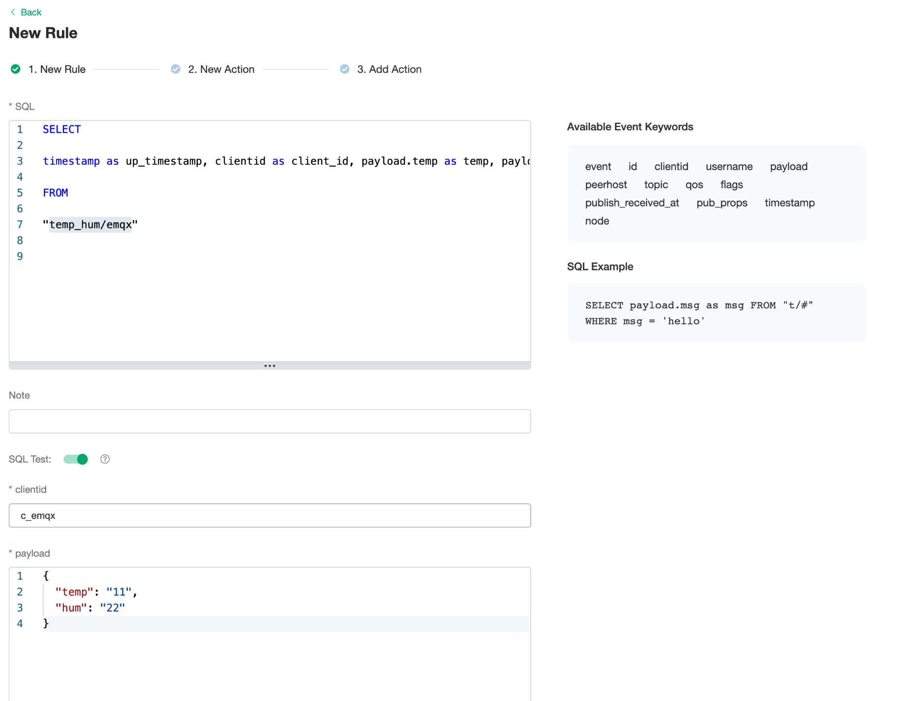
   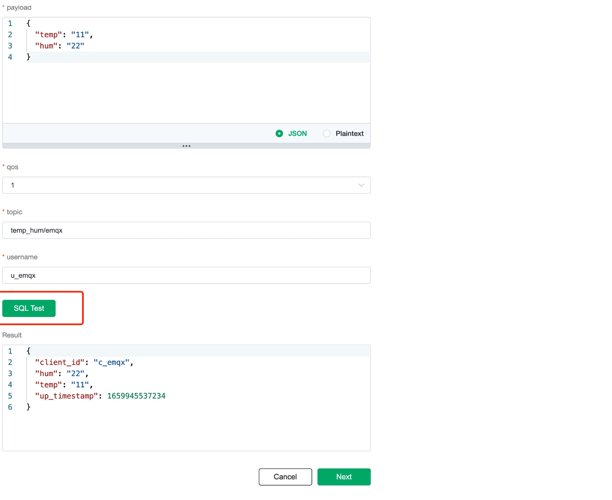

3. Create Action

   Click on the `Next` button at the bottom to enter action view. Select the resource created in the first step, select `Data Persistence - Data to MongoDB Atlas` for `Action Type` and enter the collection of your Mongodb Atlas.

   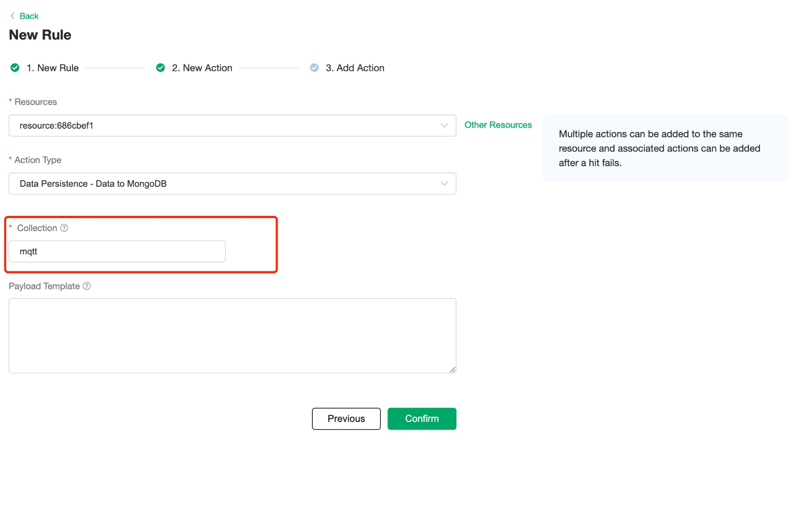

   Click on `Confirm` to create action.

## Test

1. Use [MQTT X](https://mqttx.app/) to simulate publishing temperature and humidity data

   You need to replace broker.emqx.io with the deployment connection address you have created and add the client-side authentication information in the EMQX Cloud console.

   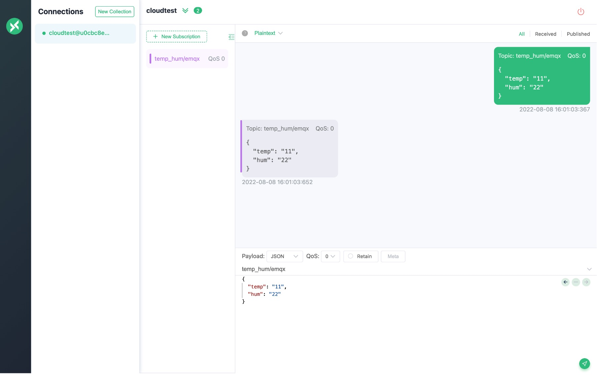

2. View rule monitor

   Check the rule monitoring and add one to the "Success" number.

   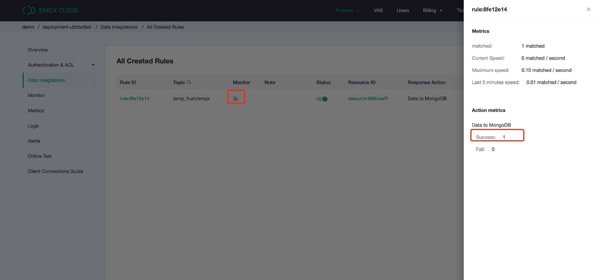

3. View stored results

   ```bash
   db.temp_hum.find()
   ```

   
