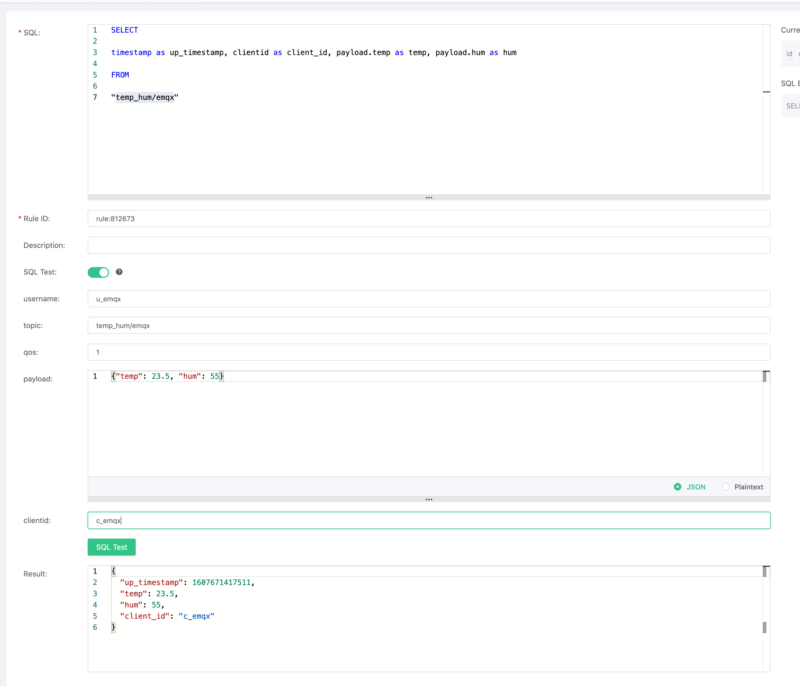
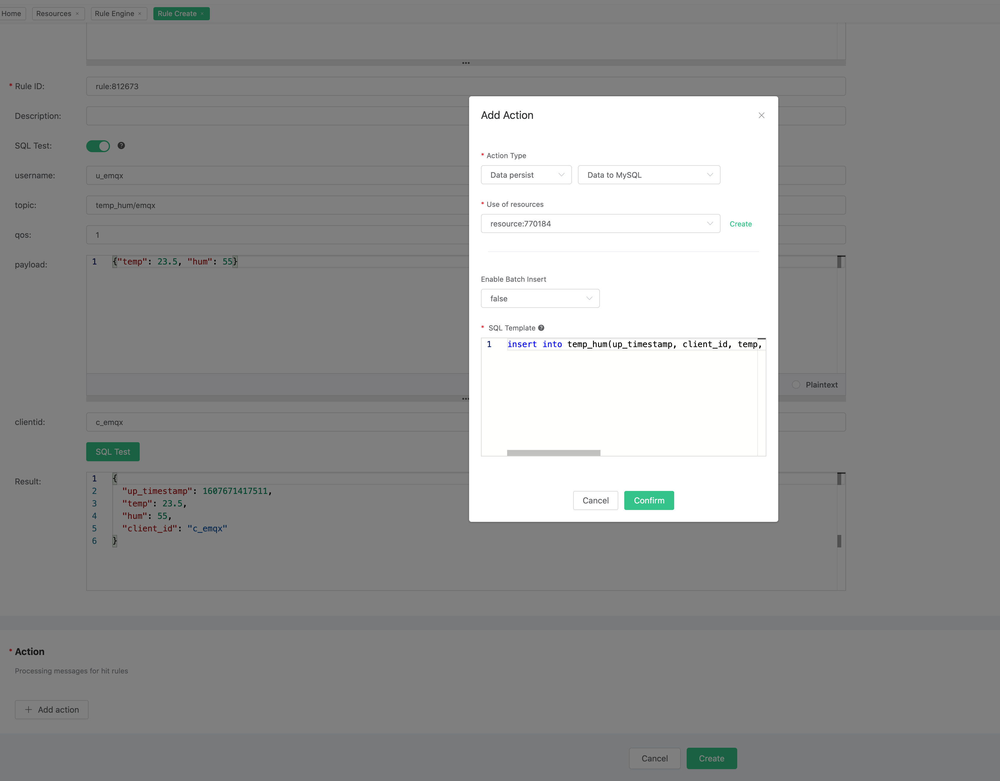
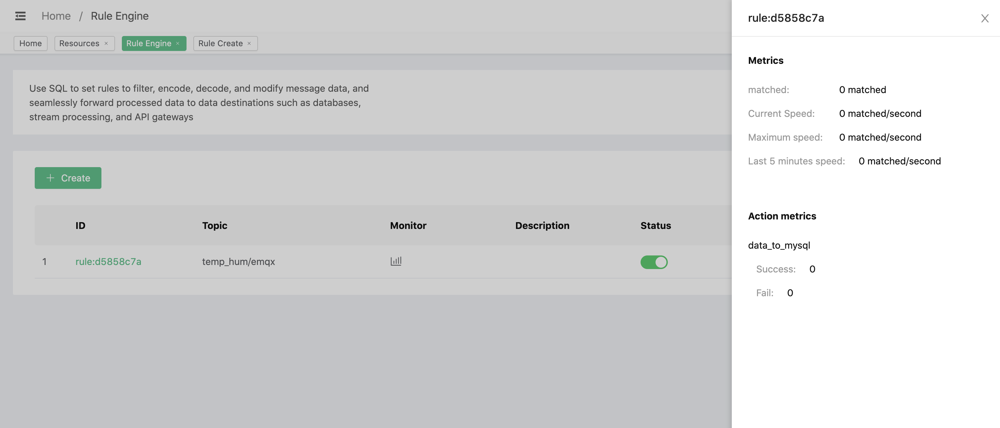

# Save device data to MySQL using the Rule Engine

In this article, we will simulate the temperature and humidity data, and report these data to EMQ X Cloud via the MQTT protocol and then we will use EMQ X Cloud rules engine to dump the data to MySQL.

Before you start, you will need to complete the following:

* A deployment (EMQ X Cluster) has been created on EMQ X Cloud.

* For Dedicated Deployment users: please complete the creation of a [VPC Peering Connections](../deployments/Security features and Settings/vpc_peering.md) connection first. All IPs mentioned below refer to the resource's intranet IP.

* For Free Trial and Shared Deployment users: No PC Peering Connections is required. All IP references below are to the public IP of the resource.


## MySQL Configuration

1. Installing MySQL with Docker

   ```bash
   docker run -d --restart=always \
       --name mysql \
       -p 3306:3306 \
       -e MYSQL_ROOT_PASSWORD=public \
       -d mysql/mysql-server:5.7
   ```
2. Creating and Selecting a Database

   ```mysql
   CREATE DATABASE emqx;
   USE emqx;
   ```

3. Create temp_hum table
   Use the following SQL command to create `temp_hum` table, and this table will be used for storing the temperature and humidity data reported by devices.

    ```sql
    CREATE TABLE `temp_hum` (
    `id` int(11) unsigned NOT NULL AUTO_INCREMENT,
    `up_timestamp` timestamp NULL DEFAULT NULL,
    `client_id` varchar(32) DEFAULT NULL,
    `temp` float unsigned DEFAULT NULL,
    `hum` float unsigned DEFAULT NULL,
    PRIMARY KEY (`id`),
    KEY `up_timestamp_client_id` (`up_timestamp`,`client_id`)
    ) ENGINE=InnoDB AUTO_INCREMENT=26 DEFAULT CHARSET=utf8mb4;
    ```

4. For dedicated deployment, set up to allow EMQ X cluster IP segments to access the database (optional).
     To obtain the deployment segments go to Deployment Details → View VPC Peering Connections Information to replicate the deployment VPC CIDR.

     ```mysql
       # Dedicated Deployment CIDR: 10.11.x.%
       GRANT ALL PRIVILEGES ON *.* TO root@'10.11.30.%' IDENTIFIED BY 'public' WITH GRANT OPTION;
       
       # Free Trial and Shared Deployment CIDR: 123.xxx.xxx.xxx
       GRANT ALL PRIVILEGES ON *.* TO root@'%' IDENTIFIED BY 'public' WITH GRANT OPTION;
     ```

5. Insert test data and view data

   ```mysql
     INSERT INTO temp_hum(up_timestamp, client_id, temp, hum) values (FROM_UNIXTIME(1603963414), 'temp_hum-001', 19.1, 55);
     
     select * from temp_hum;
   ```

   
## Rules Engine Configuration  

Go to Deployment Details and click on EMQ X Dashbaord to go to Dashbaord

1. Create MySQL Resource

   Click on Rules on the left menu bar → Resources, click on New Resource and drop down to select the MySQL resource type. Fill in the information of the mysql database you have just created and click Test. If there is an error, you should check if the database configuration is correct.
   
   
2. Rule Test
   click on Rules on the left menu bar → Rules, click on Create and enter the following rule to match the SQL statement. In the following rule, we read the time when the message was reported `up_timestamp`, client ID, payload via `temp_hum/emqx` topic. Also, we can read temperature and humidity from this topic.
   
   ```sql
   SELECT 
   
   timestamp as up_timestamp, clientid as client_id, payload.temp as temp, payload.hum as hum  
   
   FROM  
   
   "temp_hum/emqx"  
   ```
   
   
3. Add Action

   Click on the Add action in the bottom left corner, drop down and select → Save data to MySQL. Select the resource created in the first step and enter the following data to insert into the SQL template.

   ```sql
   insert into temp_hum(up_timestamp, client_id, temp, hum) values (FROM_UNIXTIME(${up_timestamp}/1000), ${client_id}, ${temp}, ${hum}) 
   ```
   

4. Click on Create a Rule, and return the list of rules
   


5. Check Rules Monitoring
   
   

## Test

1. Use [MQTT X](https://mqttx.app/) to simulate reporting temperature and humidity data

   You need to replace broker.emqx.io with the deployment [connection address](../deployments/view_deployment.md) you have created and add the [client-side authentication information](../deployments/auth_and_acl.md) in the EMQ X Dashboard.
   

2. View data dump results
      ```sql
      select * from temp_hum order by up_timestamp desc limit 10;
      ```
   
