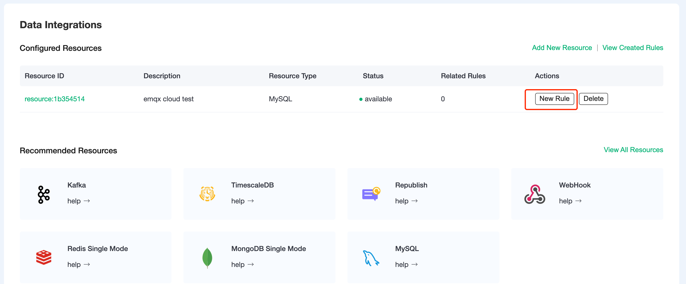

# Save device data to MySQL using the Data Integrations

In this article, we will simulate temperature and humidity data and report these data to EMQX Cloud via the MQTT protocol, and then use the EMQX Cloud Data Integrations to dump the data into MySQL.

Before you start, you need to complete the following operations:

- [Create a Dedicated deployment.](../create/dedicated.md)
- [Create a VPC peering connection.](../deployments/vpc_peering.md) All IP addresses mentioned below refer to the internal network IP of the resource.
  - [NAT gateway service](../vas/nat-gateway.md) allows usage of public IP address to connect to resources.

## MySQL Configuration

1. Install MySQL with Docker.

    ```bash
    docker run -d --restart=always \
    --name mysql \
    -p 3306:3306 \
    -e MYSQL_ROOT_PASSWORD=public \
    mysql/mysql-server:5.7
    ```

2. Create a database.

    ```bash
    docker exec -it mysql mysql -uroot -ppublic
    CREATE DATABASE emqx;
    USE emqx;
    ```

3. Create table.

    Use the following SQL command to create `temp_hum` table, and this table will be used for storing the temperature and humidity data reported by devices.

    ```sql
    CREATE TABLE `temp_hum` (
    `id` int(11) unsigned NOT NULL AUTO_INCREMENT,
    `up_timestamp` timestamp NULL DEFAULT NULL,
    `client_id` varchar(32) DEFAULT NULL,
    `temp` float unsigned DEFAULT NULL,
    `hum` float unsigned DEFAULT NULL,
    PRIMARY KEY (`id`),
    KEY `up_timestamp_client_id` (`up_timestamp`,`client_id`)
    ) ENGINE=InnoDB AUTO_INCREMENT=26 DEFAULT CHARSET=utf8mb4;
    ```

4. For professional deployment, set up to allow EMQX cluster IP segments to access the database (optional). To get the deployment segments go to Deployment Details → View VPC Peering Connections Information to replicate the deployment VPC CIDR.

    ```sql
    # Professional Deployment CIDR: 10.11.x.%
    GRANT ALL PRIVILEGES ON *.* TO root@'10.11.30.%' IDENTIFIED BY 'public' WITH GRANT OPTION;
       
    # Basic Deployment CIDR: 123.xxx.xxx.xxx
    GRANT ALL PRIVILEGES ON *.* TO root@'%' IDENTIFIED BY 'public' WITH GRANT OPTION;
    ```

5. Insert test data and view data.

    ```sql
    INSERT INTO temp_hum(up_timestamp, client_id, temp, hum) VALUES (FROM_UNIXTIME(1603963414), 'temp_hum-001', 19.1, 55);
     
    SELECT * FROM temp_hum;
    ```

## Data Integrations Configuration

Go to Deployment Details and click on `Data Integrations` on the left menu bar.

1. Create MySQL Resource.

    Click on `MySQL` under the Data Persistence.

    

    Fill in the information of the mysql database you have just created and click `Test`. If there is an error, you should check if the database configuration is correct. Then click on `New` to create MySQL resource.

    

2. Create Rule.

    Choose the MySQL resource under Configured Resources, click on `New Rule` and enter the following rule to match the SQL statement. In the following rule, we read the time when the message was reported `up_timestamp`, client ID, payload via `temp_hum/emqx` topic. Also, we can read temperature and humidity from this topic.

    ```sql
    SELECT
    timestamp AS up_timestamp, clientid AS client_id, payload.temp AS temp, payload.hum AS hum  
    FROM
    "temp_hum/emqx"
    ```

    

    You can use `SQL Test` to see the result

    

3. Add Action.

    Click on the Next action in the bottom to enter action view. Select the resource created in the first step, select `Data Persistence - Data to MySQL` as Action Type, and enter the following data to insert into the SQL template.

    ```sql
    INSERT INTO temp_hum(up_timestamp, client_id, temp, hum) VALUES (FROM_UNIXTIME(${up_timestamp}/1000), ${client_id}, ${temp}, ${hum}) 
    ```

    
    Click on `Confirm` to create action.

4. View Resource Detail.

    Click on the resource to see the detail.

    

5. Check Rules Monitoring.

    Click the monitor icon of rule to see the metrics

    

## Test

1. Use [MQTT X](https://mqttx.app/) to simulate reporting temperature and humidity data.

    You need to replace broker.emqx.io with the deployment connection address you have created and add the client-side authentication information in the EMQX Dashboard.

    - topic: `temp_hum/emqx`
    - payload: `{ "temp": "20.1", "hum": "57" }`

    

2. View data dump results.

    ```sql
    select * from temp_hum order by up_timestamp desc limit 10;
    ```

    
