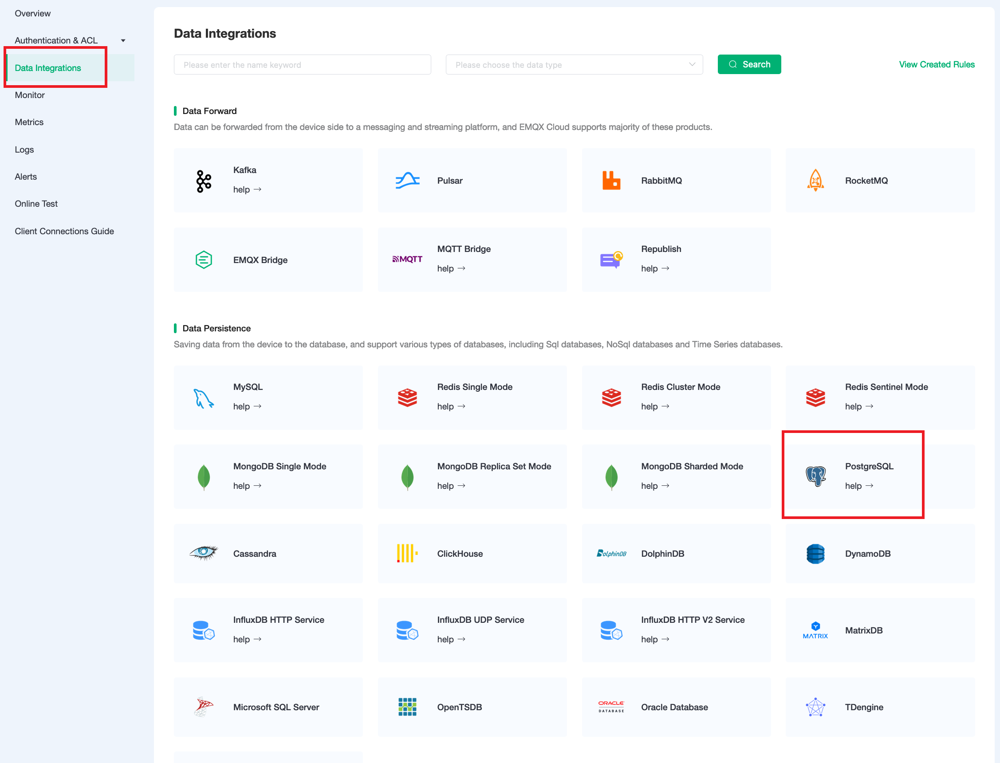
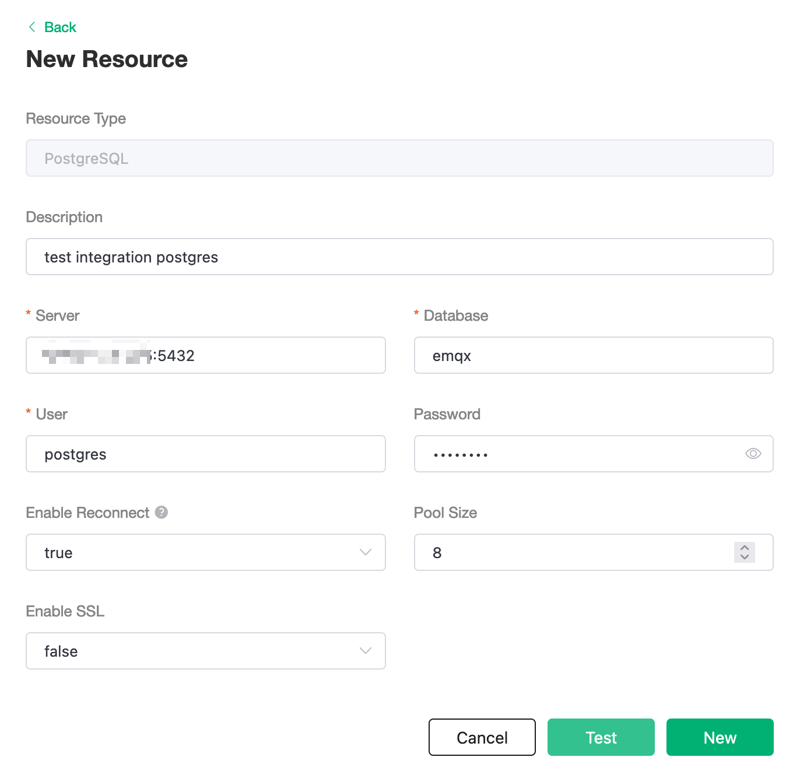
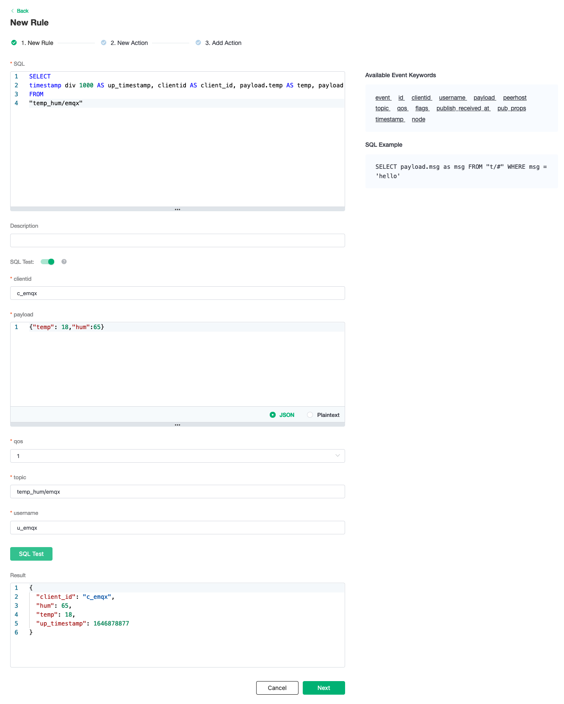
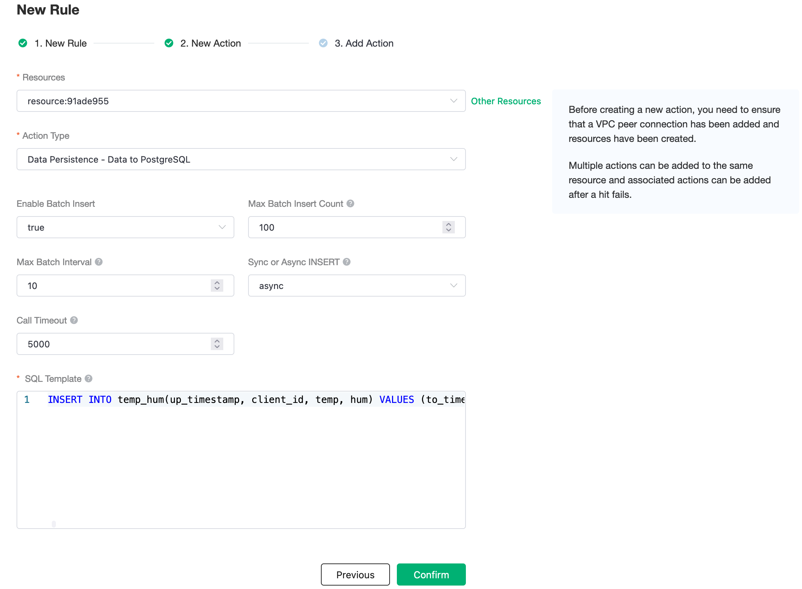
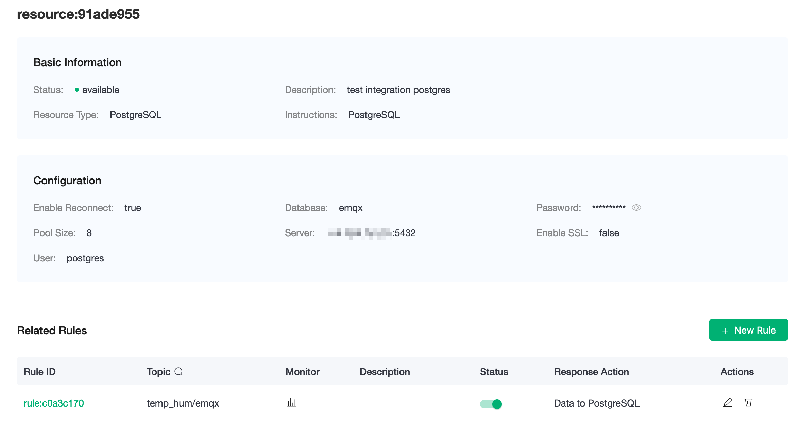
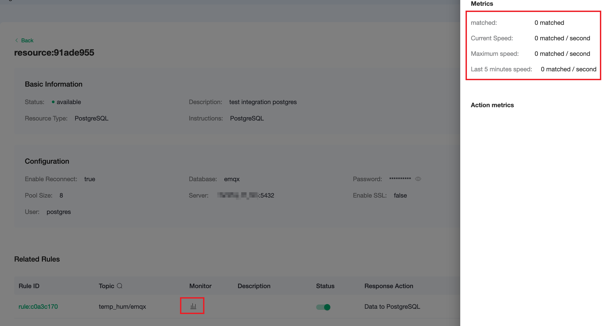
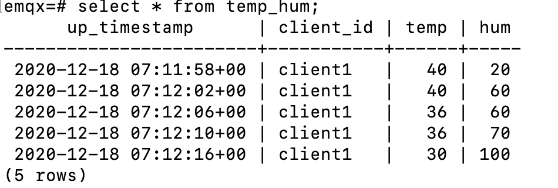

# Save device data to PostgreSQL using the Data Integrations

In this article, we will simulate temperature and humidity data and report these data to EMQX Cloud via the MQTT protocol, and then use the EMQX Cloud Data Integrations to dump the data into PostgreSQL.

Before you start, you need to complete the following operations:

- [Create a Professional or Premium EMQX Cloud deployment.](../deployments/create_deployment.md)
- [Create a VPC peering connection.](../deployments/vpc_peering.md) All IP addresses mentioned below refer to the internal network IP of the resource.
  - [NAT gateway service](../vas/nat-gateway.md) allows usage of public IP address to connect to resources.

## PostgreSQL Configuration

1. Install PostgreSQL

    ```bash
    docker run -d --name postgres -p 5432:5432 -e POSTGRES_PASSWORD=password postgres:14
    ```

2. Create database

    ```bash
    docker exec -it postgre psql -U postgres
    CREATE database emqx;
    \c emqx
    ```

3. Create table

    Use the following SQL statement to create `temp_hum` table. This table will be used to save the temperature and humidity data reported by devices.

    ```sql
    CREATE TABLE temp_hum (
        up_timestamp   TIMESTAMPTZ       NOT NULL,
        client_id      TEXT              NOT NULL,
        temp           DOUBLE PRECISION  NULL,
        hum            DOUBLE PRECISION  NULL
    );
    ```

4. Insert test data and view it

    ```sql
    INSERT INTO temp_hum(up_timestamp, client_id, temp, hum) VALUES (to_timestamp(1603963414), 'temp_hum-001', 19.1, 55);

    SELECT * FROM temp_hum;
    ```

## Data Integrations Configuration

Go to Deployment Details and click on `Data Integrations` on the left menu bar.

1. Create PostgreSQL Resource.

    Click on `PostgreSQL` under the Data Persistence.

    

    Fill in the PostgreSQL database information you have just created and click `Test`. If there is an error, you should check if the database configuration is correct. Then click on `New` to create PostgreSQL resource.

    

2. Create Rule.

    Choose the PostgreSQL resource under Configured Resources, click on `New Rule` and enter the following rule to match the SQL statement. In the following rule we read the time `up_timestamp` when the message is reported, the client ID, the message body (Payload) from the `temp_hum/emqx` topic and the temperature and humidity from the message body respectively.

    ```sql
    SELECT 
    timestamp div 1000 AS up_timestamp, clientid AS client_id, payload.temp AS temp, payload.hum AS hum
    FROM
    "temp_hum/emqx"
    ```

    

3. Create Action.

    Click on the `Next` button in the bottom to enter action view. Select the resource created in the first step, select `Data Persistence - Data to PostgreSQL` for `Action Type` and enter the following data to insert into the SQL template.

    ```sql
    INSERT INTO temp_hum(up_timestamp, client_id, temp, hum) VALUES (NOW(), ${client_id}, ${temp}, ${hum})
    ```

    

    Click on `Confirm` to create action.

4. View Resource Detail.

    Click on the resource to see the detail.

    

5. Check Rule Monitoring.

    Click the monitor icon of rule to see the metrics

    

## Test

1. Use [MQTT X](https://mqttx.app/) to simulate temperature and humidity data reporting

    You need to replace `broker.emqx.io` with the deployment [connection address](../deployments/view_deployment.md) you have created and add the [client-side authentication information](../deployments/auth.md) in the EMQX Dashboard.

    - topic: `temp_hum/emqx`
    - payload: `{ "temp": "20.1", "hum": "57" }`

    

2. View data dump results

    ```sql
    select * from temp_hum order by up_timestamp desc limit 10;
    ```

    
