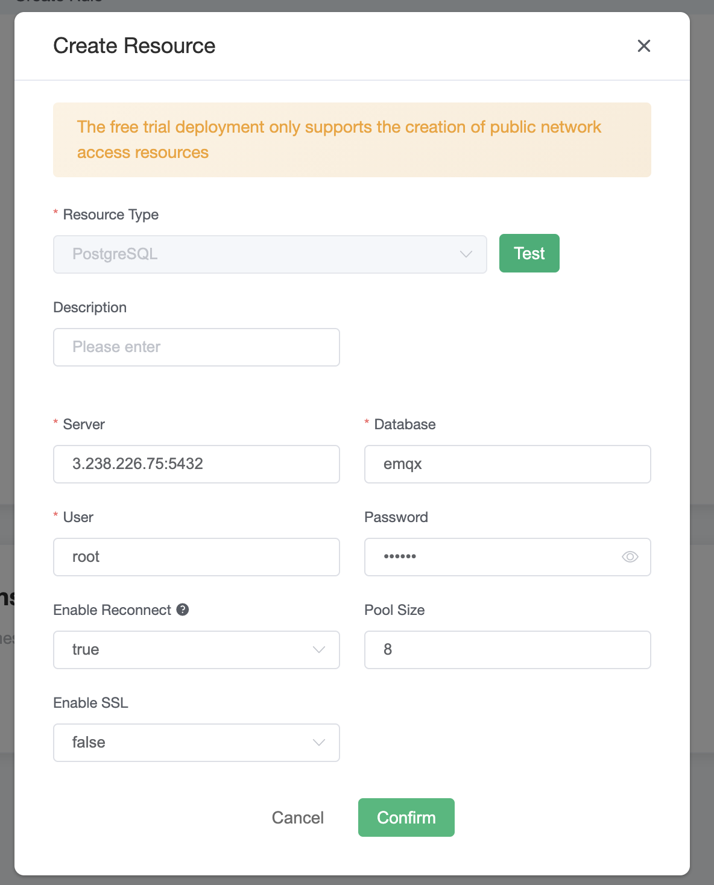
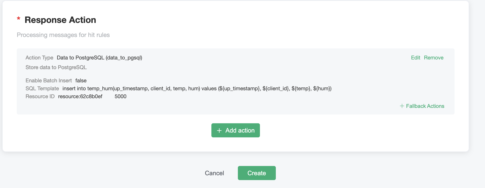

# Save device data to PostgreSQL using the Rule Engine

In this article, we will simulate the temperature and humidity
data, and publish these data to EMQ X Cloud via the MQTT protocol, and then we will use the EMQ X Cloud
rule engine to store the data to PostgreSQL.

Before you start, you will need to complete the following:

* A deployment (EMQ X Cluster) has been created on EMQ X Cloud.

* For professional deployment users: Please complete the creation of a [VPC Peering Connection](../deployments/security_features_and_settings/vpc_peering.md) first. All IPs mentioned below refer to the resource's intranet IP.

* For basic deployment users: No VPC Peering Connection is required. All IPs mentioned below refer to the resource's public IP.

## PostgreSQL Configuration

1. Install PostgreSQL 11
   ```bash
   docker run -d --restart=always     --name postgres     -p 5432:5432     -e POSTGRES_PASSWORD=public     -e POSTGRES_USER=root     postgres:11
   ```

2. New database
   ```sql
   CREATE database emqx;
   ```

3. New temperature and humidity table

   Use the following SQL statement to create `temp_hum` table. This table will be used to save the temperature and humidity data reported by devices.
    ```sql
    CREATE TABLE temp_hum (
    id SERIAL NOT NULL, 
    up_timestamp INTEGER, 
    client_id VARCHAR(32), 
    temp FLOAT, 
    hum FLOAT, 
    PRIMARY KEY (id)
    );
    ```

4. Insert test data and view it
    ```sql
     Insert into temp_hum(up_timestamp, client_id, temp, hum) values (1603963414,'client_1',19.1,55); 
     select * from temp_hum;
   ```
   
    ```sql
    select * from temp_hum;
    ```
## EMQ X Cloud Rule Engine Configuration

Select `Rule Engine` from the left menu bar to edit rule engine configuration.

1. Create PostgreSQL Resource

   Click on Rule Engine on the left menu bar and
   click on `+ New` button to create a new resource.

   

   Then fill in the information regarding the PostgreSQL database
   you choose to store the data. You could always test if the database configuration you entered is correct before confirm to add the resource. If you get an error message after
   clicking the `Test` button, make sure to double-check the input information
   and retry.

   

   If the configuration test is passed, click on `confirm` to finish creating resource.

2. Create Rule

   Now we need to create a rule for the rule engine.
   Click on Rule Engine on the left menu bar and
   click on `+ New` button to create a new Rule.

   In the following rule, we read the timestamp,
   client ID, payload via temp_hum/emqx topic.

   ```sql
   SELECT 
   
   timestamp as up_timestamp, clientid as client_id, payload.temp as temp, payload.hum as hum  
   
   FROM  
   
   "temp_hum/emqx"  
   ```

   

3. Rule Test

   You should always test the SQL ahead to make sure it's functioning
   as you expected.
   


4. Add Action

   After inputting the SQL command, it's time to create the response actions.

   Towards the bottom of the page, in the Response Action section,
   click on the `+ Add action` button.
   
   
    Fill in the SQL Template with sql command bellow
   ```sql
   insert into temp_hum(up_timestamp, client_id, temp, hum) values (${up_timestamp}, ${client_id}, ${temp}, ${hum})
   ```
   
5. Click on `Confirm` to finish creating a Rule. You could always come back to edit you rules and add more actions.
   


5. Check Rules Monitoring
   


## Test

1. Use [MQTT X](https://mqttx.app/) to simulate publishing temperature and humidity data

   You need to replace broker.emqx.io with the deployment [connection address](../deployments/view_deployment.md) you have created and add the [client-side authentication information](../deployments/auth_and_acl.md) in the EMQ X Dashboard.
   

2. View stored results
      ```sql
      select * from temp_hum;
      ```
   
