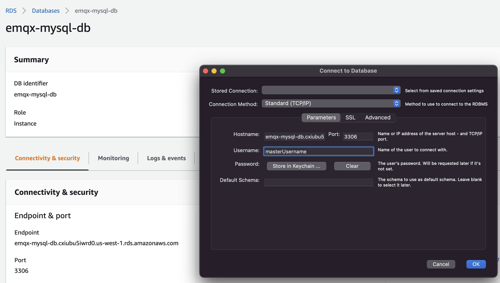
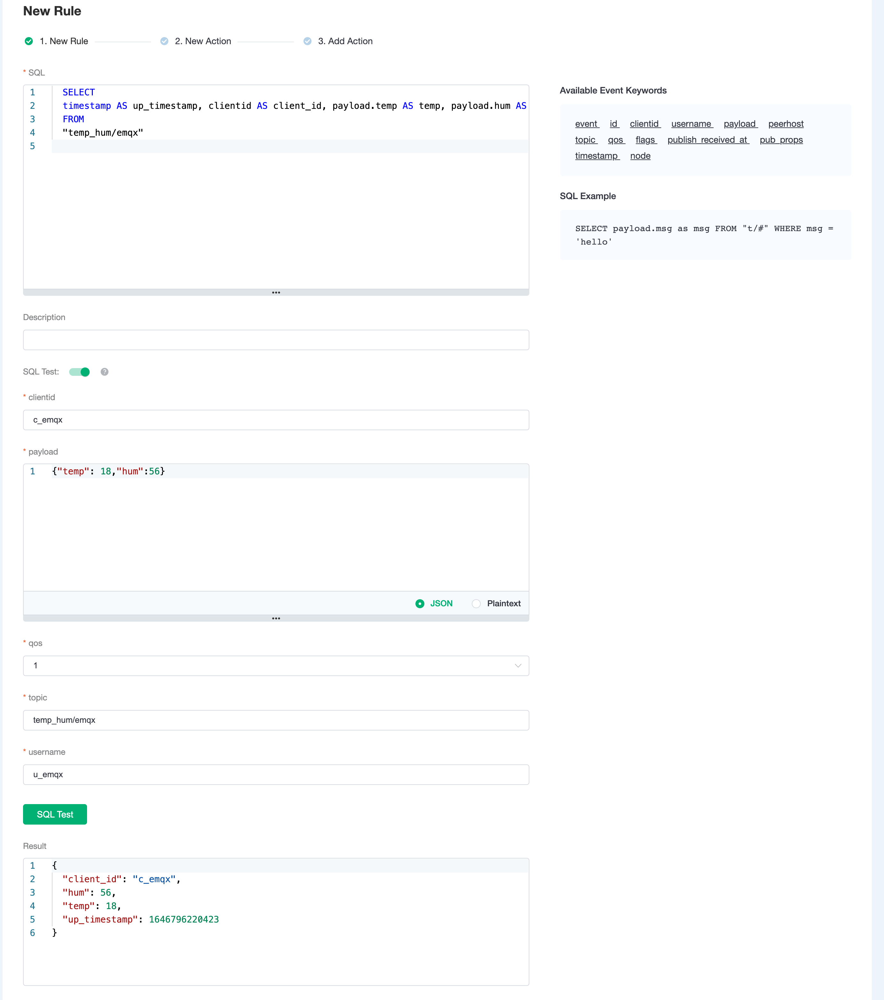
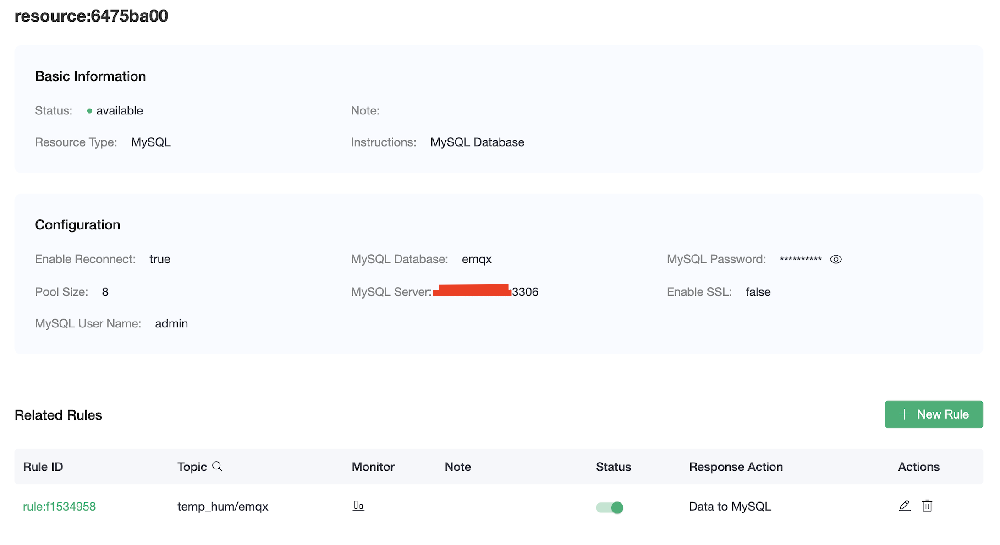

# Integrate with MySQL

In this article, we will simulate temperature and humidity data and report these data to EMQX Cloud via the MQTT protocol, and then use the EMQX Cloud Data Integrations to dump the data into MySQL.

Before you start, you need to complete the following operations:

- [Create a Professional or Premium EMQX Cloud deployment.](../deployments/create_deployment.md)
- [Create a VPC peering connection.](../deployments/vpc_peering.md) All IP addresses mentioned below refer to the internal network IP of the resource.
  - [NAT gateway service](../vas/nat-gateway.md) allows usage of public IP address to connect to resources.

## RDS for MySQL Configuration

1. Follow [this AWS tutorial](https://aws.amazon.com/getting-started/hands-on/create-mysql-db/) to create an RDS for MySQL instance.

    - Use the same VPC that has been peered to the EMQX deployment.
    - Storage Autoscaling and Backups do not need to be enabled for testing.
    - For this tutorial, the instance will be publicly accessible so that you can connect your local machine to it and add data. Note that EMQX connects to the MySQL instance via private IP through VPC peering.
    - In Database Authentication, choose "Password authentication" for simplicity.

2. Connect to the RDS instance.

    - Go to the [Download MySQL Workbench](http://dev.mysql.com/downloads/workbench/) page to download and install MySQL Workbench. For more information on using MySQL, see the [MySQL Documentation](http://dev.mysql.com/doc/). You will be prompted to log in, sign up, or begin your download.  You can click *No thanks, just start my download for a quick download*.
    - Use the AWS Console to open port 3306 of the RDS instance's Security Group to the EMQX deployment's CIDR block and to your local machine's IP address.
      - The EMQX CIDR block can be found at the EMQX console in the deployment's Overview page by clicking the View button in the VPC Peering Connection section.
      - Your IP address can be found at <http://checkip.amazonaws.com/>

    

    - Launch the MySQL Workbench application and go to Database > Connect to Database (Ctrl+U) from the menu bar, then fill out the dialog box:
      - Hostname: You can find your hostname on the Amazon RDS console as shown in the screenshot.  
      - Port: The default value should be 3306.
      - Username: Type in the username you created for the Amazon RDS database.
      - Password: Click Store in Vault/Keychain and enter the password that you used when creating the Amazon RDS database.

    

3. Create database, create table, insert data, and view it.

    ```sql
    CREATE DATABASE emqx;
    USE emqx;
    CREATE TABLE `temp_hum` (
        `id` int(11) unsigned NOT NULL AUTO_INCREMENT,
        `up_timestamp` timestamp NULL DEFAULT NULL,
        `client_id` varchar(32) DEFAULT NULL,
        `temp` float unsigned DEFAULT NULL,
        `hum` float unsigned DEFAULT NULL,
        PRIMARY KEY (`id`),
        KEY `up_timestamp_client_id` (`up_timestamp`,`client_id`)
        ) ENGINE=InnoDB AUTO_INCREMENT=26 DEFAULT CHARSET=utf8mb4;
    INSERT INTO temp_hum(up_timestamp, client_id, temp, hum) VALUES (FROM_UNIXTIME(1603963414), 'temp_hum-001', 19.1, 55);
    SELECT * FROM temp_hum;
    ```

    

## Data Integrations Configuration

Go to Deployment Details and click on `Data Integrations` on the left menu bar.

1. Create MySQL Resource.

    Click on `MySQL` under the Data Persistence.

    

    To use the AWS endpoint, the instance's public access must be disabled. The setting can be changed in the AWS Console at RDS > Databases > [DB Instance] > Modify > Connectivity > Additional Configuration.

    

    Fill in the information of the mysql database you have just created and click `Test`. If there is an error, you should check if the database configuration is correct. Then click on `New` to create MySQL resource.

    

2. Create Rule.

    Choose the MySQL resource under Configured Resources, click on `New Rule` and enter the following rule to match the SQL statement. In the following rule, we read the time when the message was reported `up_timestamp`, client ID, payload via `temp_hum/emqx` topic. Also, we can read temperature and humidity from this topic.

    ```sql
    SELECT
    timestamp AS up_timestamp, clientid AS client_id, payload.temp AS temp, payload.hum AS hum  
    FROM
    "temp_hum/emqx"
    ```

    You can use `SQL Test` to see the result.

    

3. Add Action.

    Click on the Next action in the bottom to enter action view. Select the resource created in the first step, select `Data Persistence - Data to MySQL` as Action Type, and enter the following data to insert into the SQL template.

    ```sql
    INSERT INTO temp_hum(up_timestamp, client_id, temp, hum) VALUES (FROM_UNIXTIME(${up_timestamp}/1000), ${client_id}, ${temp}, ${hum}) 
    ```

    

    Click on `Confirm` to create action.

4. View Resource Detail.

    Click on the resource to see the detail.

    

5. Check Rules Monitoring.

    Click the monitor icon of rule to see the metrics.

    

## Test

1. Use [MQTTX](https://mqttx.app/) to simulate reporting temperature and humidity data.

    You need to replace broker.emqx.io with the deployment connection address you have created and add the client-side authentication information in the EMQX Dashboard.

    - topic: `temp_hum/emqx`
    - payload: `{ "temp": "20.1", "hum": "57" }`

    

2. View data dump results

    ```sql
    select * from temp_hum order by up_timestamp desc limit 10;
    ```

    
