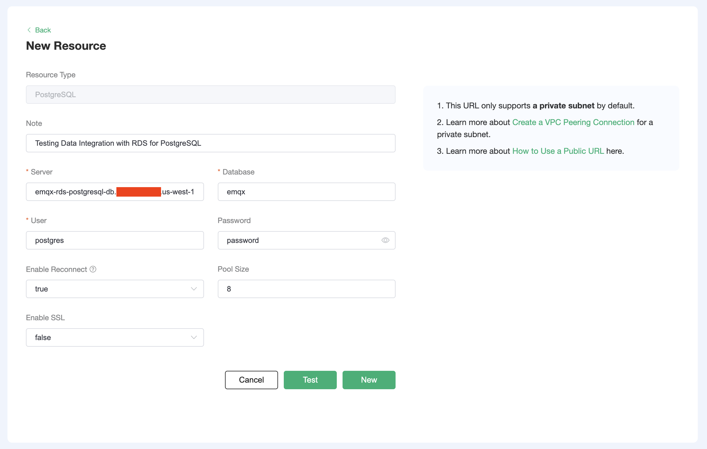

# Save device data to PostgreSQL using the Data Integrations

In this article, we will simulate temperature and humidity data and report these data to EMQX Cloud via the MQTT protocol, and then use the EMQX Cloud Data Integrations to dump the data into PostgreSQL.

Before you start, you need to complete the following operations:

- [Create a Professional or Premium EMQX Cloud deployment.](../deployments/create_deployment.md)
- [Create a VPC peering connection.](../deployments/vpc_peering.md) All IP addresses mentioned below refer to the internal network IP of the resource.
  - [NAT gateway service](../vas/nat-gateway.md) allows usage of public IP address to connect to resources.

## RDS for PostgreSQL Configuration

1. Follow [this AWS tutorial](https://aws.amazon.com/getting-started/hands-on/create-connect-postgresql-db/) to create an RDS for PostgreSQL instance.

    - Use the same VPC that has been peered to the EMQX deployment.
    - Storage Autoscaling and Backups do not need to be enabled for testing.
    - Do not enable public access. EMQX connects to the PostgreSQL instance via private IP through VPC peering. Enabling public access would cause the AWS-generated endpoint address to point to the public IP address.
    - In Database Authentication, choose "Password authentication" for simplicity.

2. Open port 5432 on the RDS instance's security group for requests from the EMQX cluster.

    Copy the EMQX cluster CIDR block, which can be found in the EMQX console > Overview > VPC Peering Connection > View button.

    

    Find the PostgreSQL instance in Amazon RDS console, select it, and click on its security group.

    

    In the security group overview page, click on "Edit inbound rules" and add a rule with type `PostgreSQL` and the EMQX deployment CIDR block as source.

    

3. Access the RDS instance from the EC2 instance.

    AWS facilitates creating an EC2 instance in order to manipulate the RDS database. In the Amazon RDS console, click on the database, then "Set up EC2 connection".

    

    Follow the prompt to select an existing EC2 instance or create a new one. Then, SSH into the newly configured EC2 instance and [install PostgreSQL](https://www.postgresql.org/download/linux/ubuntu/):

    ```bash
    # For Ubuntu users:

    # Create the file repository configuration:
    sudo sh -c 'echo "deb http://apt.postgresql.org/pub/repos/apt $(lsb_release -cs)-pgdg main" > /etc/apt/sources.list.d/pgdg.list'

    # Import the repository signing key:
    wget --quiet -O - https://www.postgresql.org/media/keys/ACCC4CF8.asc | sudo apt-key add -

    # Update the package lists:
    sudo apt-get update

    # Install the latest version of PostgreSQL.
    sudo apt-get -y install postgresql-client
    ```

    Connect to PostgreSQL with the command `psql -h <hostname> -p 5432 -U <master_username> -W` and type in the password when prompted. The hostname can be found in the Amazon RDS console as shown below.

    

4. Create database, create table, insert data, and view it.

    ```sql
    CREATE database emqx;
    \c emqx
    CREATE TABLE temp_hum (
        up_timestamp   TIMESTAMPTZ       NOT NULL,
        client_id      TEXT              NOT NULL,
        temp           DOUBLE PRECISION  NULL,
        hum            DOUBLE PRECISION  NULL
    );
    INSERT INTO temp_hum(up_timestamp, client_id, temp, hum) VALUES (to_timestamp(1603963414), 'temp_hum-001', 19.1, 55);
    SELECT * FROM temp_hum;
    ```

## Data Integrations Configuration

Go to Deployment Details and click on `Data Integrations` on the left menu bar.

1. Create PostgreSQL Resource.

    Click on `PostgreSQL` under the Data Persistence.

    

    Fill in the information of the PostgreSQL database you have just created and click `Test`. Make sure to add the port number at the end of the server hostname (`:5432`). If there is an error, you should check if the database configuration is correct. Then click on `New` to create PostgreSQL resource.

    

2. Create Rule.

    Choose the MySQL resource under Configured Resources, click on `New Rule` and enter the following rule to match the SQL statement. In the following rule, we read the time when the message was reported `up_timestamp`, client ID, payload via `temp_hum/emqx` topic. Also, we can read temperature and humidity from this topic.

    ```sql
    SELECT
    timestamp AS up_timestamp, clientid AS client_id, payload.temp AS temp, payload.hum AS hum  
    FROM
    "temp_hum/emqx"
    ```

    You can use `SQL Test` to see the result.

    

3. Add Action.

    Click on the Next action in the bottom to enter action view. Select the resource created in the first step, select `Data Persistence - Data to PostgreSQL` as Action Type, and enter the following data to insert into the SQL template.

    ```sql
    INSERT INTO temp_hum(up_timestamp, client_id, temp, hum) VALUES (NOW(), ${client_id}, ${temp}, ${hum})
    ```

    

    Click on `Confirm` to create action.

4. View Resource Detail.

    Click on the resource to see the detail.

    

5. Check Rules Monitoring.

    Click the monitor icon of rule to see the metrics.

    

## Test

1. Use [MQTT X](https://mqttx.app/) to simulate reporting temperature and humidity data.

    You need to replace `broker.emqx.io` with the deployment connection address you have created and add the client-side authentication information in the EMQX Dashboard.

    - topic: `temp_hum/emqx`
    - payload: `{ "temp": "20.1", "hum": "57" }`

    

2. View data dump results.

    ```sql
    select * from temp_hum order by up_timestamp desc limit 10;
    ```

    
