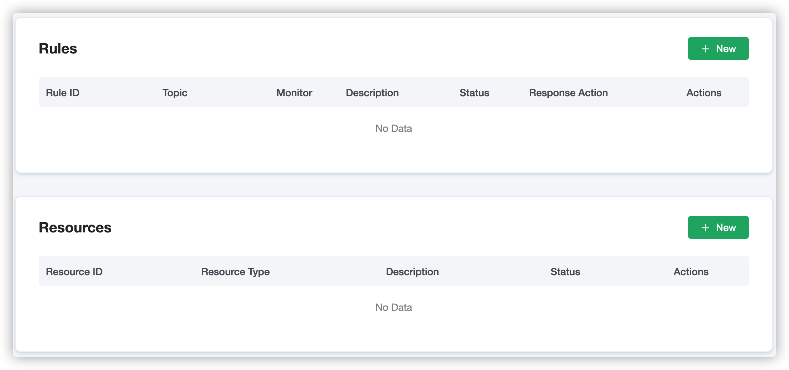
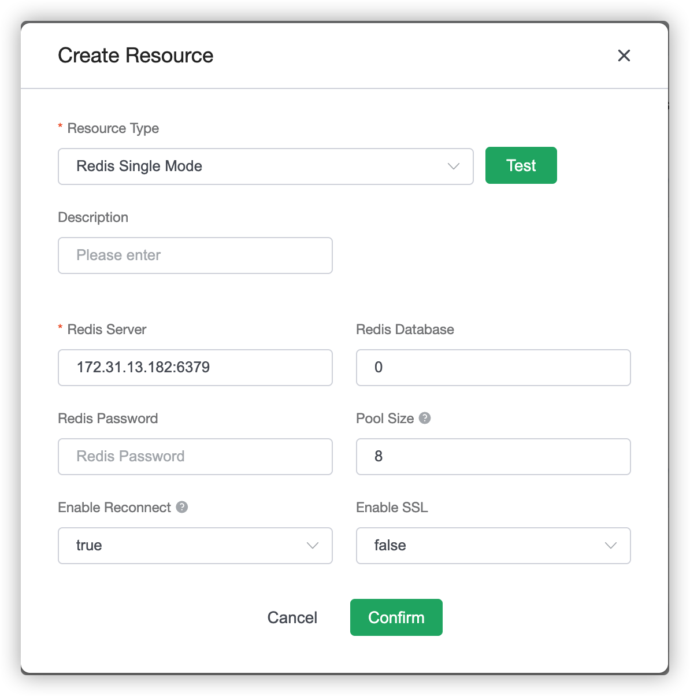
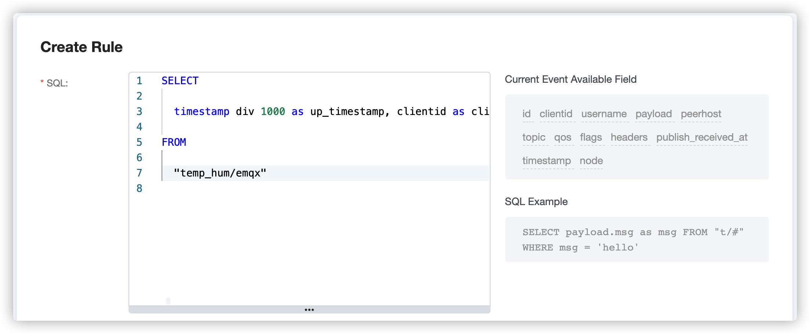
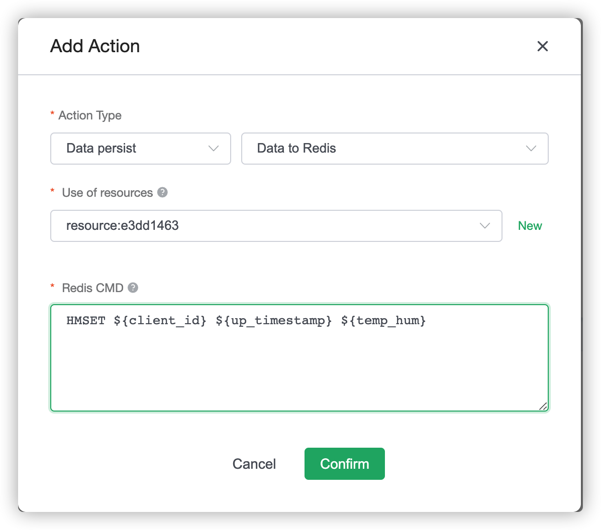
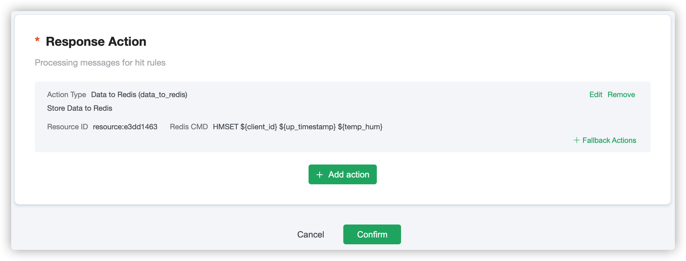
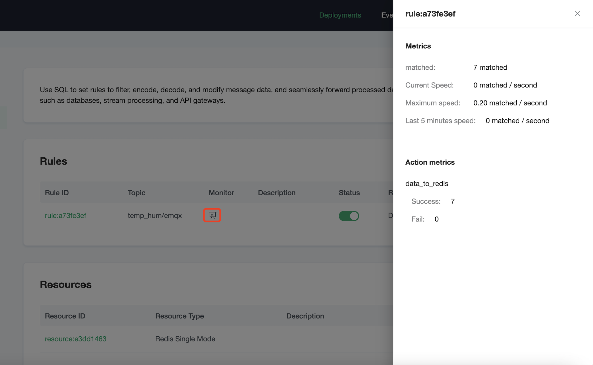
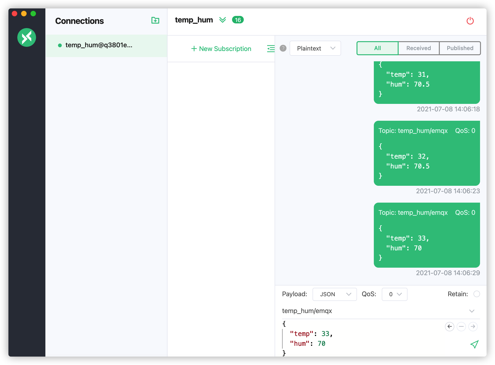
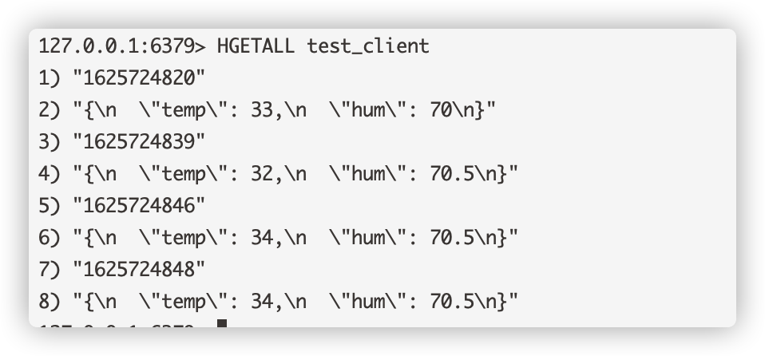

# Save device data to Redis using the Rule Engine

In this article, we will simulate the temperature and humidity
data, and publish these data to EMQ X Cloud via the MQTT protocol, and then we will use the EMQ X Cloud
rule engine to store the data to Redis.

Before you start, you will need to complete the following:

* A deployment (EMQ X Cluster) has been created on EMQ X Cloud.

* For professional deployment users: Please complete the creation of a [VPC Peering Connection](../deployments/vpc_peering.md) first. All IPs mentioned below refer to the resource's intranet IP.

* For basic deployment users: No VPC Peering Connection is required. All IPs mentioned below refer to the resource's public IP.


## Redis Configuration

1. Pull the newest version of Redis mirror
   ```bash
   docker pull redis:latest
   ```
   
2. Run Redis Container
   ```bash
   docker run -itd --name redis -p 6379:6379 redis
   ```


## EMQ X Cloud Rule Engine Configuration

1. Create Redis Resource

   Click on Rule Engine on the left menu bar and click on `+ New` button to create a new resource.

   
   
   Then fill in the information regarding the Redis you choose to store the data. 
   You could always test if the database configuration you entered is correct before confirm to add the resource. 
   If you get an error message after clicking the `Test` button, make sure to double-check the input information and retry.

      

   If the configuration test is passed, click on `confirm` to finish creating resource.


2. Create Rule

   Now we need to create a rule for the rule engine. 
   Click on Rule Engine on the left menu bar and click on `+ New` button to create a new Rule.
   In the following rule, we read the timestamp, client ID, payload via temp_hum/emqx topic.
   
   ```sql
   SELECT 
   
    timestamp div 1000 as up_timestamp, clientid as client_id, payload as temp_hum
   
   FROM
   
    "temp_hum/emqx"
   ```

   


3. Rule Test

   You should always test the SQL ahead to make sure it's functioning
   as you expected.

   )


4. Add Action

   After inputting the SQL command, it's time to create the response actions.

   Towards the bottom of the page, in the Response Action section,
   click on the `+ Add action` button. 
   Select the resource created in the first step and enter the following data to insert into the Redis command template.

   ```bash
   HMSET ${client_id} ${up_timestamp} ${temp_hum}
   ```
   
   )
   

5. Click on `Confirm` to finish creating a Rule. You could always come back to edit you rules and add more actions.

   


6. Check Rules Monitoring

   


## Test

1. Use [MQTT X](https://mqttx.app/) to simulate publishing temperature and humidity data

   You need to replace `broker.emqx.io` with the deployment [connection address](../deployments/view_deployment.md) you have created and add the [client-side authentication information](../deployments/auth.md) in the EMQ X Dashboard.
   
   

2. View stored results

      ```bash
   docker exec -it redis bash redis-cli
   HGETALL test_client
   ```
   
   
