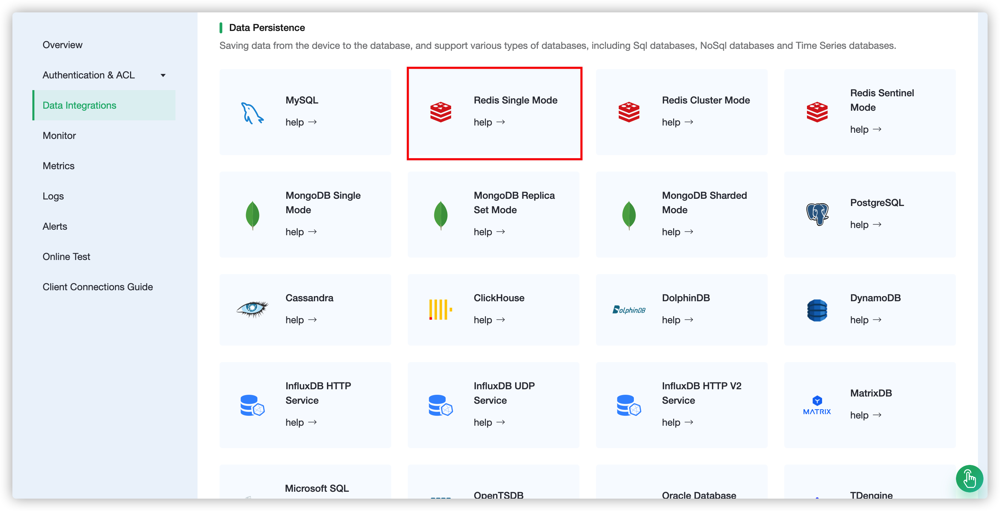
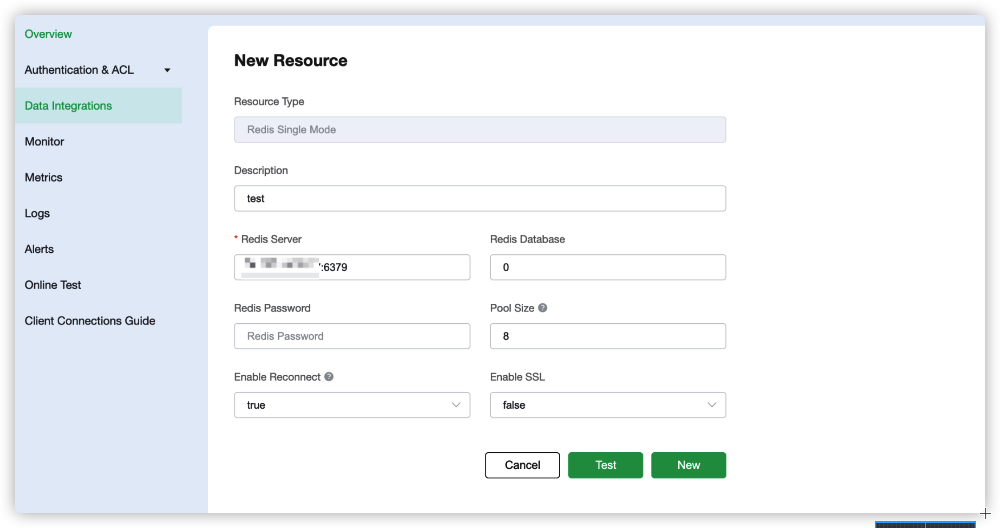
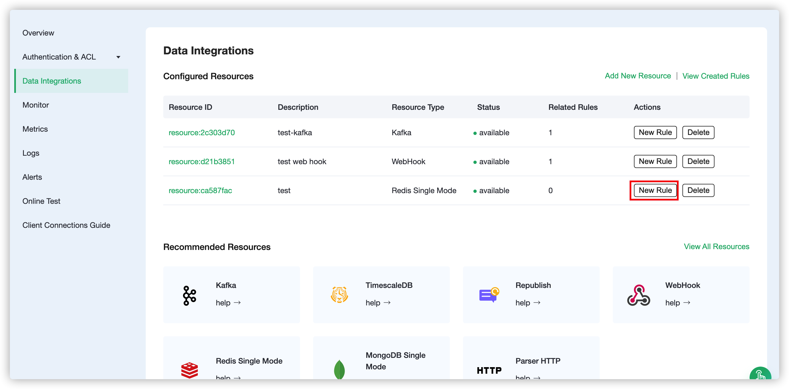
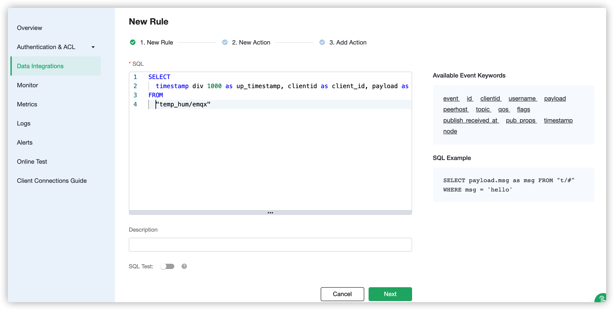
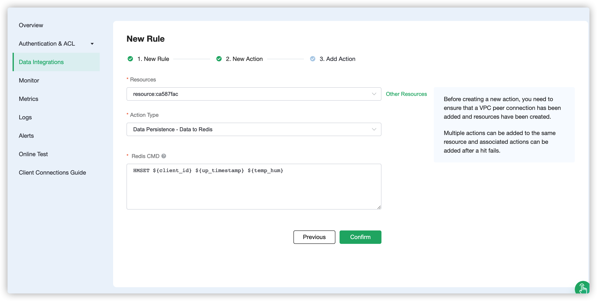

# Save device data to Redis using the Rule Engine

In this article, we will simulate the temperature and humidity
data, and publish these data to EMQX Cloud via the MQTT protocol, and then we will use the EMQX Cloud
rule engine to store the data to Redis.

Before you start, you will need to complete the following:

* A deployment (EMQX Cluster) has been created on EMQX Cloud.

* For professional deployment users: Please complete the creation of a [VPC Peering Connection](../deployments/vpc_peering.md) first. All IPs mentioned below refer to the resource's intranet IP. If the professional deployment has a NAT gateway can also be connected using public IP.

* For basic deployment users: No VPC Peering Connection is required. All IPs mentioned below refer to the resource's public IP.


## 1. Redis Configuration

1. Pull the newest version of Redis mirror
   ```bash
   docker pull redis:latest
   ```
   
2. Run Redis Container
   ```bash
   docker run -itd --name redis -p 6379:6379 redis:latest
   ```


## 2. Create Redis Single Mode Resource

Go to [EMQX Cloud Console](https://cloud-intl.emqx.com/console/), and click to enter the deployment of Redis to be used.

On the deployment page, select the Data Integrations and click the Redis single mode resource under Data Persistence to create it.



In the Create Resource page, set as follows:
- Redis Server: IP address and port of the server



Click Test button when configuration is complete, then click New button to create a resource when it is available.

## 3. Create Rule

After the resource is successfully created, you can return to the data integration page and find the newly created resource, and click create rule.



Our goal is to trigger the engine when the client sends a temperature and humidity message to the **temp_hum/emqx** topic. Here you need a certain process of SQL:
* Only for 'temp_hum/emqx'
   
Based on the above principles, our final SQL should look like this
```sql
SELECT
    timestamp div 1000 as up_timestamp, clientid as client_id, payload as temp_hum
FROM
    "temp_hum/emqx"
```



## 4. Create Action

After completing the rule configuration, click Next to configure and create an action. We read the up_timestamp, client ID, temperature and humidity form the topic and save to Redis.

```bash
HMSET ${client_id} ${up_timestamp} ${temp_hum}
```



After an action is created, you can add another action or return it to the data integration screen

## 5. Test

1. Use [MQTT X](https://mqttx.app/) to simulate publishing temperature and humidity data

   You need to replace `broker.emqx.io` with the deployment [connection address](../deployments/view_deployment.md) you have created and add the [client-side authentication information](../deployments/auth.md) in the EMQX Dashboard.

   

2. View stored results

      ```bash
   docker exec -it redis bash redis-cli
   HGETALL test_client
   ```

   
