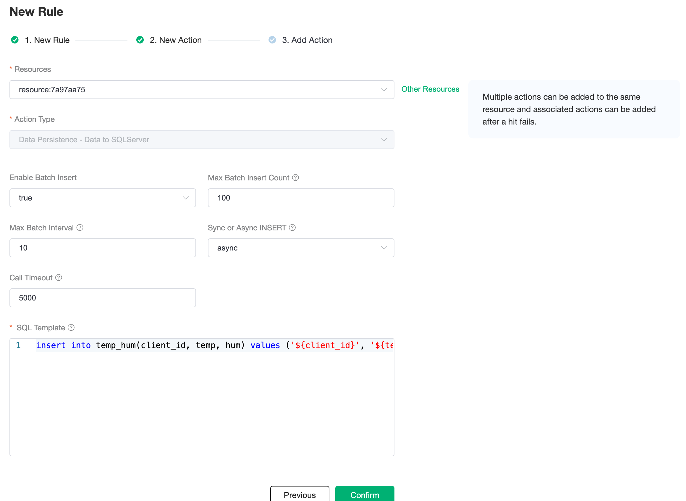

# Integrate with SQL Server

In this article, we will simulate the temperature and humidity data, and report these data to EMQX Cloud via the MQTT protocol, and then we will use EMQX Cloud Data Integrations to dump the data to SQL Server.

Before you start, you will need to complete the following:

- A deployment (EMQX Cluster) has been created on EMQX Cloud.
- For Professional Plan users: Please complete [Peering Connection Creation](../deployments/vpc_peering.md) first, all IPs mentioned below refer to the internal network IP of the resource.(Professional Plan with a [NAT gateway](../vas/nat-gateway.md) can also use public IP to connect to resources).
- For BYOC Plan users: Please establish a peering connection between the VPC where BYOC is deployed and the VPC where the resources are located. All IPs mentioned below refer to the internal IP of the resources. If you need to access the resources via public IP addresses, please configure a NAT gateway in your public cloud console for the VPC where BYOC is deployed.

## SQL Server Configuration

1. Install SQL Server with Docker

   ```bash
   # Password requires a combination of upper and lower case and special characters
   docker run -e 'ACCEPT_EULA=Y' -e 'SA_PASSWORD=Mqtt_public' -p 1433:1433 -d mcr.microsoft.com/mssql/server:2017-latest

   # Connect to your SQL Server instance
   sqlcmd -S localhost -U sa -P Mqtt_public -d master
   ```

2. Create a database

   ```bash
   CREATE DATABASE emqx;
   go;
   ```

   ```bash
   USE emqx;
   go;
   ```

3. Create table

   Use the following SQL command to create `temp_hum` table, and this table will be used for storing the temperature and humidity data reported by devices.

   ```sql
   CREATE TABLE temp_hum(client_id VARCHAR(64) NULL,
                         temp NVARCHAR(100) NULL,
                         hum NVARCHAR(100) NULL,
                         up_timestamp DATETIME NOT NULL DEFAULT CURRENT_TIMESTAMP);
                         
   go;
   ```

4. Configure odbc driver

   Provide your SQL Server version through the EMQX Cloud [tickets](https://docs.emqx.com/en/cloud/latest/feature/tickets.html) service, and the ODBC driver will be installed for your deployment in the background.

## Data Integrations Configuration

Go to Deployment Details and click on `Data Integrations` on the left menu bar.

1. Create SQL Server Resource

   Click on `SQL Server` under the Data Persistence.

   

   Fill in the information of the sqlserver database you have just created and click `Test`. If there is an error, you should check if the database configuration is correct. Then click on `New` to create SQL Server resource.

   

2. Create Rule

   Choose the SQL Server resource under Configured Resources, click on `New Rule` and enter the following rule to match the SQL statement. In the following rule, we read the time when the message was reported `up_timestamp`, client ID, payload via `temp_hum/emqx` topic. Also, we can read temperature and humidity from this topic.

   ```sql
   SELECT
   timestamp as up_timestamp, clientid as client_id, payload.temp as temp, payload.hum as hum
   FROM
   "temp_hum/emqx" 
   ```

   

   You can use `SQL Test` to see the result

   

3. Add Action

   Click on the Next action in the bottom to enter action view. Select the resource created in the first step, select `Data Persistence - Data to SQL Server` as Action Type, and enter the following data to insert into the SQL template.

   ```sql
   insert into temp_hum(client_id, temp, hum) values ('${client_id}', '${temp}', '${hum}') 
   ```

   
   Click on `Confirm` to create action.

4. View Resource Detail

   Click on the resource to see the detail.

   

5. Check Rules Monitoring

   Click the monitor icon of rule to see the metrics

   

## Test

1. Use [MQTTX](https://mqttx.app/) to simulate reporting temperature and humidity data

   You need to replace broker.emqx.io with the deployment connection address you have created and add the client-side authentication information in the EMQX Dashboard.

   - topic: `temp_hum/emqx`
   - payload:

      ```json
      {
         "temp": "24.1",
         "hum": "34.5"
      }
      ```

   

2. View data dump results

      ```sql
      select * from temp_hum order by up_timestamp;
      ```

      
