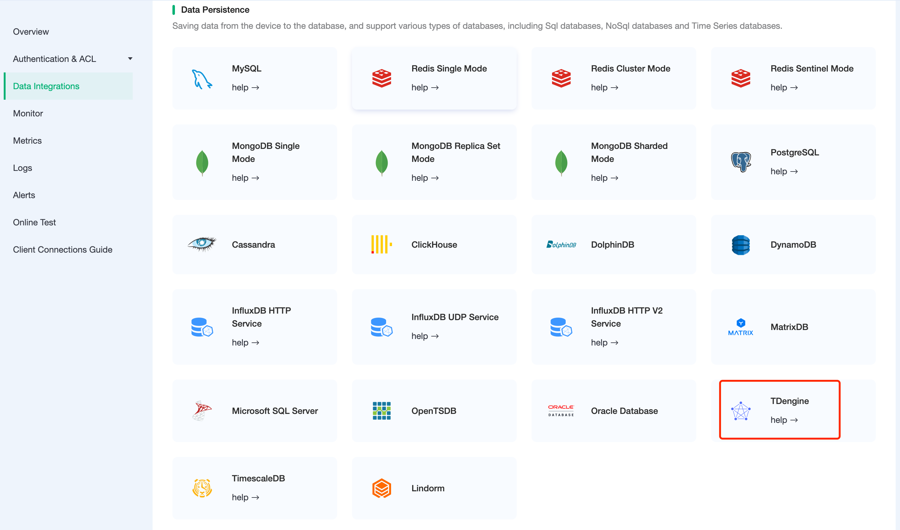
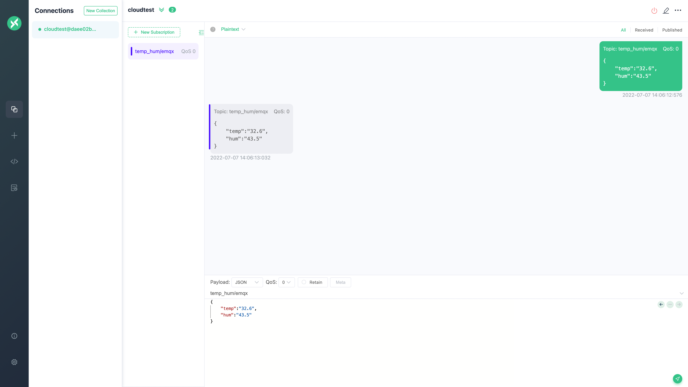
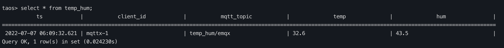

# Integrate with TDengine

[TDengine](https://github.com/taosdata/TDengine) is an open source big data platform designed and optimized by [TOS Data](https://www.taosdata.com/) for IoT, Telematics, Industrial Internet, IT O&M, and other applications.In addition to the core 10x faster time-series database functionality, it also provides caching, data subscription, streaming computing and other features to minimise the complexity of R & D and O & M.

In this article, we will simulate temperature & humidity data and report it to EMQX Cloud via the MQTT protocol, and then use the EMQX Cloud data integration to save the data into TDengine.

Before you start, you need to complete the following operations:

- A deployment (EMQX Cluster) has been created on EMQX Cloud.
- For Professional Plan users: Please complete [Peering Connection Creation](../deployments/vpc_peering.md) first, all IPs mentioned below refer to the internal network IP of the resource.(Professional Plan with a [NAT gateway](../vas/nat-gateway.md) can also use public IP to connect to resources).
- For BYOC Plan users: Please establish a peering connection between the VPC where BYOC is deployed and the VPC where the resources are located. All IPs mentioned below refer to the internal IP of the resources. If you need to access the resources via public IP addresses, please configure a NAT gateway in your public cloud console for the VPC where BYOC is deployed.

## TDengine configuration

1. Install TDengine

   ```bash
   # EMQX currently supports TDengine 2.x, not 3.x yet
   docker run --name tdengine -d -p 6030:6030 -p 6035:6035 -p 6041:6041 -p 6030-6040:6030-6040/udp tdengine/tdengine:2.0.16.0
   ```

2. New database

   ```bash
   docker exec -it tdengine bash
   taos
   create database emqx;
   use emqx;
   ```

3. New table

   Use the following SQL statement to create `temp_hum` table. This table will be used to save the temperature & humidity data of device data.

 > "topic" is a reserved keyword of TDengine. Using "topic" as the field name will cause the table build to fail.  

   ```sql
   CREATE TABLE temp_hum (
   ts timestamp,
   client_id NCHAR(64),
   mqtt_topic NCHAR(255),
   temp BINARY(1024),
   hum BINARY(1024)
   );
   ```

## EMQX Cloud Data Integrations configuration

Go to your deployment and click on the `Data Integrations` menu bar on the left.

1. New Resource

   Click on Data Integrations on the left menu bar → Resources, click on New Resource and drop down to select the TDengine resource type. Fill in the information from the newly created TDengine database: the default username is **root**, and the default password is **taosdata**. TDengine does not configure the database name in the resource, please configure it in SQL. If there is an error, you should promptly check whether the database configuration is correct.
   
   

2. Fill in rule

   Click `Data Integration` on the left menu bar, find the configured resource, click New Rule, and then enter the following rule to match the SQL statement

   ```sql
   SELECT

   now_timestamp('millisecond')  as ts,
   clientid as client_id,
   topic as mqtt_topic,
   payload.temp as temp,
   payload.hum as hum

   FROM

   "temp_hum/emqx"
   ```

   
   

3. Add a response action

   Click Next, select the resource created in the first step, drop down and select Action Type → Data Persistence → Data to TDengine, Enter the following data to the SQL template. You need to specify the database name in SQL, and the character type should be enclosed in single quotes, click Confirm.

   ```sql
   insert into emqx.temp_hum(ts, client_id, mqtt_topic, temp, hum) values (${ts}, '${client_id}', '${mqtt_topic}', '${temp}', '${hum}')
   ```

   

## Test

1. Use [MQTTX](https://mqttx.app/) to connect the deployment

   You need to replace broker.emqx.io with the created deployment connection address, and add client authentication information to the EMQX Cloud Dashboard.

   

2. View the data saving results

   ```sql
   select * from temp_hum;
   ```

   

3.View rules monitoring

   Check the rule monitoring and add one to the number of success.

   
