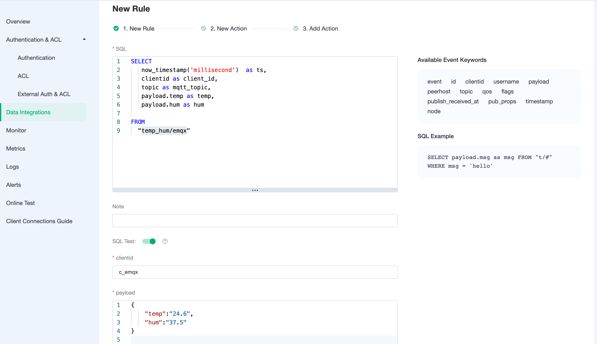
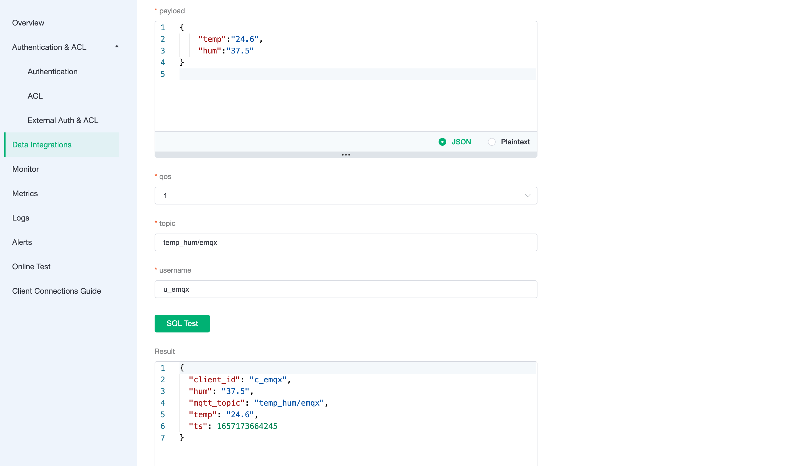

# Save device data to TDengine using the Data Integrations

[TDengine](https://github.com/taosdata/TDengine) is an open source big data platform designed and optimized by [TOS Data](https://www.taosdata.com/) for IoT, Telematics, Industrial Internet, IT O&M, and other applications.In addition to the core 10x faster time-series database functionality, it also provides caching, data subscription, streaming computing and other features to minimise the complexity of R & D and O & M.

In this article, we will simulate data and report it to EMQX Cloud via the MQTT protocol, and then use the EMQX Cloud data integration to save the data into TDengine.

Before you start, you need to complete the following operations:

- Deployments have already been created on EMQX Cloud (EMQX Cluster).
- For Professional Plan users: Please complete [Peering Connection Creation](../deployments/vpc_peering.md) first, all IPs mentioned below refer to the intranet IP of the resource.(Professional Plan with a [NAT gateway](../vas/nat-gateway.md) can also use public IP to connect to resources)

## TDengine configuration

1. Install TDengine

   ```bash
   docker run --name tdengine -d -p 6030:6030 -p 6035:6035 -p 6041:6041 -p 6030-6040:6030-6040/udp tdengine/tdengine
   ```

2. New database

   ```bash
   docker exec -it tdengine bash
   taos
   create database test;
   use test;
   ```

3. New table

   Use the following SQL statement to create `t_mqtt_msg` table. This table will be used to save the device data.

   ```sql
   CREATE TABLE t_mqtt_msg (
   ts timestamp,
   msgid NCHAR(64),
   mqtt_topic NCHAR(255),
   qos TINYINT,
   payload BINARY(1024),
   arrived timestamp
   );
   ```

## EMQX Cloud Data Integrations configuration

Go to your deployment and click on the `Data Integrations` menu bar on the left.

1. New Resource

   Click on Data Integrations on the left menu bar → Resources, click on New Resource and drop down to select the TDengine resource type. Fill in the tdengine database information you have just created and click Test. If you get an error, instantly check that the database configuration is correct.
   
   

2. Fill in rule

   Click `Data Integration` on the left menu bar, find the configured resource, click New Rule, and then enter the following rule to match the SQL statement

   ```sql
   SELECT * FROM "t/#"
   ```

   
   
   

3. Add a response action

   Click Next, select the resource created in the first step, drop down and select Action Type → Data Persistence → Data to TDengine, Enter the following data to the SQL template. Click on confirm.

   ```sql
   insert into test.t_mqtt_msg(ts, msgid, mqtt_topic, qos, payload) values (now, '${id}', '${topic}', ${qos}, '${payload}')
   ```

   

## Test

1. Use [MQTT X](https://mqttx.app/) to connect the deployment

   You need to replace broker.emqx.io with the created deployment [connection address](../deployments/view_deployment.md), and add [client authentication information](../deployments/auth.md) to the EMQX Cloud Dashboard.

   

2. View the data saving results

   ```sql
   select * from t_mqtt_msg;
   ```

   

3.View rules monitoring

   Check the rule monitoring and add one to the number of success.

   
