# Integrate with Timescale Cloud

This page introduces how to use the data integrations feature in EMQX Cloud to ingest data into Timescale Cloud. In the following demonstrations, you can simulate how to send temperature and humidity data to EMQX Cloud and then ingest the data into Timescale Cloud by confiuring the data integration in EMQX Cloud.

Before you start, you need to complete the following:

- A deployment (EMQX Cluster) has been created on EMQX Cloud.
- For Professional Plan users: Please complete [Peering Connection Creation](../deployments/vpc_peering.md) first, all IPs mentioned below refer to the internal network IP of the resource.(Professional Plan with a [NAT gateway](../vas/nat-gateway.md) can also use public IP to connect to resources).
- For BYOC Plan users: Please establish a peering connection between the VPC where BYOC is deployed and the VPC where the resources are located. All IPs mentioned below refer to the internal IP of the resources. If you need to access the resources via public IP addresses, please configure a NAT gateway in your public cloud console for the VPC where BYOC is deployed.

## Create a Timescale Cloud Service

This section introduces how to create a service in Timescale Cloud and connect to the service.

1. Log in to Timescale Cloud and you will be navigated to the **Create a service** page. 

2. On the **Create a service** page, select a region from the drop-down list of the **Region** field. Click **Create service** at the bottom of the page.

   ::: tip

   It is better to select a region that is close to the region of the EMQX Cloud.

   :::

   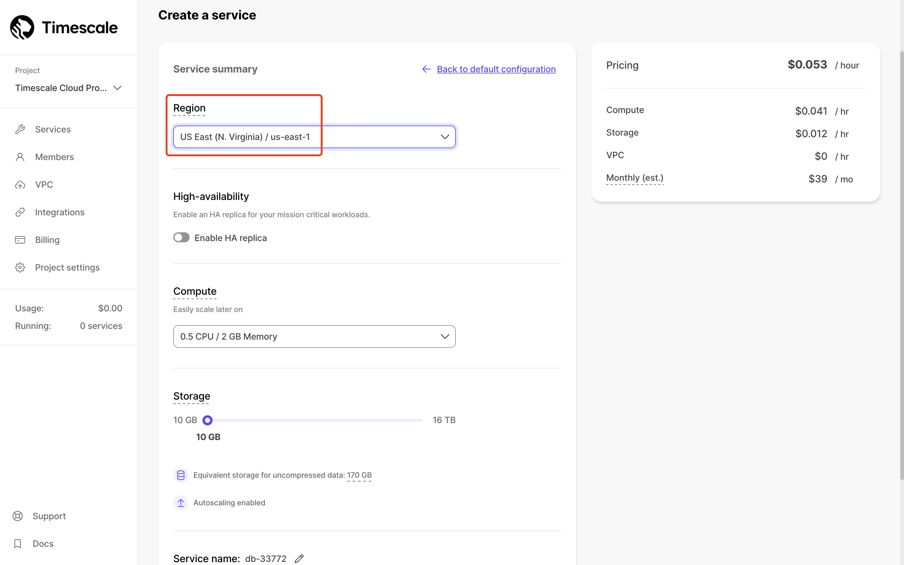

3. After the service is created, you can follow the instructions on this page to connect to your service. Or, you can follow the steps below to connect to your service. Store your **Username** and **Password** properly.

   :::tip

   You can also download the cheatsheet for further use.

   :::

   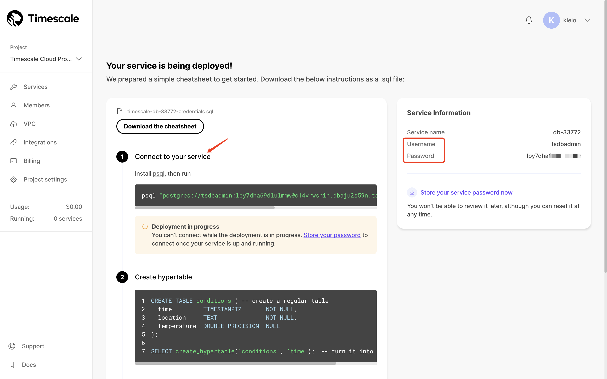

3. Install psql using the commands below.

   For macOS:

   ```bash
   brew doctor
   brew update
   brew install libpq
   ```

   For Linux:

   ```bash
   sudo apt-get update
   sudo apt-get install postgresql-client
   ```

4. In the psql terminal, run the following command to connect to your database.

   ```bash
   psql -x "postgres://{YOUR_USERNAME_HERE}:{YOUR_PASSWORD_HERE}@{YOUR_HOSTNAME_HERE}:{YOUR_PORT_HERE}/{YOUR_DB_HERE}"
   ```
   
5. Use the following SQL statement to create a new table `temp_hum` . This table will be used to save the temperature and humidity data reported by devices.

   ```sql
   CREATE TABLE temp_hum (
       up_timestamp   TIMESTAMPTZ       NOT NULL,
       client_id      TEXT              NOT NULL,
       temp           DOUBLE PRECISION  NULL,
       hum            DOUBLE PRECISION  NULL
   );
   
   SELECT create_hypertable('temp_hum', 'up_timestamp');
   ```
   
5. Insert test data and view it.

   ```sql
   INSERT INTO temp_hum(up_timestamp, client_id, temp, hum) values (to_timestamp(1603963414), 'temp_hum-001', 19.1, 55);
   
   select * from temp_hum;
   ```

   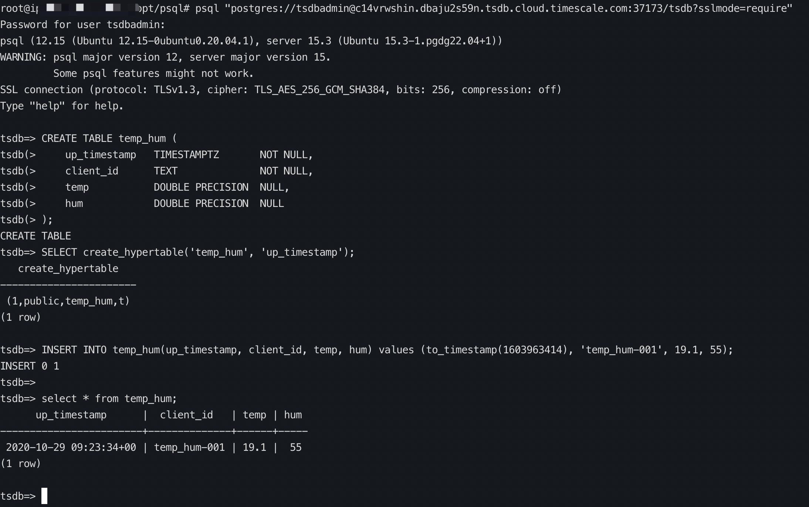

7. After you connect to your service, you can click **I stored my password, go to service overview**. On the overview page, you can see your connection information.

   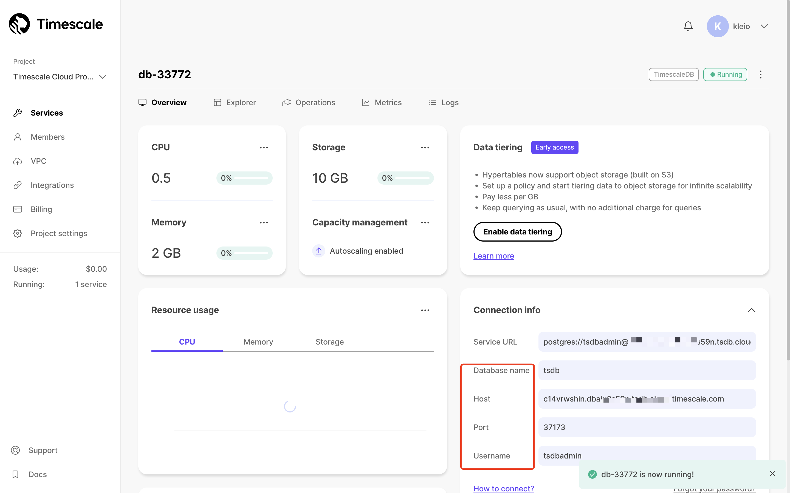

## Configure Data Integrations in EMQX Cloud

This section provides instructions on how to configure a Timescale data integration in EMQX Cloud Console using the service you created in Timescale Cloud to save data from the device to the Timescale.

1. Sign in to your Cloud Console and go to the deployment details page. 

2. Click **Data Integrations** from the left navigation menu. Under **Data Persistence**, click **TimescaleDB**.

   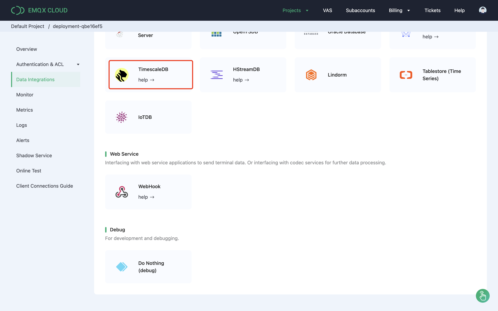
   
3. Fill in the Timescaledb connection information you get in [Create a Timescale Cloud Service](#create-a-timescale-cloud-service). Set the **Pool Size** to `1`. Click **Test** to test the connection.

   - If the connection fails, you need to check if the database configuration is correct. 
   - If the connection is successful, click **New** to create a TimescaleDB resource.

   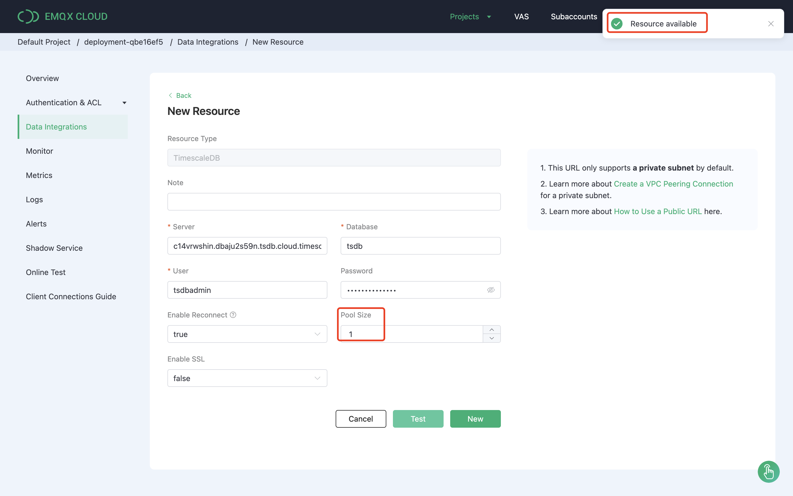

4. Under **Configured Resources**, select the TimescaleDB resource. Click **New Rule** and enter the following rule to match the SQL statement. The `SELECT` part of the rule includes the following fields:

   - `up_timestamp`: The real time when the message is sent.
   - `client ID`: The ID of the device that sends the message. 
   - `Payload`: The payload of the message on topic `temp_hum/emqx`, which contains the temperature and humidity data.

   ```sql
   SELECT 
   timestamp div 1000 AS up_timestamp, clientid AS client_id, payload.temp AS temp, payload.hum AS hum
   FROM
   "temp_hum/emqx"
   ```

   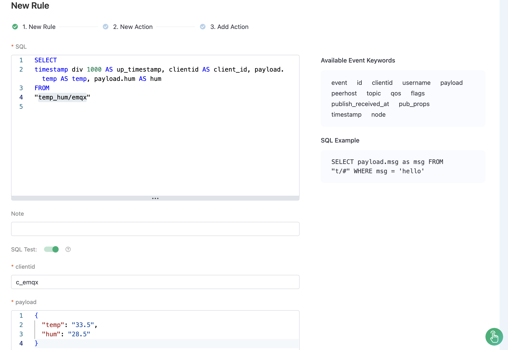

3. Enable **SQL Test** by clicking the toogle switch. Fill in the required fields and click **SQL Test** to test if the rule works. 

   You should get the expected result as shown in the screenshot.

   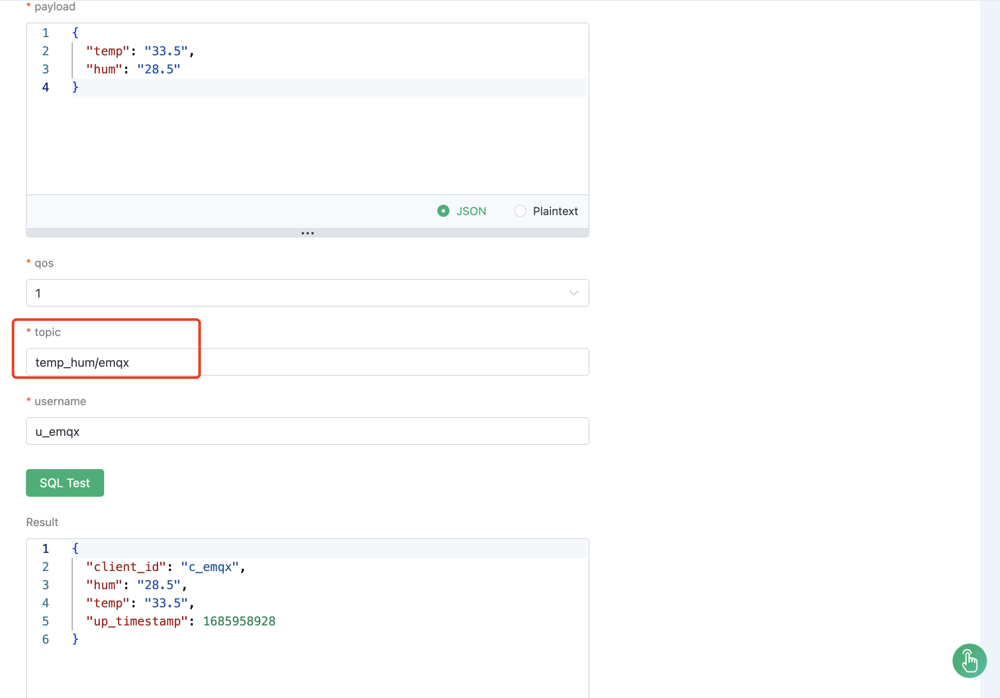
   
3. Click the **Next** button at the bottom to create an action. Select the resource created before from the drop-down list. In **SQL Template**, enter the following data to insert them into the SQL template.

   ```sql
   INSERT INTO temp_hum(up_timestamp, client_id, temp, hum) VALUES (to_timestamp(${up_timestamp}), ${client_id}, ${temp}, ${hum})
   ```
   
   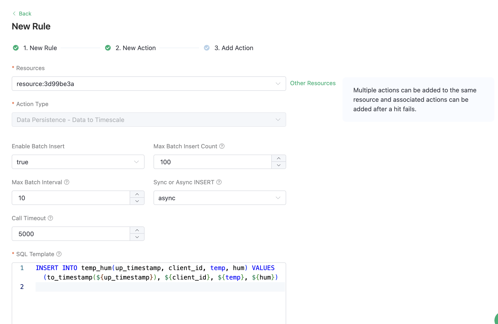

4. Click **Confirm** to create the action. You will be prompted to add another rule if needed. Otherwise, you can click **View Details**.

8. On the details page, you can see the rule sql and the associated action. 

   :::tip

   You can also see all created rules by clicking **Data Integrations** -> **View Created Rules**. 

   :::

   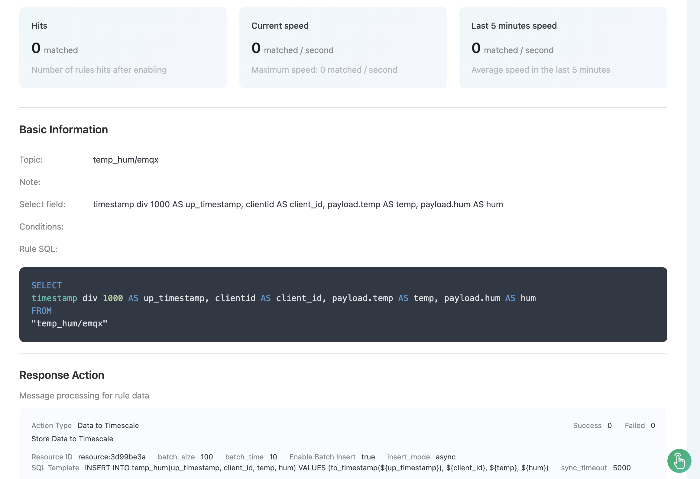

5. Click the icon in the **Monitor** column to see the detailed metrics of the rule.

   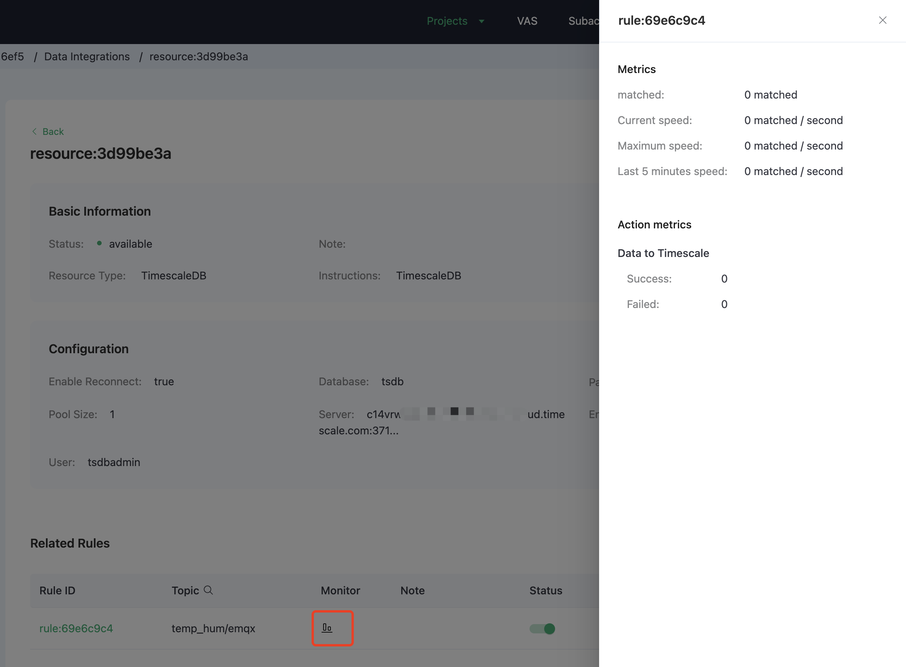

## Test Data Integration

This section demonstrates how to use [MQTTX](https://mqttx.app/) to simulate temperature and humidity data reporting and test if the data integration work properly.

1. Start the MQTTX. In connection information, replace `broker.emqx.io` with the created deployment connection address. Add client authentication information in the EMQX Cloud Console.

1. In MQTTX, send messages containing the temperature and huminidy data in the payload.

   

2. View metrics of the rule in the EMQX Cloud Console. The number of incoming message shown in **Success** should be added by 1 after a message is sent.

   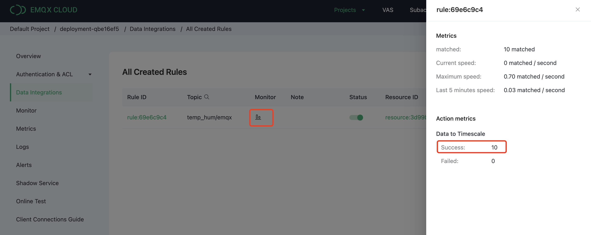

3. In the psql terminal, use the command below to view data ingested into the Timescale database.

   ```sql
   select * from temp_hum order by up_timestamp desc limit 10;
   ```

   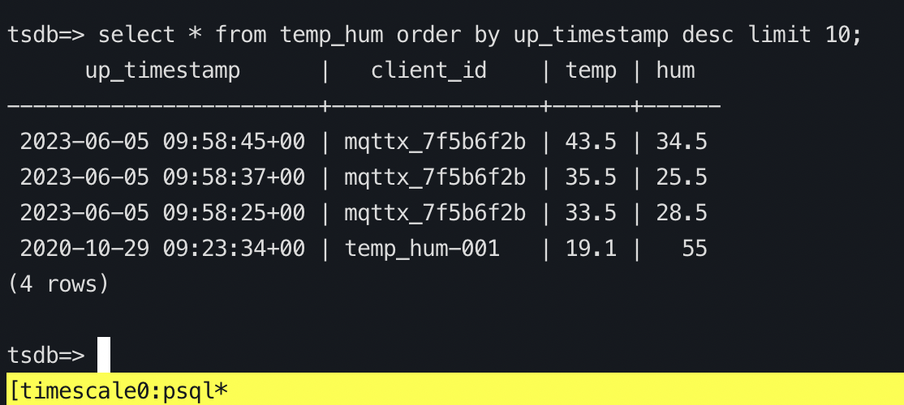
