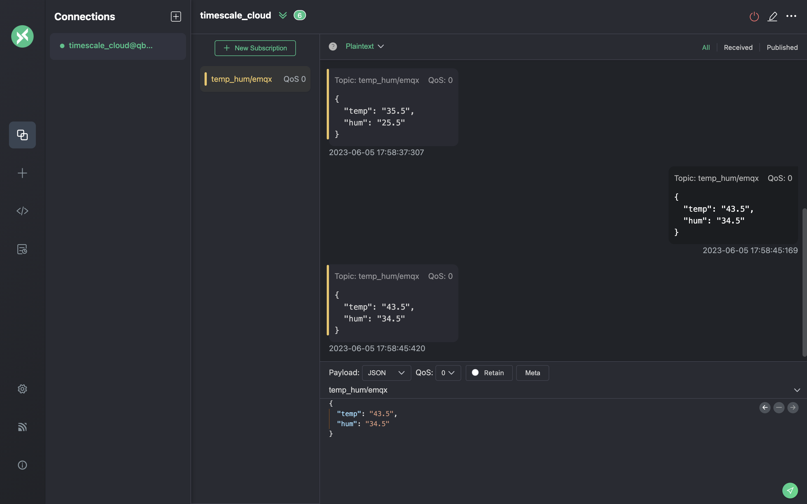

# Integrate with Timescale Cloud

In this article, we will simulate temperature and humidity data and report these data to EMQX Cloud via the MQTT protocol and then use the EMQX Cloud Data Integrations to dump the data into Timescale Cloud.

Before you start, you will need to complete the following:

- Deployments have already been created on EMQX Cloud (EMQX Cluster).
- For Professional deployment users: Please complete [NAT gateway](../vas/nat-gateway.md) first, all IPs mentioned below refer to the public IP of the resource.

## Create a Timescale Cloud service

1. Login to the Timescale Cloud and go to `Create a Service` page, select a `Region`.

   

   Then click `Create service`.

   

2. Initiate your Timescale Cloud instance.

   After the instance is created, the `connection information` is obtained on this page. You can also download the cheatsheet for further use.

   
   

3. Install psql.

   For macOS:

   ```bash
   brew doctor
   brew update
   brew install libpq
   ```

   For Linux:

   ```bash
   sudo apt-get update
   sudo apt-get install postgresql-client
   ```

4. Connect to your database using psql.

   Enter the following command in the terminal to build the connection:

   ```bash
   psql -x "postgres://{YOUR_USERNAME_HERE}:{YOUR_PASSWORD_HERE}@{YOUR_HOSTNAME_HERE}:{YOUR_PORT_HERE}/{YOUR_DB_HERE}"
   ```

      To create a new table:

      Use the following SQL statement to create `temp_hum` table. This table will be used to save the temperature and humidity data reported by devices.

   ```sql
   CREATE TABLE temp_hum (
       up_timestamp   TIMESTAMPTZ       NOT NULL,
       client_id      TEXT              NOT NULL,
       temp           DOUBLE PRECISION  NULL,
       hum            DOUBLE PRECISION  NULL
   );
   
   SELECT create_hypertable('temp_hum', 'up_timestamp');
   ```

5. Insert test data and view it.

   ```sql
   INSERT INTO temp_hum(up_timestamp, client_id, temp, hum) values (to_timestamp(1603963414), 'temp_hum-001', 19.1, 55);
   
   select * from temp_hum;
   ```

   

## Data Integrations Configuration

Go to Deployment Details and click on `Data Integrations` on the left menu bar.

1. Create TimescaleDB Resource

   Click on `TimescaleDB` under the Data Persistence.

   

   Fill in the timescaledb database information you have just created and click `Test`. If there is an error, you should check if the database configuration is correct. Then click on `New` to create TimescaleDB resource.

   

2. Create Rule

   Choose the TimescaleDB resource under Configured Resources, click on `New Rule` and enter the following rule to match the SQL statement. In the following rule we read the time `up_timestamp` when the message is reported, the client ID, the message body (Payload) from the `temp_hum/emqx` topic and the temperature and humidity from the message body respectively.

   ```sql
   SELECT 
   timestamp div 1000 AS up_timestamp, clientid AS client_id, payload.temp AS temp, payload.hum AS hum
   FROM
   "temp_hum/emqx"
   ```

   
   

3. Create Action

   Click on the `Next` button in the bottom to enter action view. Select the resource created in the first step and enter the following data to insert into the SQL template.

   ```sql
   INSERT INTO temp_hum(up_timestamp, client_id, temp, hum) VALUES (to_timestamp(${up_timestamp}), ${client_id}, ${temp}, ${hum})
   ```

   

   Click on `Confirm` to create action.

4. After successfully binding the action to the rule, click `View Details` to see the rule sql statement and the bound actions.

   

5. To see the created rules, go to `Data Integrations/View Created Rules`. Click the Monitor button to see the detailed match data of the rule.

   

## Test

1. Use [MQTTX](https://mqttx.app/) to simulate temperature and humidity data reporting

   You need to replace broker.emqx.io with the created deployment connection address, and add client authentication information to the EMQX Dashboard.

   

2. View rules monitoring

   Check the rule monitoring and add one to the "Success" number.

   

3. View data dump results

   ```sql
   select * from temp_hum order by up_timestamp desc limit 10;
   ```

   
