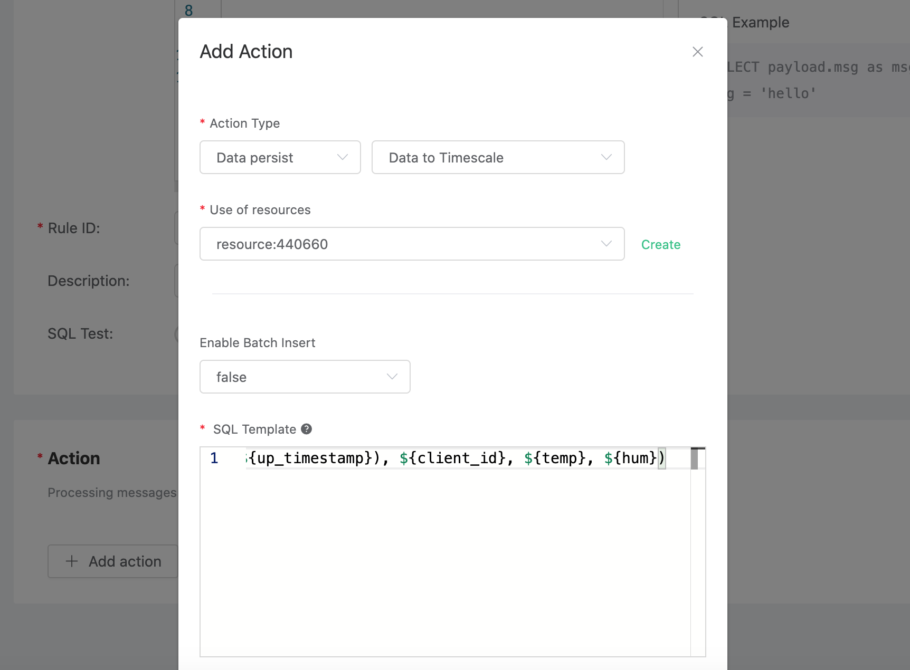
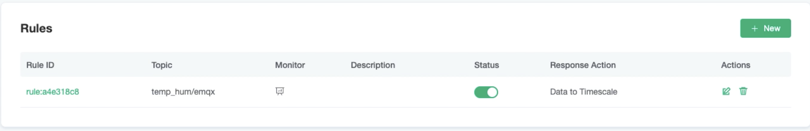
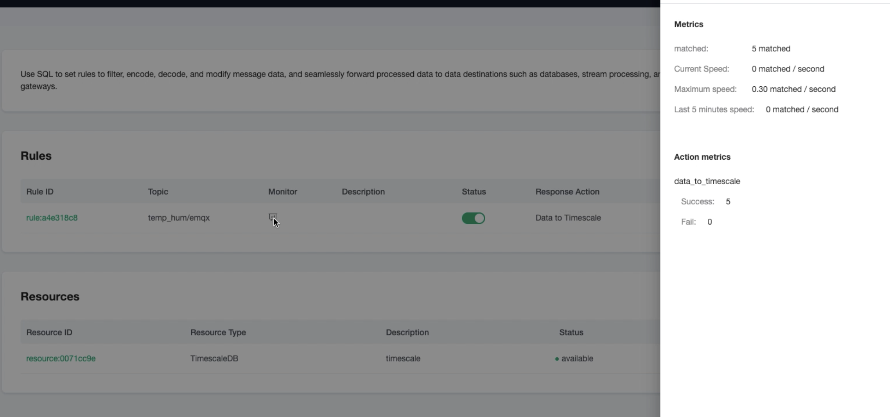
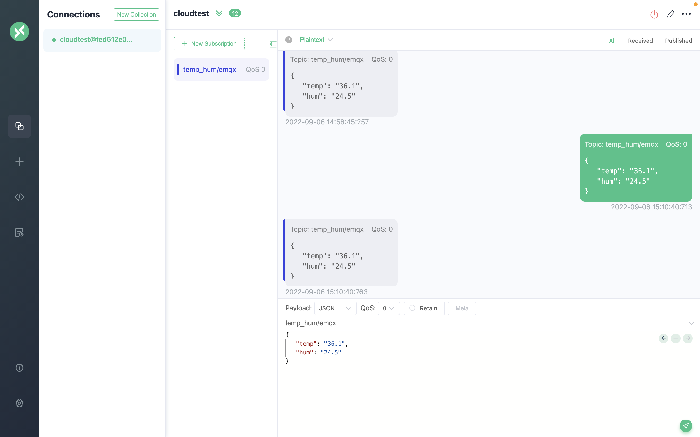

# Save device data to Timescale Cloud using the Rule Engine

In this article, we will simulate temperature and humidity data and report these data to EMQ X Cloud via the MQTT protocol and then use the EMQ X Cloud rules engine to dump the data into Timescale Cloud.

Before you start, you need to complete the following operations:
* Deployments have already been created on EMQ X Cloud (EMQ X Cluster).
* For professional deployment users: Please complete [Peering Connection Creation](../deployments/vpc_peering.md) first, all IPs mentioned below refer to the intranet IP of the resource.


  <div style="position: relative; padding: 30% 45%;">
  <iframe style="position: absolute; width: 100%; height: 100%; left: 0; top: 0;" src="https://www.youtube.com/embed/7EheLmjaHCk" title="YouTube video player" frameborder="0" allow="accelerometer; autoplay; encrypted-media; gyroscope; picture-in-picture" allowfullscreen></iframe>
  </div>

## Create a Timescale Cloud service

1. Login the Timescale Cloud and click `Create a new service`

   

2. Config the service of your needs and click `Create service`

   

3. Install psql 
   
   For MacOS:
   ```bash
   brew doctor
   brew update
   brew install libpq
   ```
   
   For Linux:
   ```bash
   sudo apt-get update
   sudo apt-get install postgresql-client
   ```

4. Connect to your database using psql

   
   
   Enter the following command in the terminal to build the connection:

   ```bash
   $ psql -x "postgres://{YOUR_USERNAME_HERE}:{YOUR_PASSWORD_HERE}@{YOUR_HOSTNAME_HERE}:{YOUR_PORT_HERE}/{YOUR_DB_HERE}"
   ```

      To create a new table: 
   
      Use the following SQL statement to create `temp_hum` table. This table will be used to save the temperature and humidity data reported by devices.
      
   ```sql
   CREATE TABLE temp_hum (
       up_timestamp   TIMESTAMPTZ       NOT NULL,
       client_id      TEXT              NOT NULL,
       temp           DOUBLE PRECISION  NULL,
       hum            DOUBLE PRECISION  NULL
   );
   
   SELECT create_hypertable('temp_hum', 'up_timestamp');
   ```

4. Insert test data and view it
   ```sql
   INSERT INTO temp_hum(up_timestamp, client_id, temp, hum) values (to_timestamp(1603963414), 'temp_hum-001', 19.1, 55);

   select * from temp_hum;
   ```
   
## EMQ X Cloud rules engine configuration

Go to Deployment Details and click on EMQ X Dashbaord to go to Dashbaord.

1. New Resource

   Click on Rules on the left menu bar → Resources, click on New Resource and drop down to select the TimescaleDB resource type. Fill in the timescaledb database information you have just created and click Test. If you get an error, instantly check that the database configuration is correct.
   
   
2. New Rule
   Click on Rules on the left menu bar → Rules, click on Create and enter the following rule to match the SQL statement.  In the following rule we read the time `up_timestamp` when the message is reported, the client ID, the message body (Payload) from the `temp_hum/emqx` topic and the temperature and humidity from the message body respectively.
   
   ```sql
   SELECT 
   
   timestamp div 1000 as up_timestamp, clientid as client_id, payload.temp as temp, payload.hum as hum
   
   FROM
   
   "temp_hum/emqx"
   ```
   

3. Add a response action

   Click on Add Action in the bottom left corner, drop down and select → Data Persistence → Save Data to Timescale, select the resource created in the first step and enter the following data to insert into the SQL template.

   ```sql
   insert into temp_hum(up_timestamp, client_id, temp, hum) values (to_timestamp(${up_timestamp}), ${client_id}, ${temp}, ${hum})
   ```
   

4. Click on New Rule and return to the list of rules
   


5. View rules monitoring
   

## Test
1. Use [MQTT X](https://mqttx.app/) to simulate temperature and humidity data reporting

   You need to replace broker.emqx.io with the created deployment [connection address](../deployments/view_deployment.md), and add [client authentication information](../deployments/auth.md) to the EMQ X Dashboard.
   
   
2. View data dump results

   ```sql
   select * from temp_hum order by up_timestamp desc limit 10;
   ```
   
