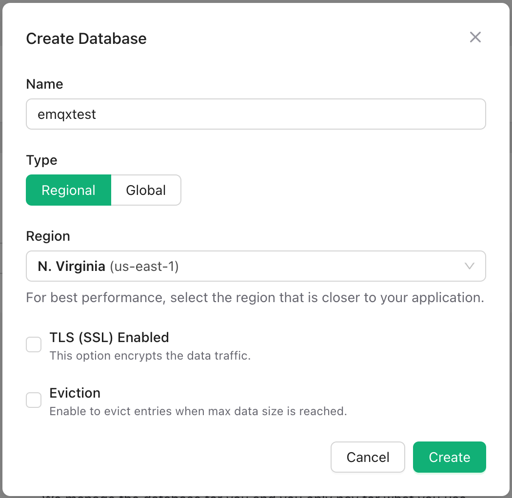
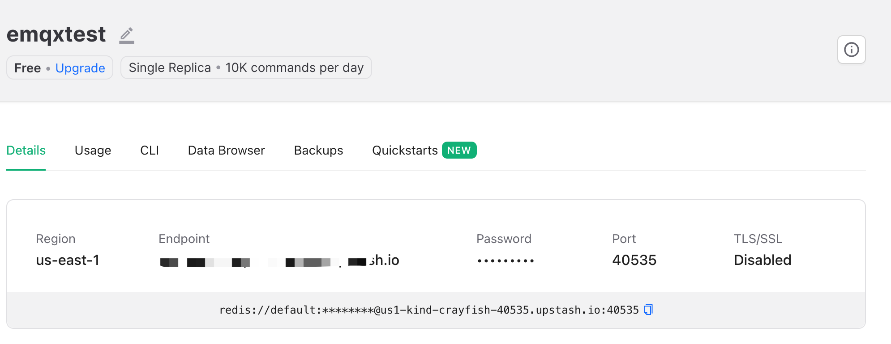
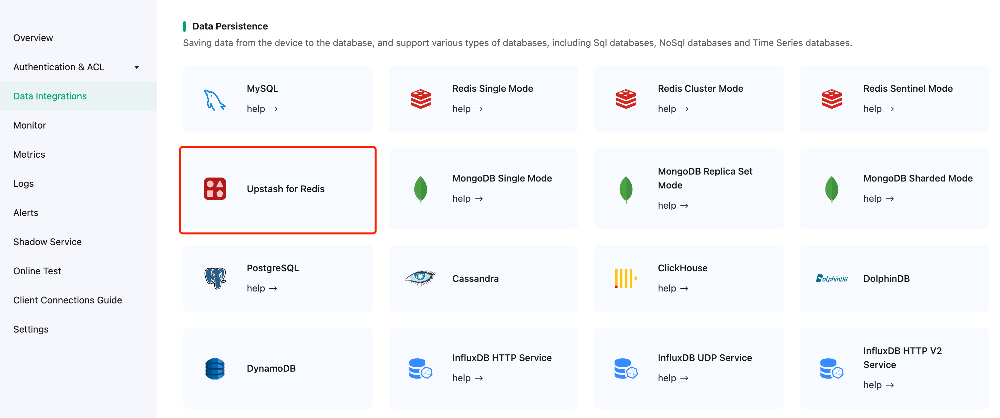
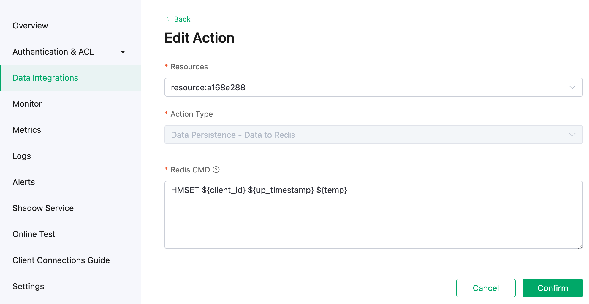
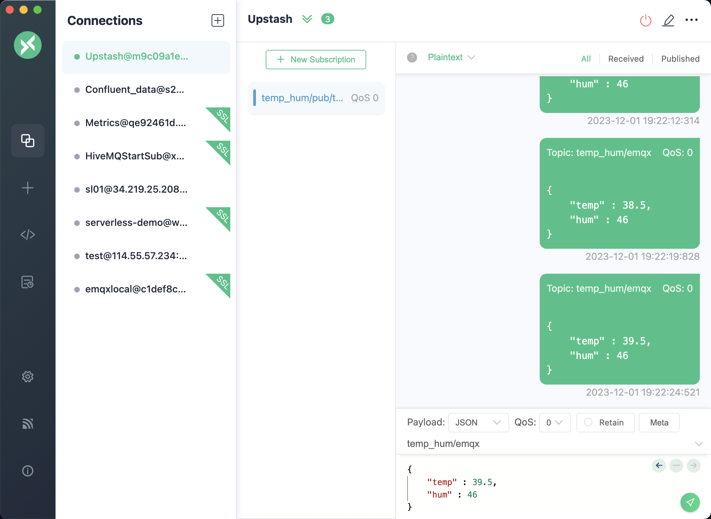
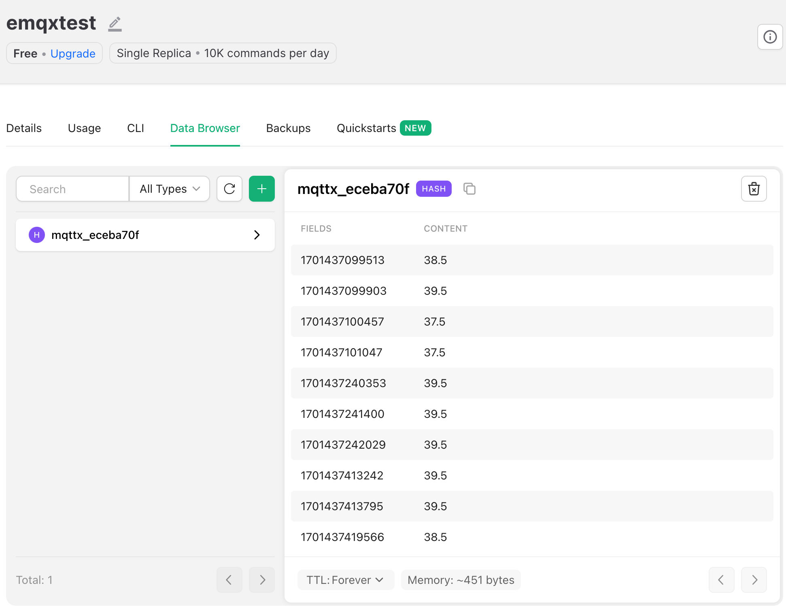

# Integrate with Upstash for Redis

Upstash is a cloud-based, serverless data platform that empowers developers to seamlessly integrate Redis databases and Kafka into their applications without the hassle of managing infrastructure. Offering a serverless architecture, Upstash allows users to enjoy the benefits of Redis, a high-performance, in-memory data store, and Kafka, without dealing with the complexities of deployment, scaling, or maintenance.

This tutorial introduces how to stream the MQTT data to Upstash by creating a data integration. Through the data integration, clients can send the temperature and humidity data to EMQX Cloud using the MQTT protocol and stream the data into Upstash for Redis. 


## Set Up Upstash for Redis Database
To begin using Upstash, visit https://upstash.com/ and create an account. 

### Create a Redis Database
1. Once you logged in, you can create a Redis Database by clicking on the **Create Database** button.

2. Type a valid name. Select the region in which you would like your database to be deployed. To optimize performance, it is recommended to choose the region that is closest to your EMQX Cloud deployment's region.

3. Click **Create**. Now you have a serverless Redis Database.



### View Details

Enter the database console, now you have the information needed for the next steps.



In the above steps, we have completed the prerequisite settings of Upstash side.

## Create Upstash Data Integration

### Enable NAT Gateway in EMQX Cloud

1. Login to EMQX Cloud console, and enter the deployment Overview page.

2. Click the **NAT Gateway** tab on the lower section of the page, and click **Subscribe Now**. Learn more about [NAT Gateway](../vas/nat-gateway.md).


### Data Integration Configuration

1. In the EMQX Cloud console, click **Data Integrations** from the navigation menu in your deployment and click **Upstash for Redis**.

   


2. Enter the information in **Endpoints** on Redis detail page to the **Redis Server**. Don't forget to add the port in the end. Enter the password in **Password** fields. Click **Test** to verify the connection to the Upstash server.
   

3. Click **New** to create a Redis resource. Under the **Configured Resources**, you can see a new Upstash for Redis is created.


4. Create a new rule. Enter the following SQL statement in the **SQL** input field. The rule used in this demonstration will read the messages from the `temp_hum/emqx` topic and enrich the JSON object by adding client_id, topic, and timestamp info. 

   - `up_timestamp`: the time when the message is reported
   - `client_id`: the ID of the client that publishes the message
   - `temp`: the temperature data in the message payload
   - `Hum`: the humidity data in the message payload

```sql
SELECT 
   timestamp as up_timestamp, 
   clientid as client_id, 
   payload.temp as temp,
   payload.hum as hum
   FROM
   "temp_hum/emqx"
```
   
   

5. Test the SQL rule by entering the test payload, topic, and client information, and click **SQL Test**. If you see the results like the following, it means the SQL test succeeds.

   

6. Click **Next** to add an action to the rule. We read the up_timestamp, client ID, temperature and humidity form the topic and save to Redis. Click **Confirm**.

   ```bash
   HMSET ${client_id} ${up_timestamp} ${temp}
   ```

   

7. After successfully binding the action to the rule, you can click **View Details** to see the rule sql statement and the bound actions.

8. To see the created rules, click the **View Created Rules** button on the Data Integrations page. Click the icon in the **Monitor** column to see the detailed metrics of the rule and action.


## Test Data Bridge

1. Use [MQTTX](https://mqttx.app/) to simulate temperature and humidity data reporting.

   You need to enter the deployment connection address and add client authentication information for connecting to the EMQX Dashboard.
   

2. View data in Upstash Console. In Data Browser, we select the client enrty, then we can check the messages.

   
