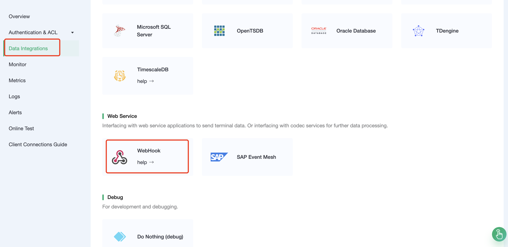
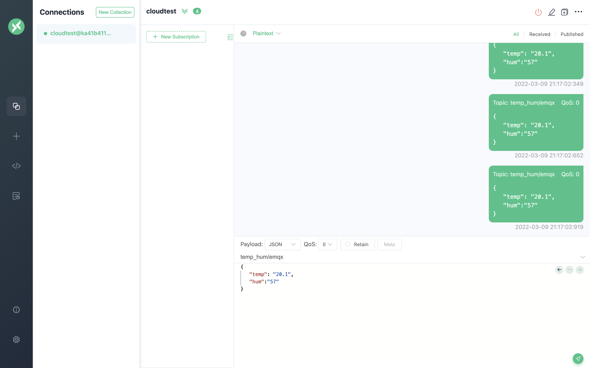

# Forwarding Device Data to Webhook Using the Data Integrations

In this article, we will simulate temperature and humidity data and report these data to EMQX Cloud via the MQTT protocol and then use the EMQX Cloud Data Integrations to dump the data into Webhook.

Before you start, you need to complete the following operations:

- Deployments have already been created on EMQX Cloud (EMQX Cluster).
- For Professional Plan users: Please complete [Peering Connection Creation](../deployments/vpc_peering.md) first, all IPs mentioned below refer to the internal network IP of the resource.(Professional Plan with a [NAT gateway](../vas/nat-gateway.md) can also use public IP to connect to resources)
- For Standard Plan users: No peering connection is required, all IPs below refer to the public IP of the resource.

  <LazyIframeVideo vendor="youtube" src="https://www.youtube.com/embed/fXahRUaQaHE/?autoplay=1&null" />

## Create a Web server

1. You could use the following python code to create a simple Web server.

   ```python
   from http.server import HTTPServer, BaseHTTPRequestHandler
   
   class SimpleHTTPRequestHandler(BaseHTTPRequestHandler):
   
       def do_GET(self):
           self.send_response(200)
           self.end_headers()
           self.wfile.write(b'Hello, world!')
   
       def do_POST(self):
           content_length = int(self.headers['Content-Length'])
           body = self.rfile.read(content_length)
           print("Received POST request with body: " + str(body))
           self.send_response(201)
           self.end_headers()
   
   httpd = HTTPServer(('0.0.0.0', 8080), SimpleHTTPRequestHandler)
   httpd.serve_forever()
   ````

## EMQX Cloud Data Integrations configuration

Go to Deployment Details and click on EMQX Dashboard to go to Dashboard.

1. New Resource
   
   Click on Data Integrations on the left menu bar, drop down to select the Webhook resource type. Fill in the webhook information you have just created and click Test. If you get an error, instantly check that the configuration is correct.
   
   

2. Rule Testing
   
   Click `Data Integration` on the left menu bar, find the configured resource, click New Rule, and then enter the following rule to match the SQL statement

   ```sql
   SELECT

   timestamp as up_timestamp, clientid as client_id, payload.temp as temp, payload.hum as hum

   FROM

   "temp_hum/emqx"
   ```

   
   

3. Add a response action
   
   Click Next, select the resource created in the first step, make sure Action Type → Send Data to Web Service, and fill in the blanks and following data:

   Message content template:

   ```
   {"up_timestamp": ${up_timestamp}, "client_id": ${client_id}, "temp": ${temp}, "hum": ${hum}}
   ```

   

4. Return to the list of rules
   
   
5. View rules monitoring
   
   

## Test

1. Use [MQTT X](https://mqttx.app/) to simulate temperature and humidity data reporting

   You need to replace broker.emqx.io with the created deployment [connection address](../deployments/view_deployment.md), and add [client authentication information](../deployments/auth.md) to the EMQX Dashboard.
   

2. View data dump results

   
