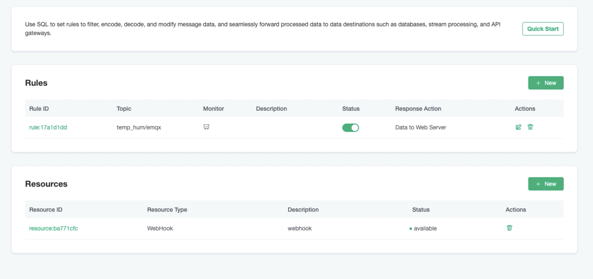
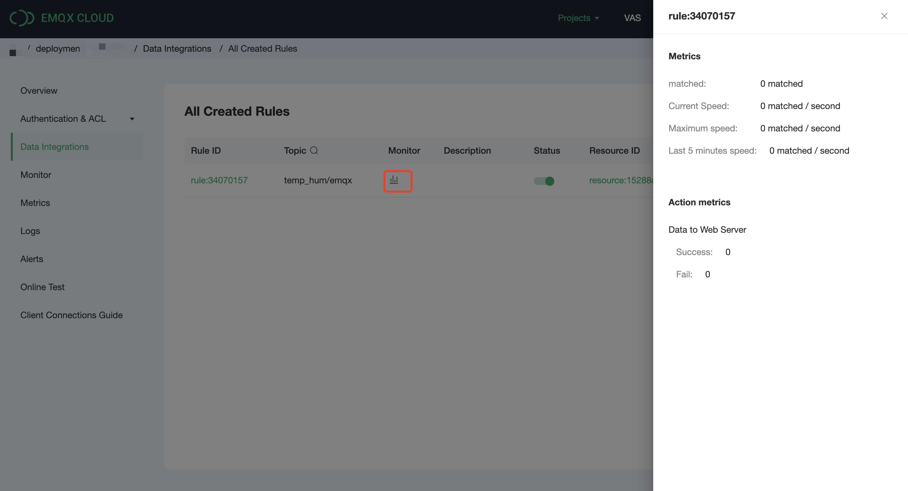

# Forwarding Device Data to Webhook Using the Rule Engine

In this article, we will simulate temperature and humidity data and report these data to EMQ X Cloud via the MQTT protocol and then use the EMQ X Cloud rules engine to dump the data into Kafka.

Before you start, you need to complete the following operations:
* Deployments have already been created on EMQ X Cloud (EMQ X Cluster).
* For professional deployment users: Please complete [Peering Connection Creation](../deployments/vpc_peering.md) first, all IPs mentioned below refer to the intranet IP of the resource.
* For basic deployment users: No peering connection is required, all IPs below refer to the public IP of the resource.


  <div style="position: relative; padding: 30% 45%;">
  <iframe style="position: absolute; width: 100%; height: 100%; left: 0; top: 0;" src="https://www.youtube.com/embed/fXahRUaQaHE" title="YouTube video player" frameborder="0" allow="accelerometer; autoplay; encrypted-media; gyroscope; picture-in-picture" allowfullscreen></iframe>
  </div>


## Create a Web server

1. You could use the following python code to create a simple Web server.
   
   ```python
   from http.server import HTTPServer, BaseHTTPRequestHandler
   
   class SimpleHTTPRequestHandler(BaseHTTPRequestHandler):
      def do_GET(self):
         self.send_response(200)
         self.end_headers()
         self.wfile.write(b'Hello, world!')
      
       def do_POST(self):
           content_length = int(self.headers['Content-Length'])
           body = self.rfile.read(content_length)
           print("Received POST request with body: " + str(body))
           self.send_response(201)
           self.end_headers()
   
   httpd = HTTPServer(('0.0.0.0', 8080), SimpleHTTPRequestHandler)
   httpd.serve_forever()
   ```

## EMQ X Cloud rules engine configuration

Go to Deployment Details and click on EMQ X Dashboard to go to Dashboard.

1. New Resource

   Click on Rules on the left menu bar → Resources, click on New Resource and drop to select the WebHook resource type. Fill in the URL and click Test. If you get an error, instantly check that the database configuration is correct.
   

2. Rule Testing
   Click on Rules on the left menu bar → Rules, click on Create and enter the following rule to match the SQL statement.  In the following rule we read the time `up_timestamp` when the message is reported, the client ID, the message body (Payload) from the `temp_hum/emqx` topic and the temperature and humidity from the message body respectively.
   
   ```sql
   SELECT 
   
   timestamp as up_timestamp, clientid as client_id, payload.temp as temp, payload.hum as hum
   
   FROM
   
   "temp_hum/emqx"
   ```
   

3. Add a response action
   Click on Add Action in the bottom left corner, drop down and select → Data Forwarding → Send Data to Web Service, select the resource created in the first step and fill in the following data:
   
   Message content template:
   ```
   {"up_timestamp": ${up_timestamp}, "client_id": ${client_id}, "temp": ${temp}, "hum": ${hum}}
   ```
   

4. Click on New Rule and return to the list of rules
   

5. View rules monitoring
   


## Test

1. Use [MQTT X](https://mqttx.app/) to simulate temperature and humidity data reporting

   You need to replace broker.emqx.io with the created deployment [connection address](../deployments/view_deployment.md), and add [client authentication information](../deployments/auth_and_acl.md) to the EMQ X Dashboard.
   
   
2. View data dump results
   
   

