# Rule

The rule describes the three configurations of "where the data comes from", "how to filter and process the data", and "where the processing results go". A rule contains three factors:

- Trigger event: The rule is triggered by an event, and the event injects the context information (data source) of the event into the rule when triggered. The event type is specified through the `FROM` clause of SQL;
- Processing rules (SQL): Use `SELECT` clause and `WHERE` clause and built-in processing functions to filter and process data from context information;
- Response action: If there is a processing result output, the rule will execute the corresponding action, such as persisting to the database, republishing the processed message, and forwarding the message to the message queue. A rule can configure multiple response actions.


## Create rules
::: tip Tip
Before creating a rule, you need to ensure that you have added [VPC peering connection](../deployments/vpc_peering.md), and [created a resource](resource.md)
:::

1. We will attach the rule to the TimescaleDB resource as an example. Either create a rule directly from the notification or the resource detail page.

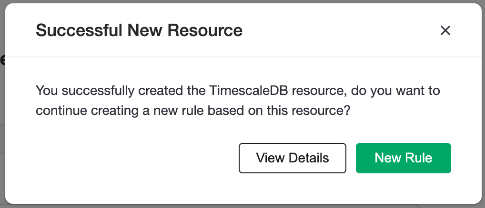

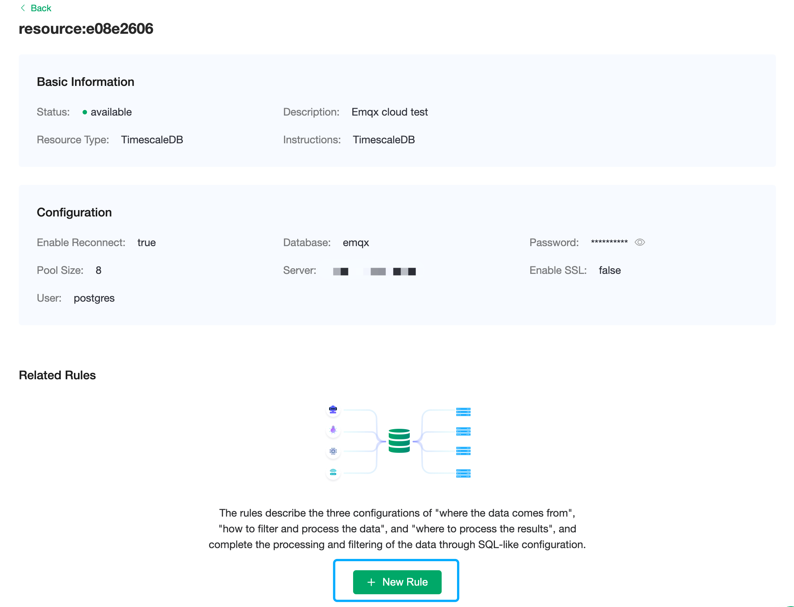


2. In the following rule, we read the time up_timestamp when the message is reported, the client ID, the message body (Payload) from the temp_hum/emqx topic and the temperature and humidity from the message body respectively.

```sql
SELECT 
timestamp div 1000 AS up_timestamp, clientid AS client_id, payload.temp AS temp, payload.hum AS hum
FROM
"temp_hum/emqx"

```
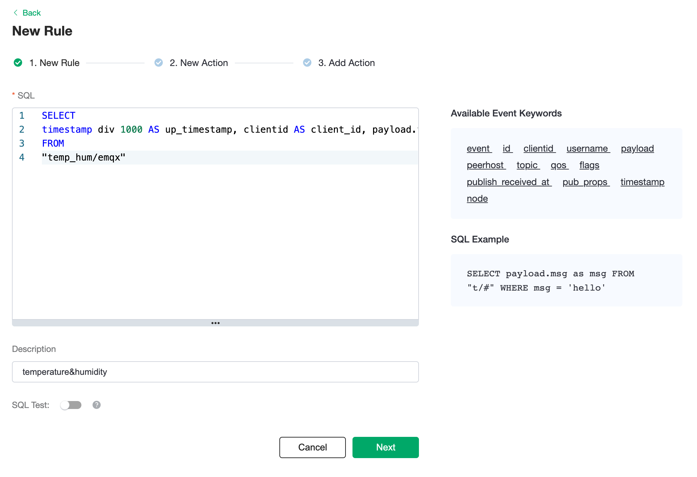


3. Create a new test SQL, click the switch button behind `SQL test`, fill in the corresponding test parameters, and finally click the `SQL test` button.

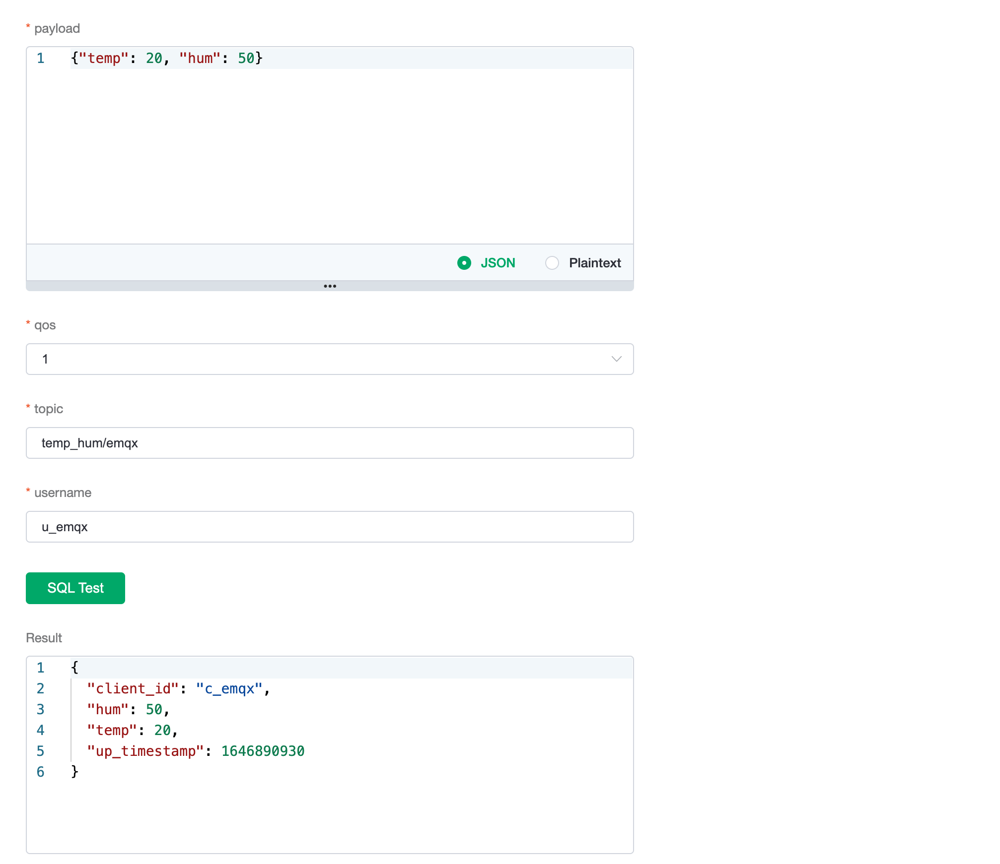


4. In the result text area, we will find the output data as expected. Then click the `Next` button to save the rule.


## Create Actions

An action solves the problem of "where to send the processed data". It tells EMQX Cloud what to do with the data generated by the rule. Usually, we set up the configuration and SQL Template for the target resource. 

1. EMQX Cloud will set the default values for the configuration. You can change them if needed.

2. Code the SQL Template, and click `Confirm` to create an action.

```sql
INSERT INTO temp_hum(up_timestamp, client_id, temp, hum) VALUES (to_timestamp(${up_timestamp}), ${client_id}, ${temp}, ${hum})

```
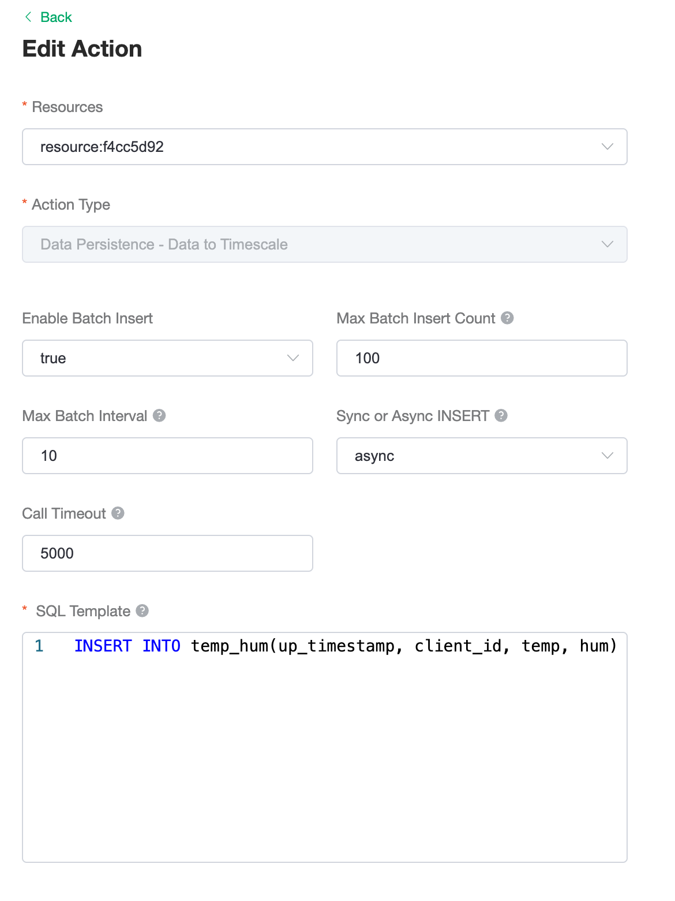
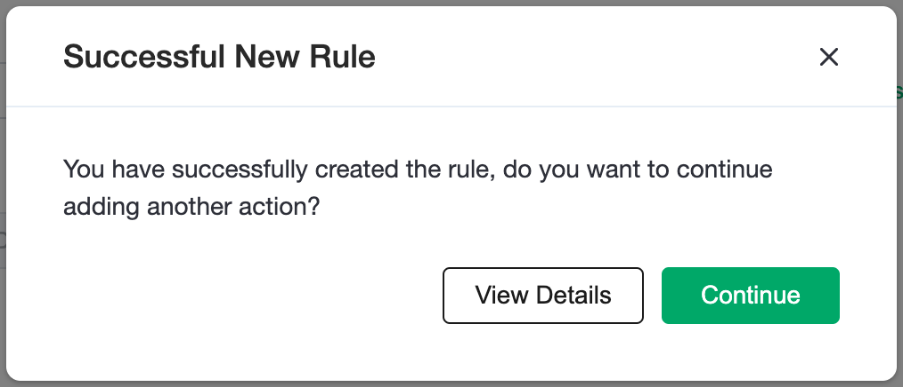

3. One rule can be associated with a few actions. Add another action, and we can change the target resource. For example, we can forward the data to Kafka cluster as well as save the data to RDS.
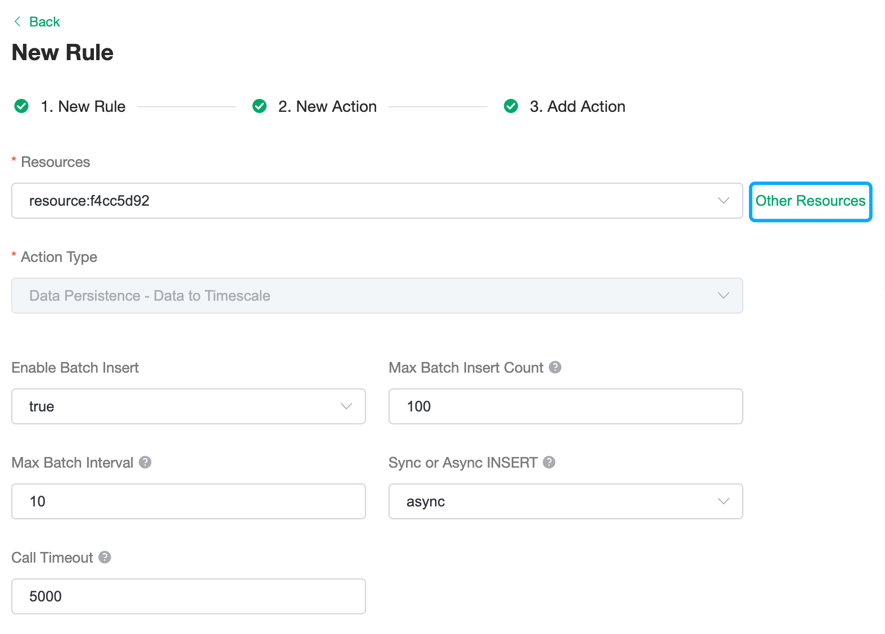

4. If there is a failure on the main action, we can set up a fallback action to ensure a double check. 
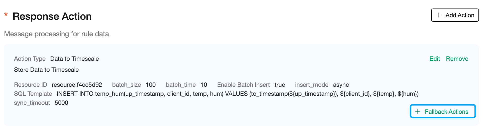


## Rules Operations

### Edit Rules
Click the edit icon to edit the rule. On this page, you can edit both the rule SQL Template and the actions.
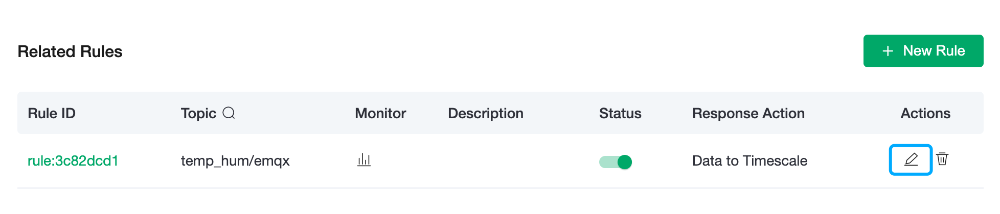
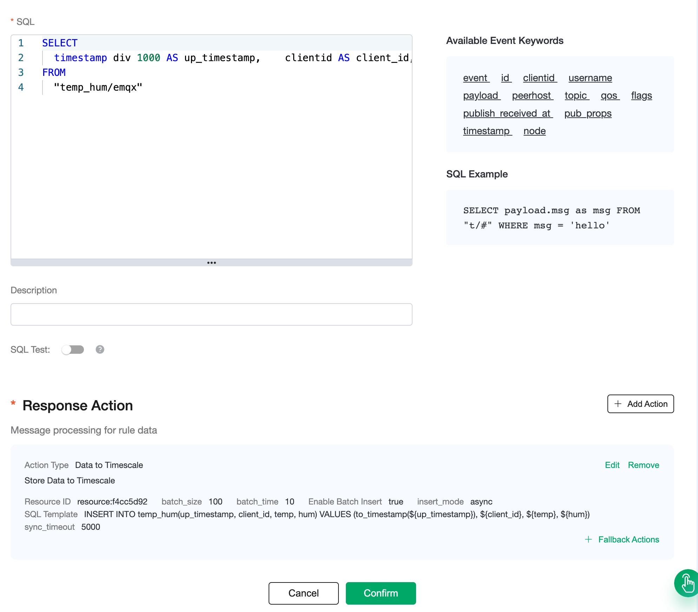
  

### View Monitoring Status

1. Click the rule monitoring icon on the rule list page.

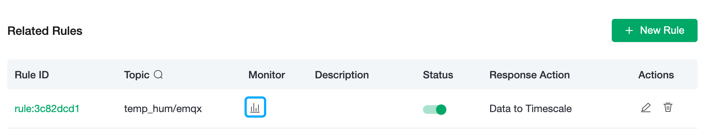

2. The panel shows the detail of rule matching status.
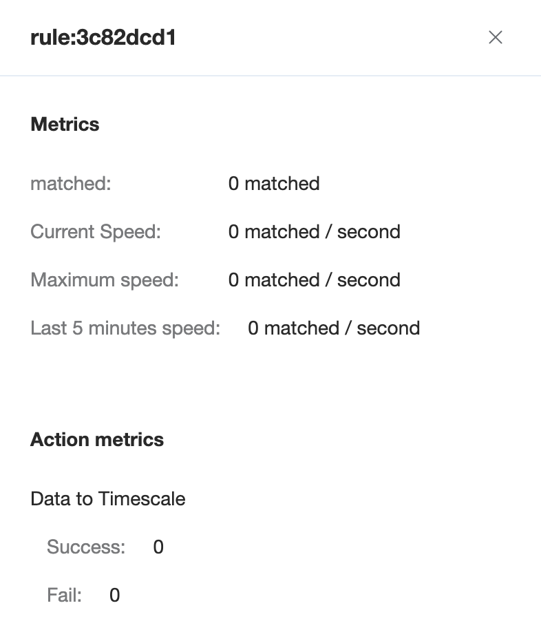


## Delete rules

In the resource detail page, you can delete the rules in the rule list.
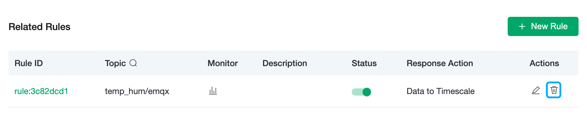

