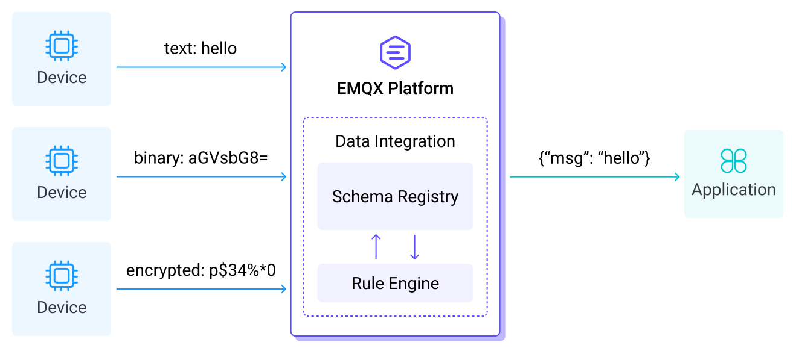
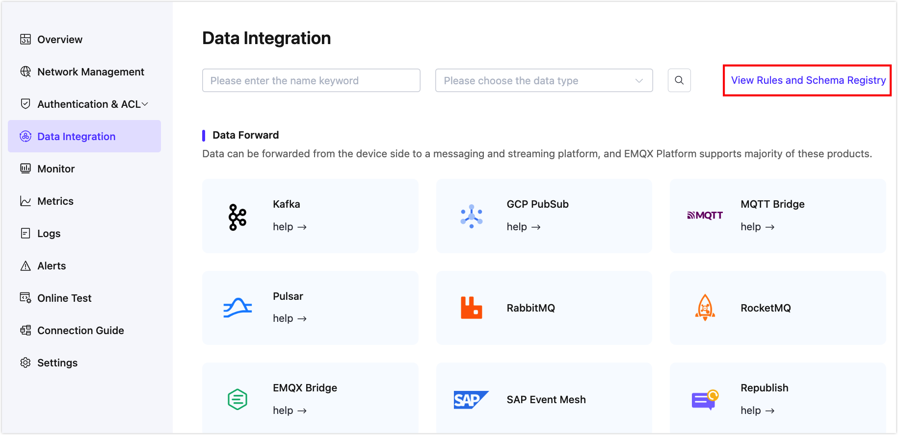
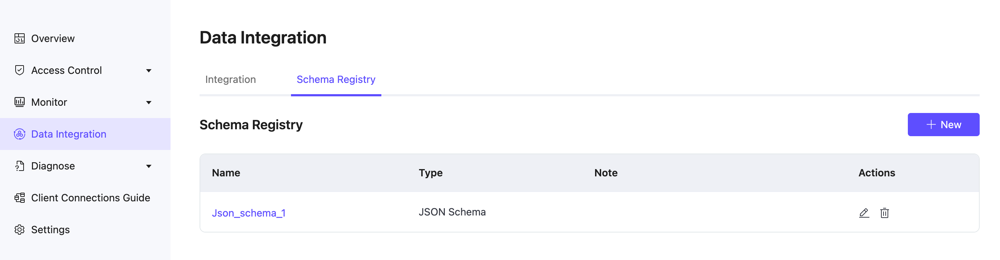

# Schema Registry

Schema Registry provides a centralized schema for managing and validating topic message data and the ability to serialize and deserialize data over the network. Publishers and subscribers of MQTT topics can use the Schema to ensure data consistency and compatibility. Schema Registry is a key component of the rule engine. It can be adapted to multiple scenarios of device access and rule design, helping to ensure data quality, compliance, application development efficiency, and system performance.

## Understand Schema Registry

The Schema defines the structure of the data. It defines the allowed data types, formats, and relationships. A schema is a blueprint for data that describes the structure of a data record, the data types of individual fields, the relationships between fields, and any constraints or rules that apply to the data.

Schemas can be used in a variety of data processing systems, including databases, messaging services, and distributed event and data processing frameworks. They help ensure that data is consistent and accurate, and can be efficiently processed and analyzed by different systems and applications. Data sharing and interoperability between different systems and organizations are facilitated.

Users can define Schema in the Schema Registry, and then use the defined Schema in rules for forwarding client data to different data services through data integration. At the same time, you can also send the data in the application or data service to the client through the Schema to realize two-way data flow.

Schema Registry has multiple advantages, including data validation, compatibility checking, version control and iterative evolution. It also simplifies the development and maintenance of data pipelines and reduces the risk of data compatibility issues, data corruption and data loss.

## Create and Manage Schema

::: warning Note

The Schema Registry feature is available in the Dedicated version of EMQX 4.4 and later. If your deployment does not include the Schema Registry feature, please [contact technical support](../feature/tickets.md) to request activation or upgrade your deployment to a higher EMQX version. 

:::

1. Enter your deployment in the EMQX Platform Console. 

2. Click **Data Integration** from the left menu. 

3. On the **Data Integration** initial page, click **View Rules and Schema Registry**. Select the **Schema Registry** tab and click **+New Schema Registry**.

   

   If you have already created a [connector](https://docs.emqx.com/en/cloud/latest/data_integration/connectors.html) or a [rule](https://docs.emqx.com/en/cloud/latest/data_integration/rules.html), click the **Schema Registry** tab beside the **Integration** tab. Click the **+New** button to create a new schema.

   

4. The EMQX Platform supports the creation of a schema in **Avro**, **Protobuf**, **JSON Schema** format. Check the [Schema Documentation](https://docs.emqx.com/en/enterprise/latest/data-integration/schema-registry.html) for details on how to create them.

Once a schema is created, you can click the schema name to view and edit the settings. You can also click the editing icon in the **Actions** column to edit the settings.
