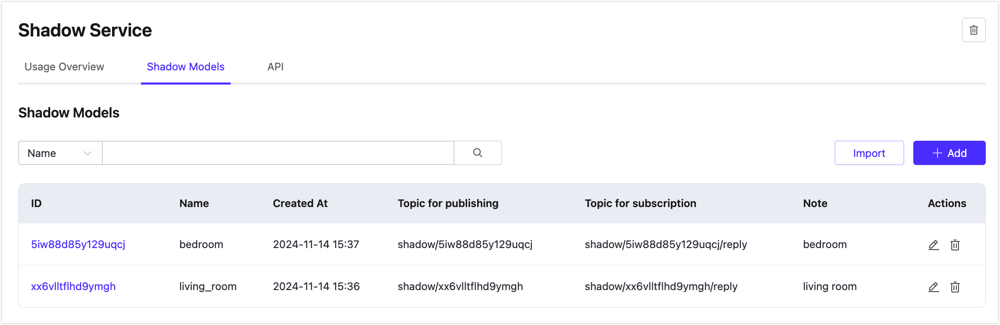
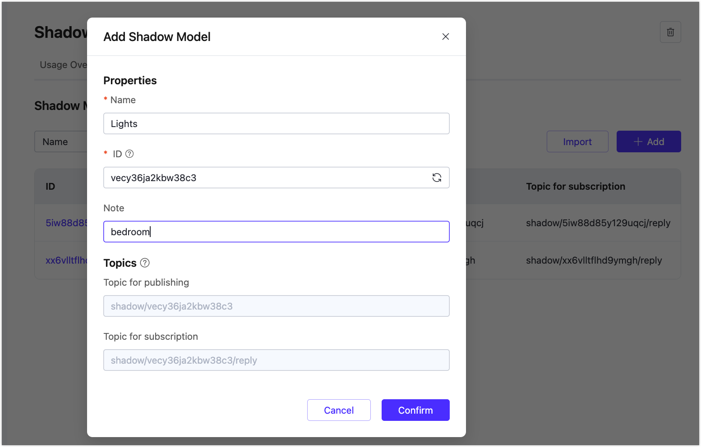
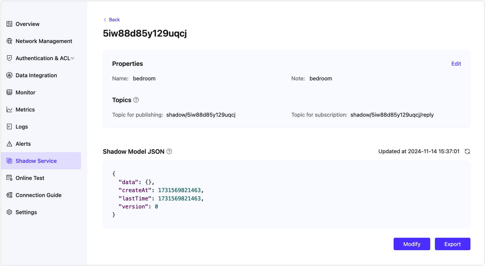

# Features

## Overview
On Statistics Overview, you can learn about the metrics of the usage of Shadow Service.

### Memory Usage
1. Check the total memory and the used memory.
2. The system will occupy about 10MB of storage by default.
3. The amount is the average usage of the last hour and updates every hour.

### Monthly Invocations
The invocation includes every message published from the device or client and every API call. The message subscribed from the device side will not be counted.

### Usage Statistics
The statistics are real-time usage for coordinate point times. In 1 hour chart, it will show the system invocations which is invoked in every 5 minutes for connection check. The system invacations will not be counted in billed invocations.

## Shadow Model List
In the shadow model list you can create, edit, and delete shadow models, and import custom's shadow models in bulk via CSV files.

### Create Shadow
Click the Add button to create a new shadow model.

<table>
   <tr>
      <th>Field</th>
      <th>Necessity</th>
      <th>Note</th>
   </tr>
   <tr>
      <td>Name</td>
      <td>Required</td>
      <td>
         3 to 50 characters, and can only contain letters, numbers, "-", "_", "."
     </td>
   </tr>
   <tr>
      <td>ID</td>
      <td>Required</td>
      <td>
         ID is a globally unique identifier for the shadow model that will be used in Topic and API, with a minimum of 8 bits and a maximum of 64 bits, and can only contain letters, numbers, "_", and "-". If not filled in it will be automatically generated.
      </td>
   </tr>
   <tr>
      <td>Note</td>
      <td>Conditional</td>
      <td>Put a note</td>
   </tr>
   <tr>
      <td>Topic for publishing</td>
      <td>Generated</td>
      <td>Automatically generated, the topic is based on ID for message publishing.</td>
   </tr>
   <tr>
      <td>Topic for subscription</td>
      <td>Generated</td>
      <td>Automatically generated, the topic is based on ID for message subscription.</td>
   </tr>
</table>

### Shadow Detail

Click ID in the shadow model list, or click the Edit button to enter the shadow model detail. On this page, you can view and modify the name and notes of the current shadow. You can also see the latest data of the payload JSON. And you can modify the JSON from the pop-up window.

::: tip
Once a shadow model is created, ID cannot be modified anymore.
:::

Learn more about the publishing topics and the subscription topics from [Communication](./invoke.md).

