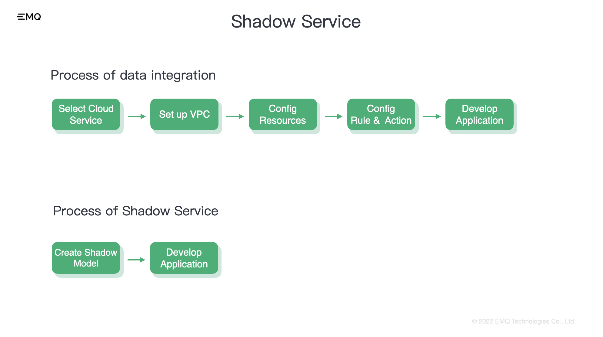
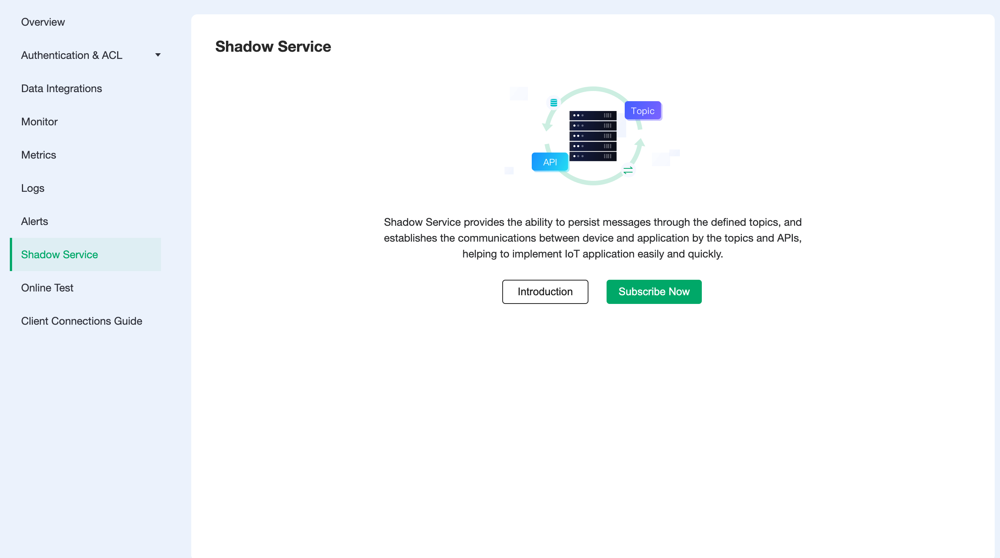
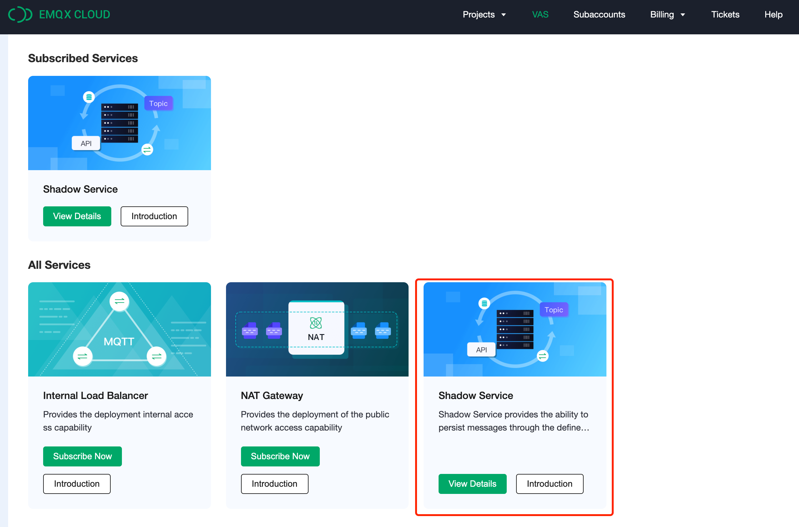
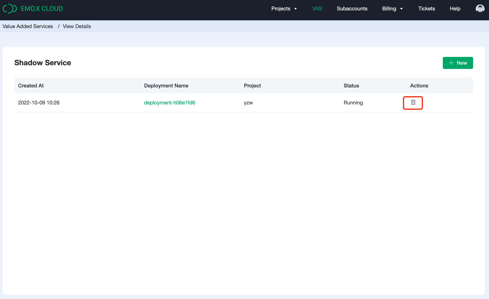

# Shadow Service

## What's Shadow Service?

Shadow service is a **data cache service** provided by EMQX Cloud. Users can implement IoT applications quickly through Topics and APIs.

With Shadow Service, users do not need to set up cloud services, create VPC connections, or transfer data through data integration step by step. Instead, this capability is used to rapidly implement applications such as things models, device shadow, and other applications related to data reporting and distribution, resulting in significant savings in development and costs.

## How to enable the service?

Due to the architect infrastructure, Shadow Service is currently only available for the deployments managed on AWS. In addition, Shadow Service is only available for **Professional Plan**, so if you have purchased Standard Plan, it's not able to use this service for the time being.

### Access A:
If you have a running deployment that meets all the criteria above, on the deployment page, click `Shadow Service` on the left menu and click `Subscribe Now` to enter the service enablement.

### Access B:
Click `VAS`(Value-Added Services) on the top menu and click `Subscribe` on Shadow Service card to go to the service enablement. If you currently have a professional deployment running in AWS, you can find the eligible deployment in the drop-down menu so you can continue with the provision.

### Brief Instruction
The metrics for Shadow Service include memory, invocation, and traffic.

1. The memory for Shadow Service is in three sizes: 1GB, 2GB, and 4GB. The size indicates the storage and the maximum amount of shadow models. The maximum size of a shadow JSON is **128 KB**. The estimated amount of shadows that can be created is based on the file size.

<table>
   <tr>
      <th>Specification</th>
      <th>Shadow Model Amount</th>
   </tr>
   <tr>
      <td>1 GB</td>
      <td>8000</td>
   </tr>
   <tr>
      <td>2 G</td>
      <td>16,000</td>
   </tr>
   <tr>
      <td>4 G</td>
      <td>32,000</td>
   </tr>
</table>

:::tip
The above figures are for reference only and the actual number of shadows that can be created is subject to the actual scenario. As shadows are generally smaller than the maximum size of 128KB, the actual maximum amount can be much larger than the above figures.
:::

2. The invocation includes every message published from the device or client and every API call. It will be billed at a unit rate of **0.04 USD per 10,000 requests**.

3. The traffic generated by Shadow Service will be attributed as part of the monthly traffic of the deployment.

4. Shadow Service supports up to 1000 QPS (Query Per Second).

### Trial
Shadow Service is available on a 7-day trial with the following rules.

1. Only for Professional Plan deployments.
2. Only 1GB service can be selected for the trial.
3. The trial is available once for each account and cannot be applied again when the trial period ends or if the service is deleted during the trial period.
3. After the trial ends, the service will be billed according to usage.
4. At the end of the trial, if there is no credit card info of the account, the service will be deleted and the data related to the service will be deleted as well.

## Billing

For more about billing, please see [Billing of Shadow Service](./pricing.md)。

## Delete the service

Please note that when the service is in the billing phase, **it will still be billed even if no shadows have been created**. When you decide not to use the service anymore, please click on `VAS` in the top menu - `Details` on the card of Shadow Service delete the service from the list and stop billing.

## Quick Guide

Please see the [Features Overview](./feature.md) for a quick-start guide on Shadow Service.

