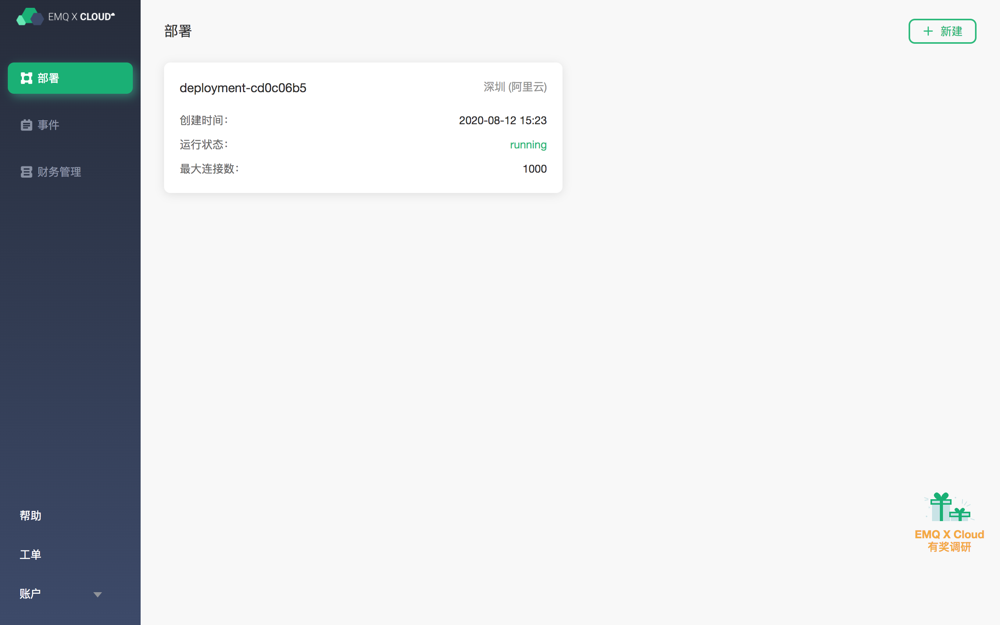

# Alibaba Cloud Kafka connects to EMQ X Cloud

Kafka is a stream processing platform developed by the Apache Foundation, which is designed for distributed, high-throughput systems. Due to its excellent distributed micro-service publish-subscribe model design, Kafka is used to build message centers and real-time streaming processing by a large number of organizations.

In the IoT ecosystem, Kafka is already one of the indispensable hubs in the IoT. The massive data generated by the device is transferred to Kafka to facilitate subsequent storage, conversion, processing, query and analysis.

[Alibaba Cloud Kafka](http://www.aliyun.com/product/kafka) is a high-throughput and high-scalability distributed message queue service built by Alibaba Cloud based on Apache Kafka. It is widely used for log collection and data aggregation monitoring, streaming data processing, online and offline analysis, etc. It is one of the indispensable products in the big data ecosystem. Alibaba Cloud provides fully hosted services, and users do not need to consider the deployment, operation and maintenance,  which is more professional, more reliable, and more secure.

[EMQ X Cloud](https://cloud.emqx.io) is an MQTT service on the cloud established by EMQ X. EMQ X team has been working in the field of IoT for many years. EMQ X MQTT server has been used by thousands of enterprise users around the world in the past few years. Each deployment has an independent VPS, load balancing, and DNS to ensure system security and stability.

This guide will connect Alibaba Cloud Kafka with EMQ X Cloud, and forward MQTT messages to Kafka topics through the EMQ X Cloud rule engine.

In order to achieve this function, we will complete the following tasks:

    1. Purchase cloud resources
    2. Establish a connection between Alibaba Cloud Kafka and EMQ X Cloud deployment
    3. Create a Kafka topic, open a port, and record the Kafka connection address
    4. Set the filter criteria of the rule engine
    5. Create a resource and an action
    6. Complete the creation of the rule engine and test it

### Operation Steps

#### 1. Create cloud resources

1.1 Create Alibaba Cloud Kafka 

If you are using Alibaba Cloud Kafka for the first time, it is recommended that you follow the instructions of [Quick Start](https://help.aliyun.com/document_detail/99949.html) for the Alibaba Cloud Message Queue Kafka version to create it.


1.2 Create EMQ X Cloud deployment

If you are using EMQ X Cloud for the first time, it is recommended that you follow the prompts of EMQ X Cloud [Quick Start](../../quick_start/README.md) to create it.



#### 2.Establish a connection between Alibaba Cloud Kafka and EMQ X Cloud deployment
2.1 You need to create a cloud enterprise network in Alibaba Cloud. Go to the cloud enterprise network page and create a cloud enterprise network example, and add the VPC where Kafka is located to the cloud enterprise network.

2.2 In the EMQ X Cloud console, enter the deployment just created, click `+VPC peering connection`, fill in the relevant information of Alibaba Cloud Enterprise Network, and record the prompt of the VPC peering connection in EMQ X Cloud.

Among them:

- Account ID == Alibaba Cloud account ID
- Peering connection ID == Cloud Enterprise Network instance ID
- VPC ID == VPC ID attached to the cloud enterprise network

Access the details of the newly created cloud enterprise network instance, click Load Network Instance, fill in the EMQ X Cloud deployment related information, and click OK.

> Note:
>
> You need to complete the EMQ X Cloud peeing connection information addition within 10 minutes, otherwise it will be regarded as a failure
>
> Go back to the EMQ X Cloud console, access the deployment details, and view the peering connection status

#### 3. Create a Kafka topic, open the port, and record the Kafka connection address

3.1 In the Alibaba Cloud Kafka console, click Topic Management -> Create Topic, and create a topic named testTopic.


3.2 In the Kafka instance details, add the whitelist IP: 0.0.0.0/0


3.3Record the IP address of the Kafka instance.


#### 4. Set the filter criteria of the rule engine

Go to the EMQ X Cloud console and click to enter the deployment to bridge Kafka.

On the deployment page, select the rule engine and click Create.


Our goal is to trigger the engine when the topic greet receives msg as hello. Certain SQL processing is required here:

● Target the greet topic, that is,'greet/#'
● Match the msg in the payload, and execute the rule engine when it is a string of 'hello'
● According to the above principles, the SQL we finally get should be as follows:

```sql
SELECT
  payload.msg as msg
FROM
  "greet/#"
WHERE
  msg = 'hello'
```

You can click SQL test under the SQL input box to fill in the data:

- topic: greet
- payload:
```json
{
"msg":"hello"
}
```

Click Test to view the obtained data results. If the settings are correct, the test output box should get the complete JSON data as follows:

```json
{
  "msg":"hello"
}
```

> Note: If test fails, please check whether the SQL is compliant, and whether the topic in the test is consistent with the SQL filled in.

#### 5. Create resources and actions
Click Add Action. On the Action Selection page, select `Bridge Data to Kafka`, and click `New` to create a resource.


On the Create Resource page, select Kafka as the resource type, and fill in the server's intranet IP and corresponding port in the Kafka server box. Click Test and it indicate that the test is successful if "Resources Available" returns .


> Note:
>
>If the test fails, please check whether the [VPC peering connection](../../deployments/vpc_peering.md) is completed and whether the IP address is correct.

Click OK to return to the configuration action page, fill in the testTopic topic just created in Kafka topic, fill in "hello from emqx cloud" in the message content template, select the default resource ID, and click OK.


The created action will be displayed in the response action column. After confirming that the information is correct, click Confirm in the lower right corner to complete the configuration of the rule engine.


#### 6. Test

> If you are using EMQ X Cloud for the first time, you can go to [Deployment Connection Guide](../../connect_to_deployments/README.md) to view the MQTT client connection and test guide

We try to send the following data to the greet/a topic

``````json
{
  "msg":"hello"
}
``````

On the rule engine page, click Monitor and you can see that the number of successes becomes 1.


In the Kafka instance, you can see the messages forwarded by EMQ X Cloud.


