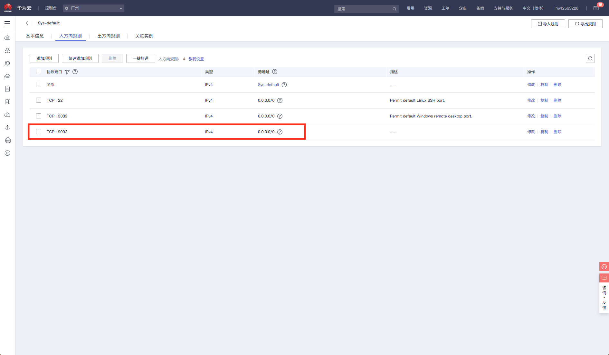
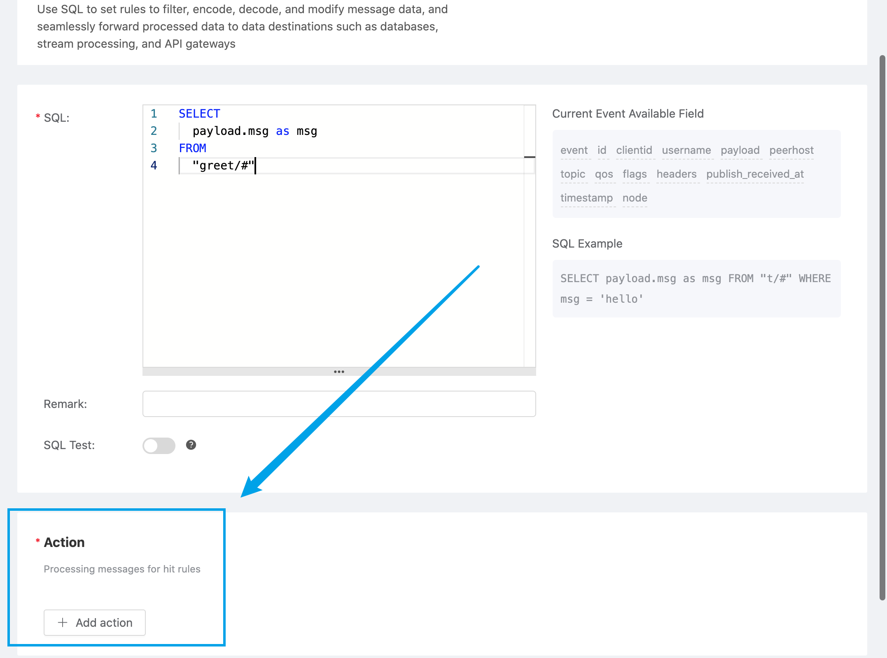
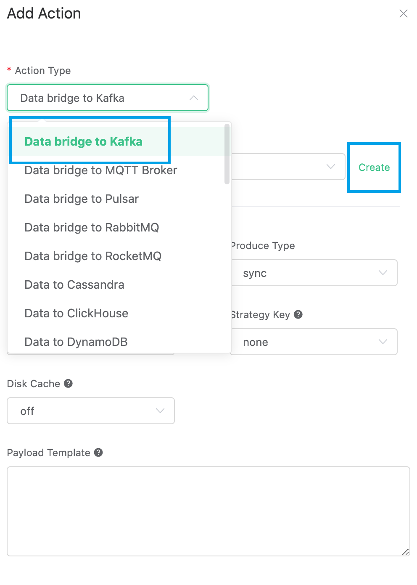
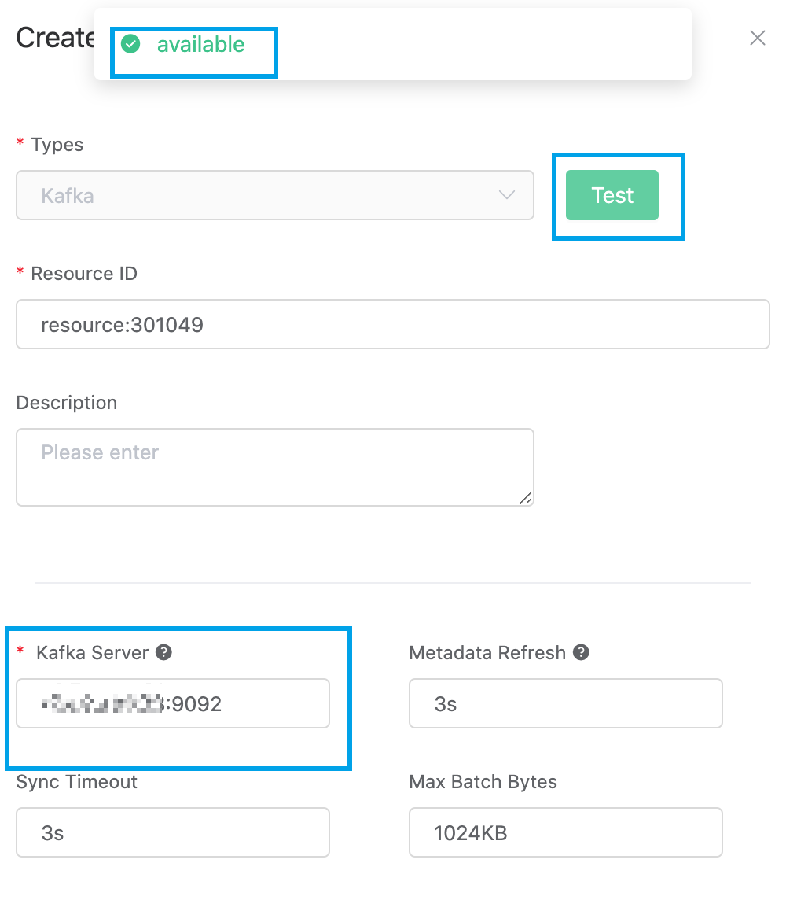

# HUAWEI CLOUD Kafka connects to EMQ X Cloud
Kafka is a stream processing platform developed by the Apache Foundation, which is designed for distributed, high-throughput systems. Due to its excellent distributed micro-service publish-subscribe model design, Kafka is used to build message centers and real-time streaming processing by a large number of organizations.

In the IoT ecosystem, Kafka is already one of the indispensable hubs in the IoT. The massive data generated by the device is transferred to Kafka to facilitate subsequent storage, conversion, processing, query and analysis.

[Huawei Cloud Distributed Messaging Service Kafka](https://www.huaweicloud.com/product/dmskafka.html) is a message queue service provided by Huawei Cloud based on the open source community version of Kafka, providing users exclusive Kafka instance with computing, storage and  bandwidth resources .

[EMQ X Cloud](https://cloud.emqx.io) is an MQTT service on the cloud established by EMQ X. EMQ X team has been working in the field of IoT for many years. EMQ X MQTT server has been used by thousands of enterprise users around the world in the past few years. Each deployment has an independent VPS, load balancing, and DNS to ensure system security and stability.

This guide will connect Huawei Cloud Kafka with EMQ X Cloud, and forward MQTT messages to Kafka topics through the EMQ X Cloud rule engine.

In order to achieve this function, we will complete the following tasks:

    1. Purchase cloud resources
    2. Establish a connection between Alibaba Cloud Kafka and EMQ X Cloud deployment
    3. Create a Kafka topic, open a port, and record the Kafka connection address
    4. Set the filter criteria of the rule engine
    5. Create a resource and an action
    6. Complete the creation of the rule engine and test it

### Operation Steps

#### 1. Create cloud resources

1.1 Create Huawei Cloud Kafka 

If you are using Huawei Cloud Kafka for the first time, it is recommended that you follow the instructions of [Quick Start](https://support.huaweicloud.com/qs-kafka/kafka-qs-0409001.html) for the Huawei Cloud Message Queue Kafka version to create it.


1.2 Create EMQ X Cloud deployment

If you are using EMQ X Cloud for the first time, it is recommended that you follow the prompts of EMQ X Cloud [Quick Start](../../quick_start/README.md) to create it.


#### 2.Establish a connection between Huawei Cloud Kafka and EMQ X Cloud deployment

In this part, we need to complete the peering connection between Huawei Cloud and EMQ X Cloud. For detailed steps, please refer to [VPC Peering Connection](../../deployments/vpc_peering.md)

2.1 Log in to the EMQ X Cloud console, enter the required deployment details, click the `+VPC peering connection` button, and record the following EMQ X Cloud VPC peering connection prompt

> Note: Do not close this page yet

   * Deploy VPC ID
   * EMQ X Cloud account ID
   * Deploy VPC network segment

2.2 Log in to your HUAWEI CLOUD account and enter the console -> Virtual Private Cloud VPC

2.3 Click Peering Connection -> Create Peering Connection and select another account. Fill in the information recorded in the EMQ X Cloud console just now, and click OK to create a peering connection request

* Peering project ID == EMQ X Cloud account ID
* Peering VPC ID == deployment VPC ID

For the local VPC here, select the VPC where Kafka is located. You can see it in Kafka instance -> basic information -> network -> virtual private cloud

2.4 On the peering connection information interface, record the following 3 values

* Peering connection ID
* VPC network segment
* VPC ID

2.5 Find my credentials and record the user ID

2.6 Go back to the EMQ X Cloud console. Fill in the peering connection ID, VPC network segment, VPC ID recorded in step 4, and user ID recorded in step 5. Click OK to complete the peering connection

2.7 In the HUAWEI CLOUD console, open `Virtual Private Cloud VPC` -> `Route Table`, and add the deployed VPC network segment in step 1.1 to the routing table of the corresponding VPC

> Note: The next hop type is peering connection

2.8 Configure security groups in the HUAWEI CLOUD console to allow the EMQ X Cloud network segment to access your VPC

#### 3.Create a Kafka topic, open the port, and record the Kafka connection address
3.1In the Huawei Cloud Kafka console, click Topic Management -> Create Topic, and create a topic named testTopic.


3.2Open port 9092 in the Kafka security group



If you do not want to be accessed from the public network, the source address can be set to the VPC network segment in step 2.1

3.3 Record the IP address of the Kafka instance


#### 4. Set the filter criteria of the rule engine

Go to the EMQ X Cloud console and click to enter the deployment to bridge Kafka.

On the deployment page, select the rule engine and click Create.


Our goal is to trigger the engine when the topic greet receives msg as hello. Certain SQL processing is required here:

● Target the greet topic, that is,'greet/#'
● Match the msg in the payload, and execute the rule engine when it is a string of 'hello'
● According to the above principles, the SQL we finally get should be as follows:

```sql
SELECT
  payload.msg as msg
FROM
  "greet/#"
WHERE
  msg = 'hello'
```

You can click SQL test under the SQL input box to fill in the data:
- topic: greet
- payload:
```json
{
"msg":"hello"
}
```

Click Test to view the obtained data results. If the settings are correct, the test output box should get the complete JSON data as follows:
```json
{
  "msg":"hello"
}
```

> Note:
>
>  If test fails, please check whether the SQL is compliant, and whether the topic in the test is consistent with the SQL filled in.


#### 5. Create resources and actions
Click Add Action. On the Select Action page, select `Bridge Data to Kafka`, click Next, and on the Configure Action page, click Create Resource.






On the Create Resource page, select Kafka as the resource type, and fill in the server's intranet IP and corresponding port in the Kafka server box. Click Test and it indicate that the test is successful if "Resources Available" returns .



> Note:
>
>If the test fails, please check whether the [VPC peering connection](../../deployments/vpc_peering.md) is completed and whether the IP address is correct.

Click OK to return to the configuration action page, fill in the testTopic topic just created in Kafka topic, fill in "hello from emqx cloud" in the message content template, select the default resource ID, and click OK.


The created action will be displayed in the response action column. After confirming that the information is correct, click Confirm in the lower right corner to complete the configuration of the rule engine.


#### 6. Test
> If you are using EMQ X Cloud for the first time, you can go to [Deployment Connection Guide](../../connect_to_deployments/README.md) to view the MQTT client connection and test guide

We try to send the following data to the greet/a topic
```json
{
  "msg":"hello"
}
```

On the rule engine page, click Monitor and you can see that the number of successes becomes 1.


