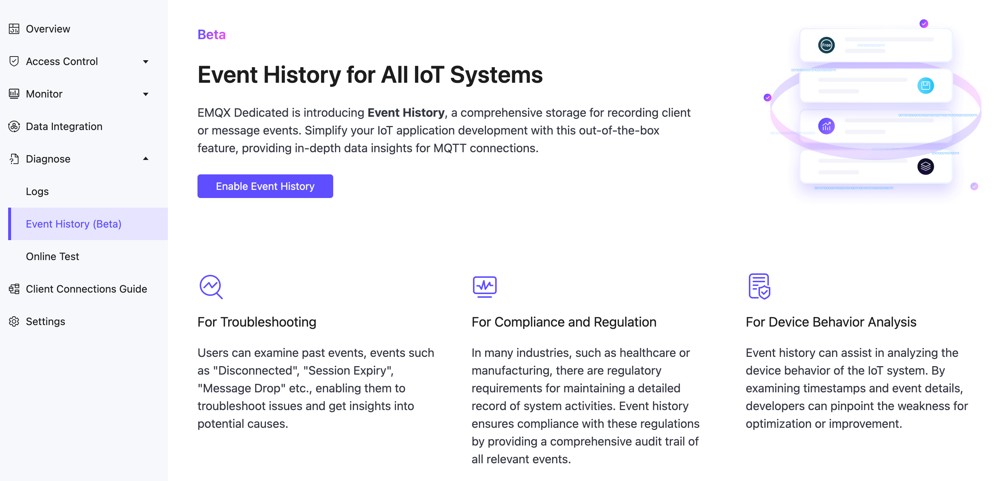

# Event History (Beta)

Event History records the client or message events, providing in-depth data insights for MQTT connections.

## Benefits

- **For Troubleshooting** : Users can examine past events, events such as "Disconnected", "Session Expiry", "Message Drop" etc., enabling them to troubleshoot issues and get insights into potential causes.
- **For Compliance and Regulation**: In many industries, such as healthcare or manufacturing, there are regulatory requirements for maintaining a detailed record of system activities. Event history ensures compliance with these regulations by providing a comprehensive audit trail of all relevant events.
- **For Device Behavior Analysis**: Event history can assist in analyzing the device behavior of the IoT system. By examining timestamps and event details, developers can pinpoint the weakness for optimization or improvement.

## Enable Event History (Beta)
::: warning Prerequisites
In Beta, Event History is only available to the **v5 Dedicated Deployment in AWS - Virginia**. Please make sure to create the valid deployment first.
:::

In the deployment page, open **Diagnose** menu on the left, click **Event History (Beta)**. In the initial page, click **Enable Event History** to enter value-added service enablement procedure.

::: tip Beta Disclaimer
Event History (Beta) is free, and customer may choose to use this feature in its sole discretion. Beta Version may not be supported and may be changed at any time without notice. Beta Version does not represent the final Services and may contain bugs that may cause failure and data loss. 
:::

## Events List

| **Event**         | **Trigger Time**           |
| -------------------- | ----------------------- |
| Client Connect       | When the broker receives the connection packet from the client.      |
| Client Connected       | When client authentication is completed and successfully connected to the broker.      |
| Client Disconnected       | Connection layer of client is ready to close.      |
| Client Subscribe      | After receiving the subscription message.      |
| Client Unsubscribe      | After receiving the unsubscribe packet.      |
| Client Connack      | When the broker is ready to issue a connection response message.     |
| Session Created      | When a `client connected` is completed and a new session is created.     |
| Session Takenover      | After the session was terminated due to takenover.     |
| Session Subscribed      | After the subscription operation is completed     |
| Session Unsubscribed      | After the unsubscription operation is completed.     |
| Session Resumed      | when `client connected` is executed and the old session information is successfully resumed.     |
| Session Discarded     | After the session was terminated due to discarded.   |
| Session Terminated     | After the session was terminated due to other reason.     |
| Message Dropped     | Message drops when the message queue becomes full or when messages expire..     |

