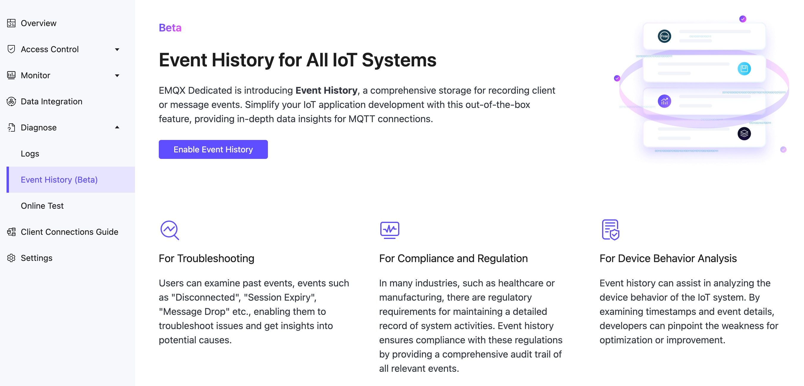
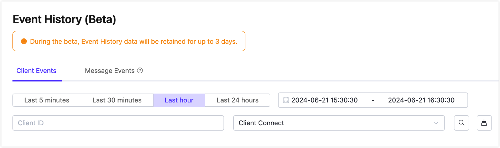
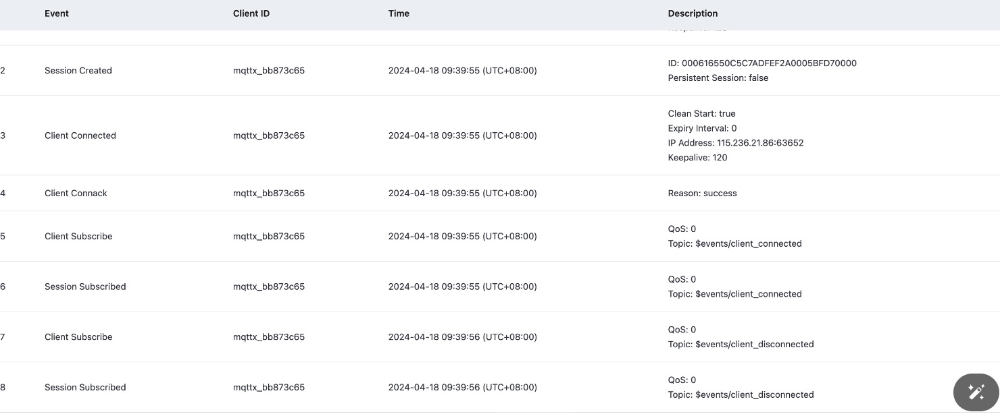

# Event History (Beta)

Event History (Beta) is a value-added service provided by the EMQX Platform. It records the client or message events, providing in-depth data insights for MQTT connections. This page introduces how to enable and use the Event History (Beta).

::: tip Beta Disclaimer

Event History (Beta) is offered for free, and customers can choose to use this feature at their discretion. The Beta Version may not be supported and is subject to change at any time without notice. The Beta Version does not represent the final product and may contain bugs that could cause failures and data loss.

:::

## Benefits

The Event History service provides the following benefits.

- **For Troubleshooting**: Users can examine past events, events such as "Disconnected", "Session Expiry", "Message Drop" etc., enabling them to troubleshoot issues and get insights into potential causes.
- **For Compliance and Regulation**: In many industries, such as healthcare or manufacturing, there are regulatory requirements for maintaining a detailed record of system activities. Event history ensures compliance with these regulations by providing a comprehensive audit trail of all relevant events.
- **For Device Behavior Analysis**: Event history can assist in analyzing the device behavior of the IoT system. By examining timestamps and event details, developers can pinpoint the weakness for optimization or improvement.

## Enable Event History (Beta)
::: warning Prerequisites
In the Beta phase, Event History is only available to the **v5 Dedicated Deployment in AWS - Virginia**. Make sure to create a valid deployment before you start.
:::

1. On the deployment page, expand the **Diagnose** from the left navigation menu. 
2. Click **Event History (Beta)**. On the initial page, click **Enable Event History**. 
3. Follow the enabling procedure to enable the value-added service.

## View Events

After enabling the service, you can view client events and message events in their respective tabs. You can filter events by a specific time period and search for events by Client ID and event type.

 

In the **Description** column of the displayed event list, it shows the details about the events.

### Event Type List

The following table lists the event types that can be recorded and when they are triggered.

| **Event**            | **Trigger Time**                                             |
| -------------------- | ------------------------------------------------------------ |
| Client Connect       | When the broker receives the connection packet from the client. |
| Client Connected     | When client authentication is completed and successfully connected to the broker. |
| Client Disconnected  | Connection layer of the client is ready to close.            |
| Client Subscribe     | After receiving the subscription message.                    |
| Client Unsubscribe   | After receiving the unsubscribe packet.                      |
| Client Connack       | When the broker is ready to issue a connection response message. |
| Session Created      | When a `client connected` is completed and a new session is created. |
| Session Takenover    | After the session was terminated due to takenover.           |
| Session Subscribed   | After the subscription operation is completed                |
| Session Unsubscribed | After the unsubscription operation is completed.             |
| Session Resumed      | when `client connected` is executed and the old session information is successfully resumed. |
| Session Discarded    | After the session was terminated due to discarded.           |
| Session Terminated   | After the session was terminated due to other reasons.       |
| Message Dropped      | Message drops when the message queue becomes full or when messages expire. |

