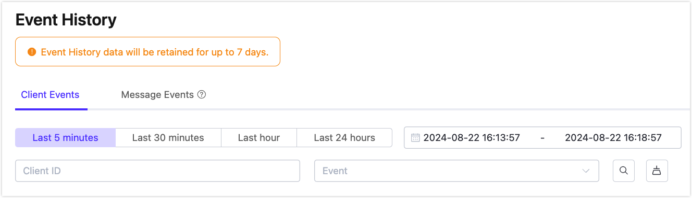

# Event History

::: tip

The Event History feature is only available to the Premium Deployment. Make sure to create a valid deployment before you start.

:::

Event History is a value-added service provided by the EMQX Platform. It records the client or message events, providing in-depth data insights for MQTT connections. This page introduces how to use the Event History.

## Benefits

The Event History service provides the following benefits.

- **Troubleshooting**: Users can examine past events, events such as "Disconnected", "Session Expiry", "Message Drop" etc., enabling them to troubleshoot issues and get insights into potential causes.
- **Compliance and Regulation**: In many industries, such as healthcare or manufacturing, there are regulatory requirements for maintaining a detailed record of system activities. Event history ensures compliance with these regulations by providing a comprehensive audit trail of all relevant events.
- **Device Behavior Analysis**: Event history can assist in analyzing the device behavior of the IoT system. By examining timestamps and event details, developers can pinpoint the weakness for optimization or improvement.

## View Events

Go to your Premium deployment. Click **Diagnose** -> **Event History** from the left navigation menu. On the Event History page, you can view client events and message events in their respective tabs. You can filter events by a specific time period and search for events by Client ID and event type.

 

In the **Description** column of the displayed event list, it shows the details about the events.

### Event Type List

The following table lists the event types that can be recorded and when they are triggered.

| **Event**            | **Trigger Time**                                             |
| -------------------- | ------------------------------------------------------------ |
| Client Connect       | When the broker receives the connection packet from the client. |
| Client Connected     | When client authentication is completed and successfully connected to the broker. |
| Client Disconnected  | Connection layer of the client is ready to close.            |
| Client Subscribe     | After receiving the subscription message.                    |
| Client Unsubscribe   | After receiving the unsubscribe packet.                      |
| Client Connack       | When the broker is ready to issue a connection response message. |
| Session Created      | When a `client connected` is completed and a new session is created. |
| Session Takenover    | After the session was terminated due to takenover.           |
| Session Subscribed   | After the subscription operation is completed                |
| Session Unsubscribed | After the unsubscription operation is completed.             |
| Session Resumed      | when `client connected` is executed and the old session information is successfully resumed. |
| Session Discarded    | After the session was terminated due to discarded.           |
| Session Terminated   | After the session was terminated due to other reasons.       |
| Message Dropped      | Message drops when the message queue becomes full or when messages expire. |

