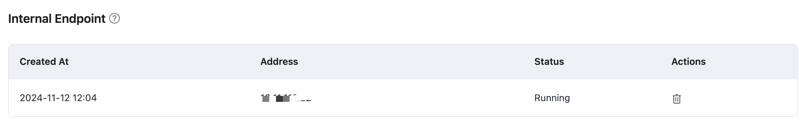

# Internal Load Balancers

::: warning Note

This feature is exclusive to the Dedicated Edition. You need to create a Dedicated deployment before subscribing to this service. 

:::

Internal Load Balancing is a service that distributes traffic on-demand within an internal network, expanding the application system's throughput by distributing traffic to different backend servers. It can also eliminate single points of failure in the system, enhancing the application system's availability. Once internal load balancing is enabled, your other service applications can connect to the EMQX deployment via an internal network address.

Before you begin, you need to complete the creation of [VPC Peering](https://chat.openai.com/g/g-aAzkOrn2h-ruan-jian-wen-dang-xie-zuo-zhu-shou/deployments/vpc_peering.md). The IP addresses mentioned below refer to the resource's internal network IP.

## Subscribe to the Service

Click **VAS** from the top menu in the EMQX Platform console to open the **Value Added Services** page. You can subscribe to the Internal Load Balancers service on the page by clicking **Subscribe Now**.  Alternatively, you can go to the deployment Overview page, select the **Internal Load Balancers** tab at the bottom, and click **Subscribe Now**.

On the subscribing process page, pay attention to the service descriptions. If you have purchased multiple deployments, select the deployment for which you need to create the service instance.

## Use the Service

After purchasing the Internal Load Balancer service, you can see the creation status of the service on the Deployment Overview page. Wait for the creation process to be completed.

When the status turns to be running, you can connect terminals under the VPC that have completed VPC peering to the deployment via the internal network address. The connection ports are consistent with the public network connection ports: MQTT port is 1883, and the WebSocket port is 8083.
