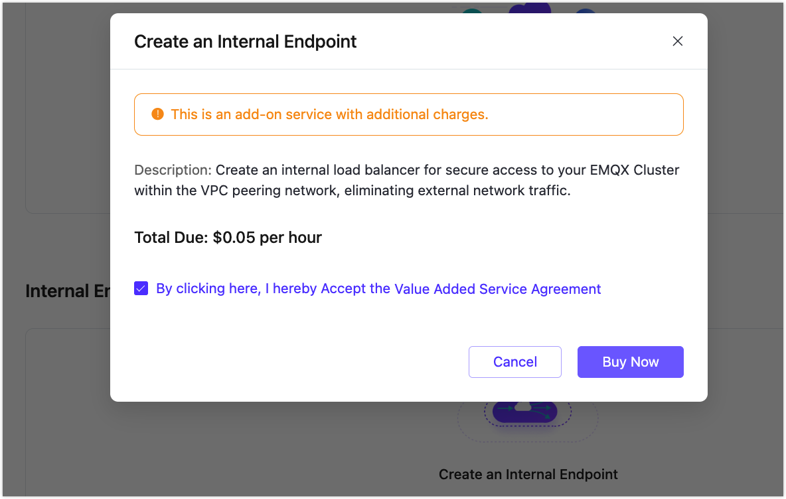
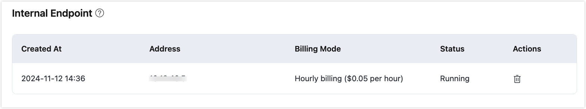
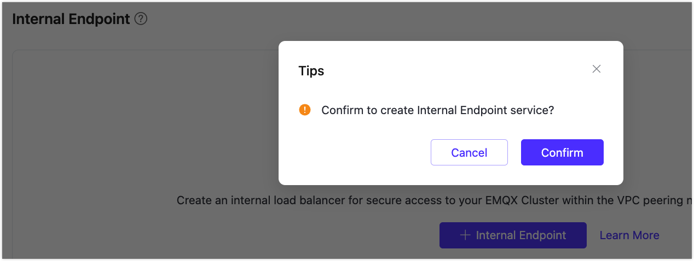

# Internal Load Balancers

::: warning Note

This feature is exclusive to the Dedicated and Premium editions. You need to create a deployment before subscribing to this service. 

:::

Internal Endpoint allows you to create an internal load-balancing service that distributes traffic on-demand within an internal network. It can expand the application system's throughput by distributing traffic to different backend servers. It can also eliminate single points of failure in the system, enhancing the application system's availability. Once an internal endpoint is enabled, your other service applications can connect to the EMQX deployment via an internal network address.

Before you begin, you need to complete the creation of [VPC Peering](https://chat.openai.com/g/g-aAzkOrn2h-ruan-jian-wen-dang-xie-zuo-zhu-shou/deployments/vpc_peering.md). The IP addresses mentioned below refer to the resource's internal network IP.

## Enable Internal Endpoint in a Dedicated Deployment

1. Go to your Dedicated deployment in the EMQX Platform Console.

2. Click **Network Management** from the left menu. Navigate to the **Internal Endpoint** area and click **+Internal Endpoint**.

3. In the pop-up dialog, check to accept the Value Added Service Agreement and click **Buy Now**.

   

4. After purchasing the service, you can see the creation status on the page. Wait for the creation process to be completed.

   When the status turns to be `Running`, you can connect terminals under the VPC that have completed VPC peering to the deployment via the internal network address. The connection ports are consistent with the public network connection ports: MQTT port is 1883, and the WebSocket port is 8083.

   

## Enable Internal Endpoint in a Premium Deployment

1. Go to your Premium deployment in the EMQX Platform Console.

2. Click **Network Management** from the left menu. Navigate to the **Internal Endpoint** area and click **+Internal Endpoint**.

3. In the pop-up dialog, click **Confirm** to start the creation process.

   

   You can see the creation status on the page. Wait for the creation process to be completed.

   When the status turns to be `Running`, you can connect terminals under the VPC that have completed VPC peering to the deployment via the internal network address. The connection ports are consistent with the public network connection ports: MQTT port is 1883, and the WebSocket port is 8083.

   
