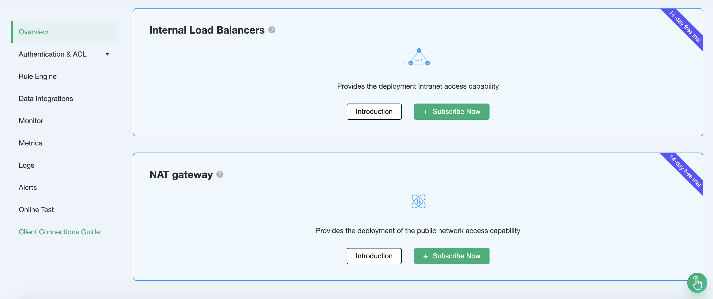

# Internal Load Balancers

::: danger
This feature is not available in the standard deployment
:::

Intranet load balancing is a service that distributes traffic on demand in the intranet, extending the throughput capacity of applications by distributing traffic to different back-end servers, and eliminating single points of failure in the system to improve the availability of applications.

Before start, you will need to complete the following actions:
* Professional deployments (EMQX clusters) have been created on EMQX Cloud.
* Please [create the vpc peer connection](../deployments/vpc_peering.md) first. All IPs mentioned below refer to the resource's internal IP.

## Service activation

You can choose to enable the intranet load balancing service from the top menu bar - `VAS` or at the bottom of the deployment overview.

## Usage

After completing the intranet load balancing value-added service purchase, you can see the intranet load balancing creation status at the corresponding deployment overview and wait for the creation to complete.

When the status of the intranet load balancing is running, you can connect the endpoints under the VPC that have completed peering to the deployment through the intranet IP of the intranet address on the same port as the public connection port: mqtt(1883) and websocket(8083).