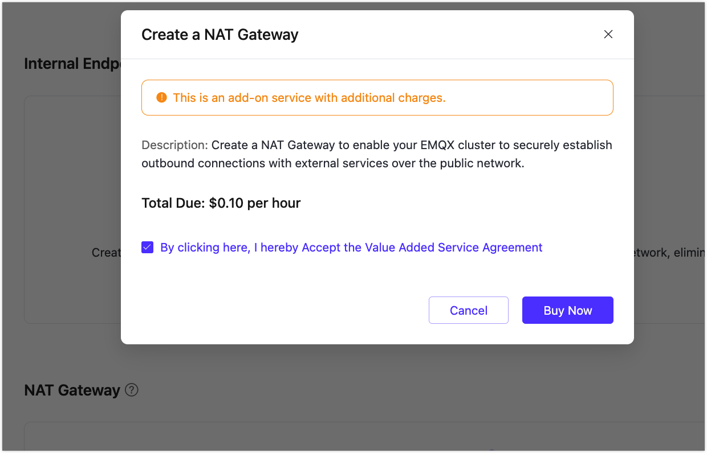
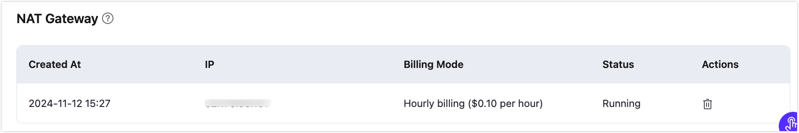
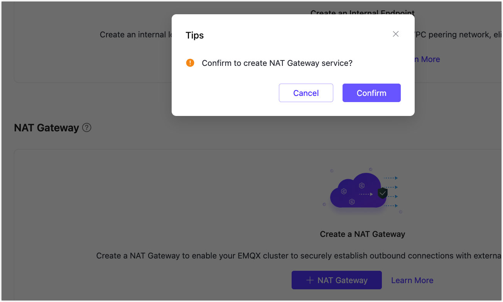
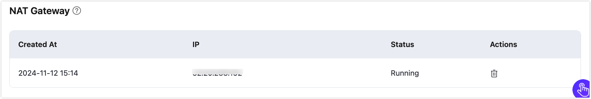

# NAT Gateway

::: warning Note

This feature is exclusive to the Dedicated and Premium editions. You need to create a deployment before purchasing this service. 

:::

The Network Address Translation (NAT) gateway provides network address translation services. Before the NAT gateway is activated, some functions of the Dedicated/Premium deployment, such as extended authentication and data integration, cannot access public network resources. Once subscribed, it allows access through public network addresses.

## Enable NAT Gateway in a Dedicated Deployment

1. Go to your Dedicated deployment in the EMQX Platform Console.

2. Click **Network Management** from the left menu. Navigate to the **NAT Gateway** area and click **+NAT Gateway**.

3. In the pop-up dialog, check to accept the Value Added Service Agreement and click **Buy Now**.

   

4. After purchasing the service, you can see the creation status on the page. Wait for the creation process to be completed.

   Once the NAT Gateway's status is `Running`, the deployment can access public network resources.

   

## Enable NAT Gateway in a Premium Deployment

1. Go to your Premium deployment in the EMQX Platform Console.

2. Click **Network Management** from the left menu. Navigate to the **NAT Gateway** area and click **+NAT Gateway**.

3. In the pop-up dialog, click **Confirm** to start the creation process.

   

   You can see the creation status of the NAT Gateway on the deployment Overview page. Wait for the creation process to be completed. Once the NAT Gateway's status is `Running`, the deployment can access public network resources.

   
