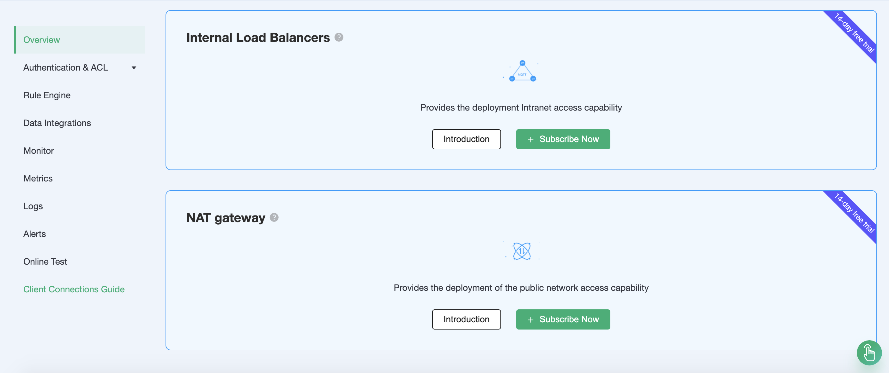
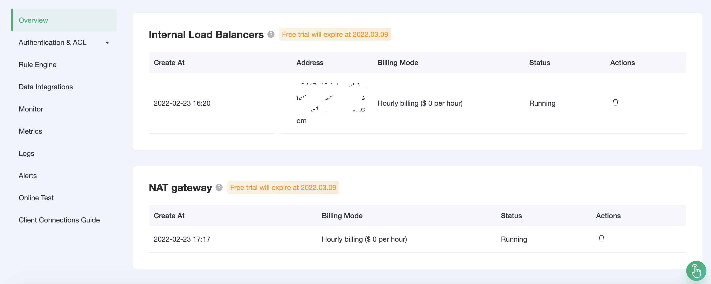

# NAT Gateway

::: warning Note
This feature is not available in the standard deployment
:::

NAT gateways can provide network address translation services to provide Professional deployments with the ability to access public network resources without the need for VPC peering connections.

Before start, you will need to complete the following actions:

* Professional deployments (EMQX clusters) have been created on EMQX Cloud.

## Service activation

You can choose to enable the NAT gateway service from the top menu bar - `VAS` or at the bottom of the deployment overview.

## Usage

After completing the NAT gateway value added service purchase, you can see the NAT gateway creation status at the appropriate deployment overview and wait for the creation to complete.

When the status of the NAT gateway is running, the deployment can access public network resources.
