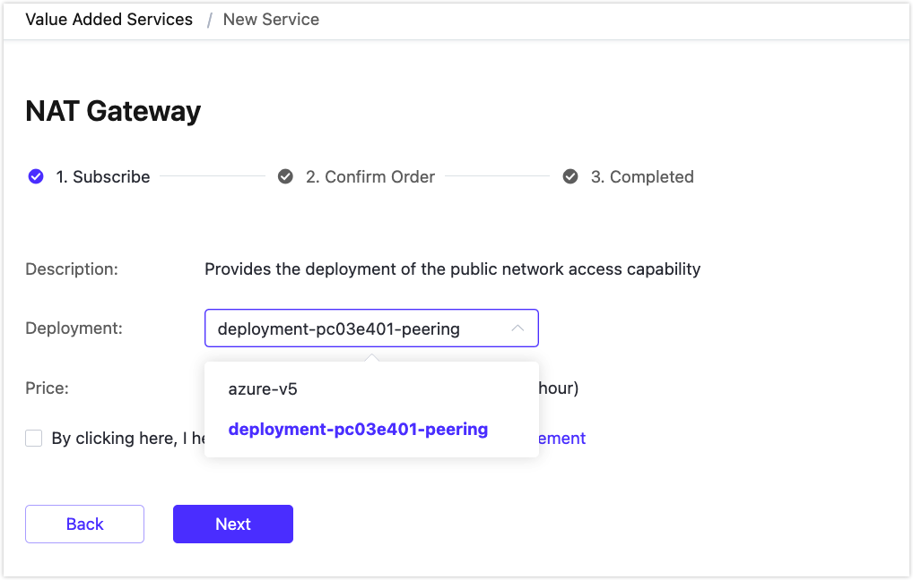
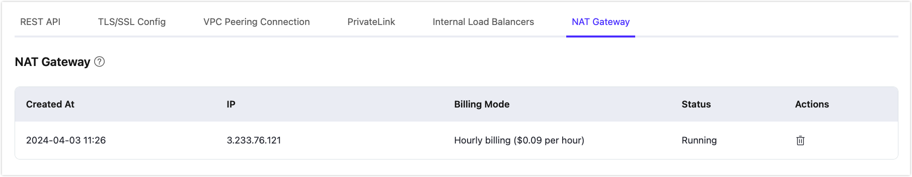

# NAT Gateway

::: warning Note

This feature is exclusive to the Dedicated and Premium editions. You need to create a deployment before purchasing this service. 

:::

The NAT gateway provides network address translation services. Before the NAT gateway is activated, some functions of the Dedicated/Premium deployment, such as extended authentication and data integration, cannot access public network resources. Once subscribed, it allows access through public network addresses.

## Subscribe to the Service

Click **VAS** from the top menu in the EMQX Platform console to open the **Value Added Services** page. You can subscribe to the NAT Gateway service on the page by clicking **Subscribe Now**.  Alternatively, you can go to the deployment Overview page, select the **NAT Gateway** tab at the bottom, and click **Subscribe Now**.

On the subscribing process page, pay attention to the service descriptions. If you have purchased multiple deployments, select the deployment for which you need to create the service instance.

## Use the Service

After purchasing the NAT Gateway service, you can see the creation status of the NAT Gateway on the deployment Overview page. Wait for the creation process to be completed. Once the NAT Gateway's status is running, the deployment can access public network resources.

