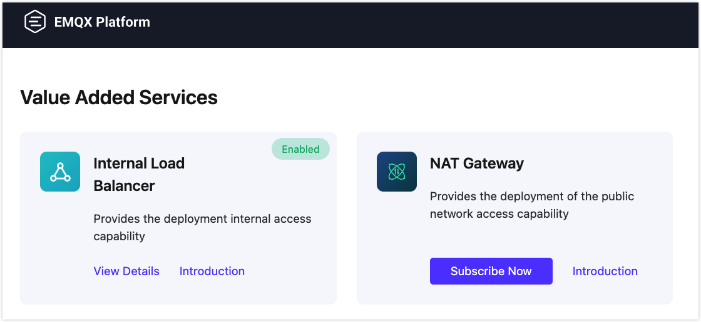
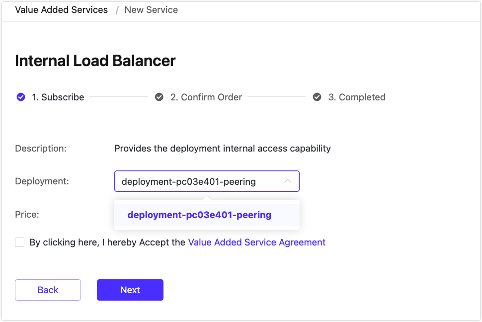
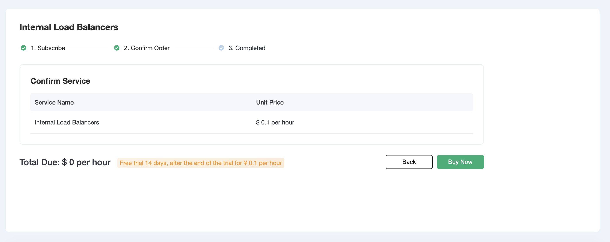
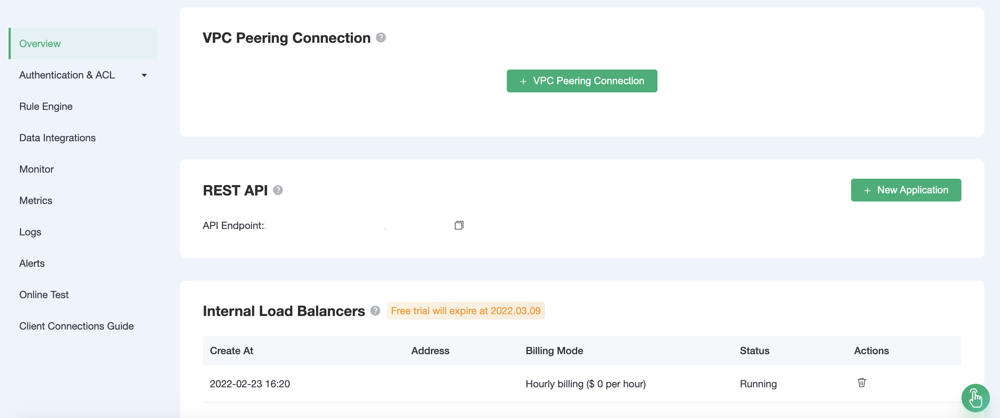
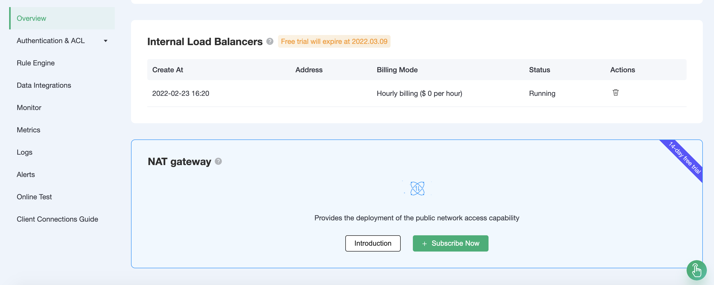

# Introduction of Value Added Services

Value-Added Services are highly available service plans provided and maintained by EMQX Cloud, it helps to meet the specific technical and product needs of our customers.

All value-added services offered by EMQX Cloud can be found in the top menu bar - `VAS`, where you can view and activate the services. Services that have already been purchased will be displayed in `Subscribed Services`. In general, we offer a free trial period to let you fully explore the features before you decide to purchase.

Some value-added services are associated with the deployment you purchased, and you can only activate them after you purchase the Professional or Standard deployment, so please pay attention to the description of the service. If you have purchased multiple editions, please select the deployment you need to create service instances for.

Once you have signed up, you can view the list of services, which will show all the value-added services of the same type that you have purchased. You can also go directly to the value-added services under deployment.

In addition to opening the service in the `VAS`, you can also see the portal where the service can be offered in the features under Deployment, (the portal will be different for different value added services). You can open this service directly here, and the process is the same as opening it in the VAS Center.

## Value-added service version requirements

<table>
   <tr>
      <th>Value-added service</th>
      <th>Deployment requirements</th>
      <th>Trial time</th>
      <th>Trial Limitations</th>
   </tr>
   <tr>
      <td>NAT gateway</td>
      <td>Professional</td>
      <td>14 days</td>
      <td>One cloud account for one trial</td>
   </tr>
   <tr>
      <td>Internal Load Balancers</td>
      <td>Professional</td>
      <td>14 days</td>
      <td>One cloud account for one trial</td>
   </tr>
</table>

