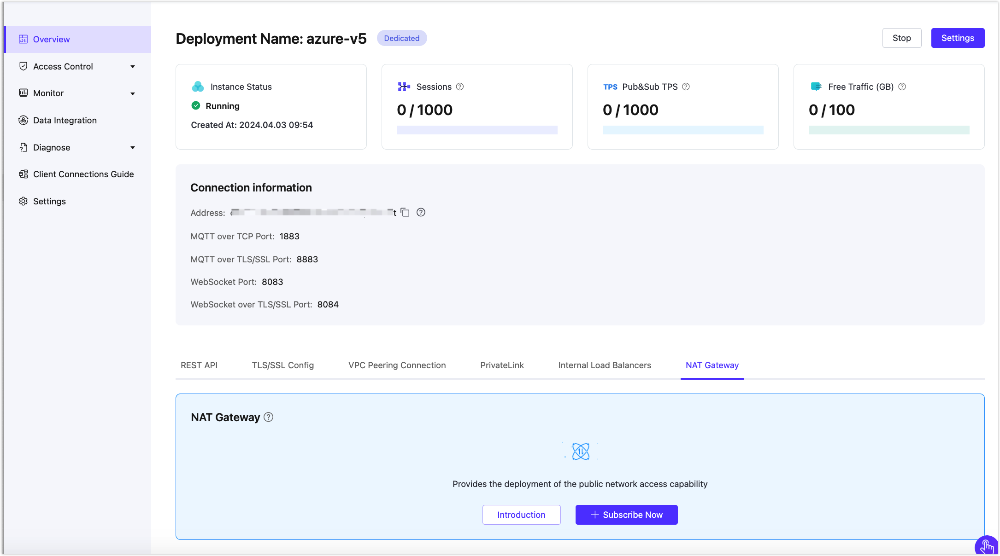

# Value Added Services

Value Added Services (VAS) are highly available service plans provided and maintained by the EMQX Platform. It helps to meet the specific technical and product needs of our customers. Value-added services are associated with the deployment you purchase. You can subscribe to related value-added services only after you purchase a Dedicated or Premium deployment. 

You can find all value-added services offered by the EMQX Platform by clicking **VAS** from the top menu. On the **Value Added Services** page, you can view or subscribe to the services. 

Alternatively, you can also view or subscribe to the services on the deployment Overview page by selecting the tab of the service at the bottom of the page.

Once you have subscribed, you can view the list of services under the tab. 

## Trial Instructions

In general, we offer a free trial period to let you fully explore the features before you decide to purchase. NAT Gateway and Internal Load Balancing offer a trial of their functionalities, with the following trial requirements:

<table>    <tr>       <th>Value-Added Service</th>       <th>Deployment Requirement</th>       <th>Trial Period</th>       <th>Trial Limitations</th>    </tr>    <tr>       <td>NAT Gateway</td>       <td>Dedicated Edition</td>       <td>14 days</td>       <td>One trial per cloud account</td>    </tr>    <tr>       <td>Internal Load Balancing</td>       <td>Dedicated Edition</td>       <td>14 days</td>       <td>One trial per cloud account</td>    </tr> </table>

